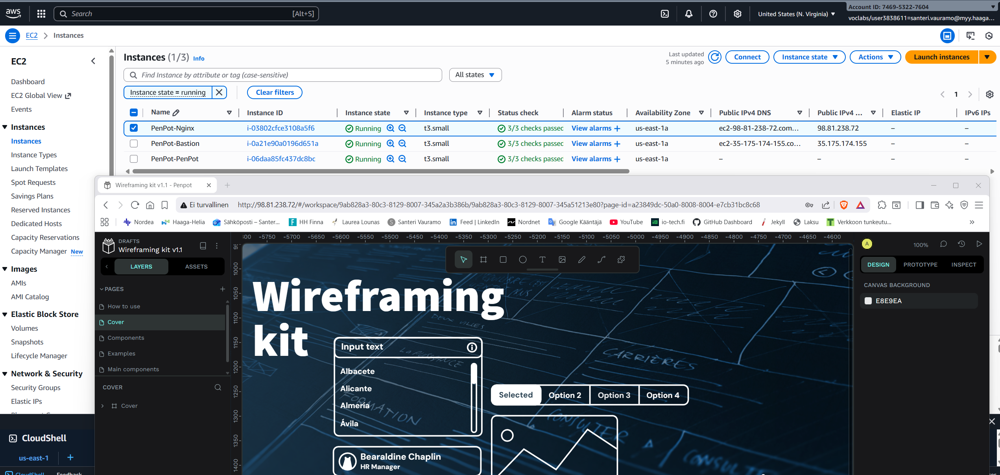

# System deployment: PenPot

---

### How to implement

- Upload the CloudFormation template "vpc-santeri-vauramo.yaml" to AWS Learner Lab Cloudshell or SandBox. 
- Run the following CLI commands to validate-template, create stack and keys, and hide the key from public:

```bash
aws cloudformation validate-template --template-body file://vpc-santeri-vauramo.yaml
```
```bash
aws ec2 create-key-pair --key-name learner-vm-key --query 'KeyMaterial' --output text > learner-vm-key.pem
chmod 400 learner-vm-key.pem
aws cloudformation create-stack --stack-name SanteriVPC --template-body file://vpc-santeri-vauramo.yaml --capabilities CAPABILITY_NAMED_IAM CAPABILITY_AUTO_EXPAND --parameters ParameterKey=KeyName,ParameterValue=learner-vm-key ParameterKey=EnvironmentName,ParameterValue=PenPot
```

For connecting to PenPot EC2 instance in PrivateSubnet1 via Bastion host:

```bash
eval $(ssh-agent)
ssh-add ~/learner-vm-key.pem
ssh -A ec2-user@"BastionHost-public-ip"

ssh ec2-user@"PenPot-instance-private-ip"
```

## Resources:

- VPC, 2 AZ's, 2 public and 2 private subnets
- Internet Gateway
- 2 NAT Gateways
- PublicInstanceSecurityGroup
- PenPotSecurityGroup
- BastionHost
- PenPotInstance in PrivateSubnet1
- NginxInstance in PublicSubnet1, works as a reverse proxy


I made sure that the NginxInstance will be created only after PenPotInstance is up and running with: "DependsOn: PenPotInstance". Unfortunately this is not a 3-tier architecture and has some flaws, there are no NACL's, no backups. Maybe if I have time, I will try to make it better. There were lots of issues trying to get the app itself installed correctly, fortunately when I forced the version to 2.4.3, it started working.

It takes some time, but there will be PenPot installed in PrivateSubnet1. You can access PenPot app via NginxInstance's public IPv4 address.

I will leave the resources open in to the AWS Learner Lab for some time now so you can access the app in http://98.81.238.72/. [Edit: It seems that even the Learner Lab can not be left running. The whole Lab was stopped and down when I tried to test the app again.] Proof of working system in PenPot.png.

The app will ask you to register to be able to use the app. You can just bash some credentials there and it will let you in.

### Useful commands in PenPot instance

- Update PenPot:
```bash
docker compose -f docker-compose.yaml pull
```
- Check if docker is running:
```bash
sudo systemctl status docker
sudo systemctl is-active docker
```
- Check docker version:
```bash
docker --version
docker-compose --version
```
- List all containers:
```bash
docker ps -a
```
- View logs in real time:
```bash
docker-compose logs --follow
```
- Restart services:
```bash
docker-compose restart
```
- Check for errors in compose file:
```bash
docker-compose -f docker-compose.yaml up --dry-run
```

### Proof of work

Here is proof of the system in use and working. This is a screenshot of the AWS Management Console showing the 3 EC2 instances, in the lower browser window you can see connection to the **Nginx** instances IPv4 address and the PenPot app working:




### Contents of the .yaml file:

```yaml
AWSTemplateFormatVersion: '2010-09-09'
Description: PenPot System deployment using Nginx as a reverse proxy in AWS VPC

Parameters:
  EnvironmentName:
    Type: String
    Default: PenPot-Environment
    Description: A name for the environment. Used in resource naming.

  LatestAmiId:
    Type: 'AWS::SSM::Parameter::Value<AWS::EC2::Image::Id>'
    Default: '/aws/service/ami-amazon-linux-latest/amzn2-ami-hvm-x86_64-gp2'
    Description: Latest Amazon Linux 2 AMI for EC2 instances.

  VpcCIDR:
    Type: String
    Default: 10.25.36.0/22
    Description: CIDR block for the VPC (e.g., 10.25.36.0/22).

  PublicSubnet1CIDR:
    Type: String
    Default: 10.25.36.0/24
    Description: CIDR block for the first public subnet.

  PublicSubnet2CIDR:
    Type: String
    Default: 10.25.37.0/24
    Description: CIDR block for the second public subnet.

  PrivateSubnet1CIDR:
    Type: String
    Default: 10.25.38.0/24
    Description: CIDR block for the first private subnet.

  PrivateSubnet2CIDR:
    Type: String
    Default: 10.25.39.0/24
    Description: CIDR block for the second private subnet.

  KeyName:
    Type: AWS::EC2::KeyPair::KeyName
    Description: Name of an existing EC2 KeyPair for SSH access.

  InstanceType:
    Type: String
    Default: t3.small
    AllowedValues: [t2.micro, t2.small, t3.micro, t3.small]
    Description: Instance type for EC2 instances.

Resources:

  PenPotVPC:
    Type: AWS::EC2::VPC
    Properties:
      CidrBlock: !Ref VpcCIDR
      EnableDnsSupport: true
      EnableDnsHostnames: true
      Tags:
        - Key: Name
          Value: !Sub ${EnvironmentName}-VPC

  InternetGateway:
    Type: AWS::EC2::InternetGateway
    Properties:
      Tags:
        - Key: Name
          Value: !Sub ${EnvironmentName}-IGW

  InternetGatewayAttachment:
    Type: AWS::EC2::VPCGatewayAttachment
    Properties:
      VpcId: !Ref PenPotVPC
      InternetGatewayId: !Ref InternetGateway

  PublicSubnet1:
    Type: AWS::EC2::Subnet
    Properties:
      VpcId: !Ref PenPotVPC
      AvailabilityZone: !Select [0, !GetAZs '']
      CidrBlock: !Ref PublicSubnet1CIDR
      MapPublicIpOnLaunch: true
      Tags:
        - Key: Name
          Value: !Sub ${EnvironmentName}-Public-AZ1

  PublicSubnet2:
    Type: AWS::EC2::Subnet
    Properties:
      VpcId: !Ref PenPotVPC
      AvailabilityZone: !Select [1, !GetAZs '']
      CidrBlock: !Ref PublicSubnet2CIDR
      MapPublicIpOnLaunch: true
      Tags:
        - Key: Name
          Value: !Sub ${EnvironmentName}-Public-AZ2

  PrivateSubnet1:
    Type: AWS::EC2::Subnet
    Properties:
      VpcId: !Ref PenPotVPC
      AvailabilityZone: !Select [0, !GetAZs '']
      CidrBlock: !Ref PrivateSubnet1CIDR
      Tags:
        - Key: Name
          Value: !Sub ${EnvironmentName}-Private-AZ1

  PrivateSubnet2:
    Type: AWS::EC2::Subnet
    Properties:
      VpcId: !Ref PenPotVPC
      AvailabilityZone: !Select [1, !GetAZs '']
      CidrBlock: !Ref PrivateSubnet2CIDR
      Tags:
        - Key: Name
          Value: !Sub ${EnvironmentName}-Private-AZ2

  PublicRouteTable:
    Type: AWS::EC2::RouteTable
    Properties:
      VpcId: !Ref PenPotVPC
      Tags:
        - Key: Name
          Value: !Sub ${EnvironmentName}-Public-RT

  DefaultPublicRoute:
    Type: AWS::EC2::Route
    Properties:
      RouteTableId: !Ref PublicRouteTable
      DestinationCidrBlock: 0.0.0.0/0
      GatewayId: !Ref InternetGateway

  PublicSubnet1RouteTableAssociation:
    Type: AWS::EC2::SubnetRouteTableAssociation
    Properties:
      RouteTableId: !Ref PublicRouteTable
      SubnetId: !Ref PublicSubnet1

  PublicSubnet2RouteTableAssociation:
    Type: AWS::EC2::SubnetRouteTableAssociation
    Properties:
      RouteTableId: !Ref PublicRouteTable
      SubnetId: !Ref PublicSubnet2

  NatGatewayEIP:
    Type: AWS::EC2::EIP
    DependsOn: InternetGatewayAttachment
    Properties:
      Domain: vpc

  NatGateway:
    Type: AWS::EC2::NatGateway
    Properties:
      AllocationId: !GetAtt NatGatewayEIP.AllocationId
      SubnetId: !Ref PublicSubnet1
      Tags:
        - Key: Name
          Value: !Sub ${EnvironmentName}-NAT

  PrivateRouteTable:
    Type: AWS::EC2::RouteTable
    Properties:
      VpcId: !Ref PenPotVPC
      Tags:
        - Key: Name
          Value: !Sub ${EnvironmentName}-Private-RT

  DefaultPrivateRoute:
    Type: AWS::EC2::Route
    Properties:
      RouteTableId: !Ref PrivateRouteTable
      DestinationCidrBlock: 0.0.0.0/0
      NatGatewayId: !Ref NatGateway

  PrivateSubnet1RouteTableAssociation:
    Type: AWS::EC2::SubnetRouteTableAssociation
    Properties:
      RouteTableId: !Ref PrivateRouteTable
      SubnetId: !Ref PrivateSubnet1

  PrivateSubnet2RouteTableAssociation:
    Type: AWS::EC2::SubnetRouteTableAssociation
    Properties:
      RouteTableId: !Ref PrivateRouteTable
      SubnetId: !Ref PrivateSubnet2

  PublicInstanceSecurityGroup:
    Type: AWS::EC2::SecurityGroup
    Properties:
      GroupDescription: Enable SSH (22), HTTP (80) and HTTPS (443) from everywhere (0.0.0.0/0)
      VpcId: !Ref PenPotVPC
      SecurityGroupIngress:
        - IpProtocol: tcp
          FromPort: 22
          ToPort: 22
          CidrIp: 0.0.0.0/0
        - IpProtocol: tcp
          FromPort: 80
          ToPort: 80
          CidrIp: 0.0.0.0/0
        - IpProtocol: tcp
          FromPort: 443
          ToPort: 443
          CidrIp: 0.0.0.0/0
      Tags:
        - Key: Name
          Value: !Sub ${EnvironmentName}-Public-SG

  PenPotSecurityGroup:
    Type: AWS::EC2::SecurityGroup
    Properties:
      GroupDescription: Allow access from Nginx (9001) and SSH from Bastion (22)
      VpcId: !Ref PenPotVPC
      SecurityGroupIngress:
        - IpProtocol: tcp
          FromPort: 9001
          ToPort: 9001
          SourceSecurityGroupId: !Ref PublicInstanceSecurityGroup
        - IpProtocol: tcp
          FromPort: 22
          ToPort: 22
          SourceSecurityGroupId: !Ref PublicInstanceSecurityGroup
      Tags:
        - Key: Name
          Value: !Sub ${EnvironmentName}-PenPot-SG

  BastionHost:
    Type: AWS::EC2::Instance
    Properties:
      InstanceType: !Ref InstanceType
      KeyName: !Ref KeyName
      ImageId: !Ref LatestAmiId
      SubnetId: !Ref PublicSubnet1
      Tags:
        - Key: Name
          Value: !Sub ${EnvironmentName}-Bastion
      SecurityGroupIds:
        - !Ref PublicInstanceSecurityGroup

  PenPotInstance:
    Type: AWS::EC2::Instance
    Properties:
      InstanceType: !Ref InstanceType
      KeyName: !Ref KeyName
      ImageId: !Ref LatestAmiId
      SubnetId: !Ref PrivateSubnet1
      Tags:
        - Key: Name
          Value: !Sub ${EnvironmentName}-PenPot
      SecurityGroupIds:
        - !Ref PenPotSecurityGroup
      UserData:
        Fn::Base64: |
          #!/bin/bash
          set -xe
          exec > >(tee /var/log/user-data.log | logger -t user-data -s 2>/dev/console) 2>&1

          echo "Starting Penpot installation (official compose, pinned version)..."

          PENPOT_PRIVATE_IP=$(curl -s http://169.254.169.254/latest/meta-data/local-ipv4 || echo "127.0.0.1")
          echo "Penpot Private IP: $PENPOT_PRIVATE_IP"

          for i in 1 2 3; do
            yum update -y && break || sleep 10
          done
          for i in 1 2 3; do
            yum install -y docker && break || sleep 10
          done

          usermod -a -G docker ec2-user || true
          systemctl enable docker
          systemctl start docker

          for i in 1 2 3; do
            curl -L "https://github.com/docker/compose/releases/latest/download/docker-compose-$(uname -s)-$(uname -m)" \
              -o /usr/local/bin/docker-compose && break || sleep 10
          done
          chmod +x /usr/local/bin/docker-compose
          ln -sf /usr/local/bin/docker-compose /usr/bin/docker-compose

          mkdir -p /opt/penpot
          cd /opt/penpot

          curl -L "https://raw.githubusercontent.com/penpot/penpot/main/docker/images/docker-compose.yaml" \
            -o docker-compose.yaml

          cat > .env << EOF
          PENPOT_VERSION=2.4.3
          PENPOT_PUBLIC_URI=http://$PENPOT_PRIVATE_IP:9001
          PENPOT_BACKEND_URI=http://penpot-backend:6060
          EOF

          echo "Starting Penpot containers..."
          docker-compose -p penpot -f docker-compose.yaml up -d

          echo "Waiting for Penpot to start..."
          sleep 30
          docker ps
          echo "Penpot installation completed."

  NginxInstance:
    Type: AWS::EC2::Instance
    DependsOn: PenPotInstance
    Properties:
      InstanceType: !Ref InstanceType
      KeyName: !Ref KeyName
      ImageId: !Ref LatestAmiId
      SubnetId: !Ref PublicSubnet1
      Tags:
        - Key: Name
          Value: !Sub ${EnvironmentName}-Nginx
      SecurityGroupIds:
        - !Ref PublicInstanceSecurityGroup
      UserData:
        Fn::Base64: !Sub |
          #!/bin/bash
          set -xe
          exec > >(tee /var/log/user-data.log | logger -t user-data -s 2>/dev/console) 2>&1

          echo "Starting Nginx installation..."

          yum update -y
          amazon-linux-extras enable nginx1
          yum clean metadata
          yum install -y nginx

          PENPOT_IP="${PenPotInstance.PrivateIp}"
          echo "PenPot IP: $PENPOT_IP"

          cat > /etc/nginx/conf.d/penpot.conf << 'EOFNGINX'
          server {
              listen 80;
              server_name _;

              client_max_body_size 31457280;

              location /ws/notifications {
                  proxy_pass http://PENPOT_IP_PLACEHOLDER:9001/ws/notifications;
                  proxy_http_version 1.1;
                  proxy_set_header Upgrade $http_upgrade;
                  proxy_set_header Connection "upgrade";
                  proxy_set_header Host $host;
                  proxy_set_header X-Real-IP $remote_addr;
                  proxy_set_header X-Forwarded-For $proxy_add_x_forwarded_for;
                  proxy_set_header X-Forwarded-Proto $scheme;
                  proxy_read_timeout 86400;
              }

              location / {
                  proxy_pass http://PENPOT_IP_PLACEHOLDER:9001/;
                  proxy_set_header Host $http_host;
                  proxy_set_header X-Real-IP $remote_addr;
                  proxy_set_header X-Scheme $scheme;
                  proxy_set_header X-Forwarded-Proto $scheme;
                  proxy_set_header X-Forwarded-For $proxy_add_x_forwarded_for;
                  proxy_redirect off;
              }
          }
          EOFNGINX

          sed -i "s/PENPOT_IP_PLACEHOLDER/$PENPOT_IP/g" /etc/nginx/conf.d/penpot.conf

          chown nginx:nginx /etc/nginx/conf.d/penpot.conf
          chmod 640 /etc/nginx/conf.d/penpot.conf

          rm -f /etc/nginx/conf.d/default.conf

          setsebool -P httpd_can_network_connect 1 || true

          echo "Testing Nginx configuration..."
          nginx -t

          echo "Starting Nginx..."
          systemctl start nginx
          systemctl enable nginx

          echo "Testing connectivity to PenPot..."
          sleep 10
          curl -I "http://$PENPOT_IP:9001" || echo "PenPot not yet ready"

          echo "Nginx installation completed!"


Outputs:
  PublicSubnets:
    Description: Public Subnets
    Value: !Join [ ",", [ !Ref PublicSubnet1, !Ref PublicSubnet2 ]]

  PrivateSubnets:
    Description: Private Subnets
    Value: !Join [ ",", [ !Ref PrivateSubnet1, !Ref PrivateSubnet2 ]]

  NginxPublicIP:
    Description: Public IP address of the Nginx instance
    Value: !GetAtt NginxInstance.PublicIp

  PenPotPrivateIP:
    Description: Private IP address of the PenPot backend instance
    Value: !GetAtt PenPotInstance.PrivateIp

  BastionPublicIP:
    Description: Public IP address of the Bastion host
    Value: !GetAtt BastionHost.PublicIp

  VPCId:
    Description: VPC ID
    Value: !Ref PenPotVPC

  PublicSecurityGroupId:
    Description: Security Group for public instances
    Value: !Ref PublicInstanceSecurityGroup

  PenPotSecurityGroupId:
    Description: Security Group for PenPot backend
    Value: !Ref PenPotSecurityGroup

  NginxURL:
    Description: URL to access PenPot via Nginx
    Value: !Sub http://${NginxInstance.PublicIp}
```


---

This document may be copied and modified in accordance with the GNU General Public License (version 2 or later). [http://www.gnu.org/licenses/gpl.html](http://www.gnu.org/licenses/gpl.html)

- Based on [Public Cloud Solution Architect](https://pekkakorpi-tassi.fi/courses/pkt-arc/pkt-arc-edu-olt-2025-1e/course.html) course by **Pekka Korpi-Tassi** 2025.
- [Project Prep Tasks](https://pekkakorpi-tassi.fi/courses/pkt-arc/pkt-arc-edu-olt-2025-1e/iac_deployment.html).

Written by **Santeri Vauramo** 2025.
