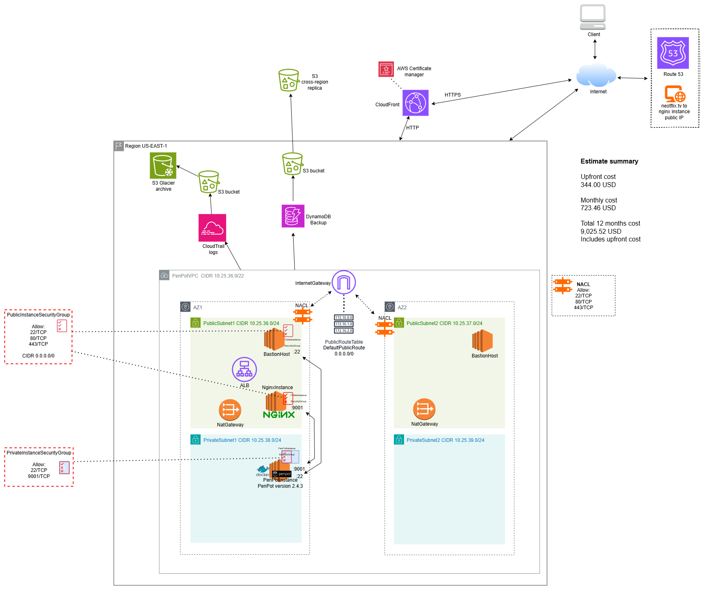

# Task 10 Draw and Annotate Architecture Task and Estimate Costs

### Task goals:

- Draw solution architecture diagram about your deployment.
- Diagram must be complete as possible as if it was for production usage.
- Note that your actual IaC deployment does not need to be production ready (no custom Domain etc.).
- Include as annotations all DNS, IP, TLS, Port and other critical details.
- Use diagram tool like: draw.io, Lucidchart, etc.
- Use AWS/Azure calculator to estimate costs.

I got to use the AWS calculator for this one. This is not anywhere near a system that makes sense, but at least I got to see in a simulation that tiny mistakes in the planning phase can be devastating to total yearly costs. These are all estimates of course.

The S3 buckets costs in this system are around 330$ per month. The backups are overkill for this kind of system.

---

This document may be copied and modified in accordance with the GNU General Public License (version 2 or later). [http://www.gnu.org/licenses/gpl.html](http://www.gnu.org/licenses/gpl.html)

- Based on [Public Cloud Solution Architect](https://pekkakorpi-tassi.fi/courses/pkt-arc/pkt-arc-edu-olt-2025-1e/course.html) course by **Pekka Korpi-Tassi** 2025.
- [Project Prep Tasks](https://pekkakorpi-tassi.fi/courses/pkt-arc/pkt-arc-edu-olt-2025-1e/iac_deployment.html).

Written by **Santeri Vauramo** 2025.
