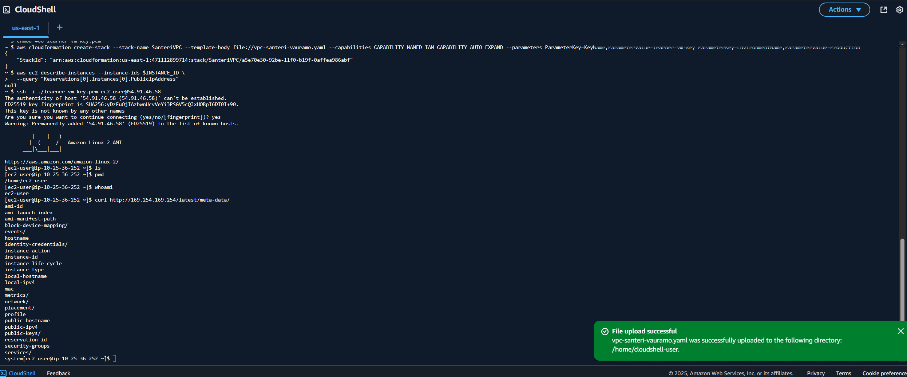

# Task 3: VM

### Task goals:

- Create Key Pair
- Create Linux VM
- Launch Linux VM to Public Subnet (requires Public IP Address)
- Tag Created Resources (Course, Implementation, Task, Student, Deployment Type)
- SSH to VM
- Read VM metadata with curl on VM and inlude screenshot

---

### Upload the CloudFormation template "vpc-santeri-vauramo.yaml" to AWS Sandbox CloudShell.

### Run the following CLI commands to create the stack and key pair:

```bash
aws cloudformation validate-template --template-body file://vpc-santeri-vauramo.yaml
```
```bash
aws ec2 create-key-pair --key-name learner-vm-key --query 'KeyMaterial' --output text > learner-vm-key.pem
chmod 400 learner-vm-key.pem
aws cloudformation create-stack --stack-name SanteriVPC --template-body file://vpc-santeri-vauramo.yaml --capabilities CAPABILITY_NAMED_IAM CAPABILITY_AUTO_EXPAND --parameters ParameterKey=KeyName,ParameterValue=learner-vm-key ParameterKey=EnvironmentName,ParameterValue=Production
```

# Check the IP of the EC2 instance by searching by Course tag, or check it out from AWS GUI console
```bash
aws ec2 describe-instances \
  --filters "Name=tag:Course,Values=Cloud Architectures - AWS" \
  --query "Reservations[].Instances[].[InstanceId, PublicIpAddress, State.Name]" \
  --output table
```
# SSH to the IP, replace the IP address for the one you've got
```bash
ssh -i ./learner-vm-key.pem ec2-user@54.91.46.58
```
# Read VM metadata by curling the AWS meta-data server
```bash
curl http://169.254.169.254/latest/meta-data/
```




