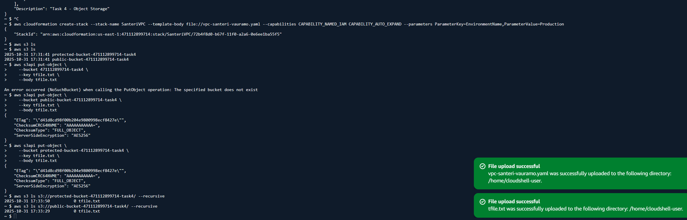

# Task 4: Object Storage

### Task goals:

- Create and configure Public Object Storage container
- Create and configure Protected Object Storage container
- Upload test files to Public container by using CLI
- Upload test files to Protected container by using CLI
- Include screenshots about Public and Protected containers with test files to task README.txt

### Upload the CloudFormation template "vpc-santeri-vauramo.yaml" and "tfile.txt" to AWS Sandbox CloudShell.

### Run the following CLI commands to validate and create the stack:
```bash
aws cloudformation validate-template --template-body file://vpc-santeri-vauramo.yaml
```
```bash
aws cloudformation create-stack --stack-name SanteriVPC --template-body file://vpc-santeri-vauramo.yaml --capabilities CAPABILITY_NAMED_IAM CAPABILITY_AUTO_EXPAND --parameters ParameterKey=EnvironmentName,ParameterValue=Production
```
 
### Check the names of the buckets (bucket names are randomized "protected-bucket-xxxxxxxxx-task4") to tackle conflicting names

```bash
aws s3 ls
```
### Copy uploaded tfile.txt with api method:
```bash
aws s3api put-object \
    --bucket BUCKET_NAME_HERE \
    --key tfile.txt \
    --body tfile.txt
```
### Another, easier method
```bash
aws s3 cp tfile.txt s3://BUCKET_NAME_HERE/my-dir/
```
### Upload to protected bucket using the access point ARN
```bash
aws s3 cp tfile.txt s3://arn:aws:s3:us-east-1:ACCOUNT-ID:accesspoint/S3BucketProtectedAccessPoint/
```
### Check if the files are actually in the buckets!
```bash
aws s3 ls s3://BUCKET_NAME_HERE/ --recursive
```


### In my test, the bucket names became:

protected-bucket-471112899714-task4

public-bucket-471112899714-task4

### the commands in my case:
```bash
aws s3api put-object \
    --bucket public-bucket-471112899714-task4 \
    --key tfile.txt \
    --body tfile.txt
aws s3api put-object \
    --bucket protected-bucket-471112899714-task4 \
    --key tfile.txt \
    --body tfile.txt
aws s3 ls s3://protected-bucket-471112899714-task4/ --recursive
aws s3 ls s3://public-bucket-471112899714-task4/ --recursive
```



 ### The template file:

```yaml
AWSTemplateFormatVersion: '2010-09-09'
Description: Task 4 - Object Storage

Parameters:
  EnvironmentName:
    Description: VPC Networking
    Type: String

  VpcCIDR:
    Type: String
    Default: 10.25.36.0/22

  PublicSubnet1CIDR:
    Type: String
    Default: 10.25.36.0/24

  Course:
    Type: String
    Default: 'Cloud Architectures - AWS'

  ImplementationID:
    Type: String
    Default: 'ICI010AS3AE-3003'

  Task:
    Type: String
    Default: 'Task 4: Object Storage'

  Learner:
    Type: String
    Default: 'Santeri Vauramo'

  DeploymentType:
    Type: String
    Default: 'Console'

Resources:
  SanteriVPC:
    Type: AWS::EC2::VPC
    Properties:
      CidrBlock: !Ref VpcCIDR
      EnableDnsSupport: true
      EnableDnsHostnames: true
      Tags:
        - Key: Name
          Value: !Ref EnvironmentName
        - Key: AccountId
          Value: !Ref "AWS::AccountId"
        - Key: Region
          Value: !Ref "AWS::Region"
        - Key: StackName
          Value: !Ref AWS::StackName
        - Key: Course
          Value: !Ref Course
        - Key: ImplementationID
          Value: !Ref ImplementationID
        - Key: Learner
          Value: !Ref Learner
        - Key: Task
          Value: !Ref Task
        - Key: DeploymentType
          Value: !Ref DeploymentType

  InternetGateway:
    Type: AWS::EC2::InternetGateway
    Properties:
      Tags:
        - Key: Name
          Value: InternetGateway
        - Key: Name
          Value: !Ref EnvironmentName
        - Key: AccountId
          Value: !Ref "AWS::AccountId"
        - Key: Region
          Value: !Ref "AWS::Region"
        - Key: StackName
          Value: !Ref AWS::StackName
        - Key: Course
          Value: !Ref Course
        - Key: ImplementationID
          Value: !Ref ImplementationID
        - Key: Learner
          Value: !Ref Learner
        - Key: Task
          Value: !Ref Task
        - Key: DeploymentType
          Value: !Ref DeploymentType

  InternetGatewayAttachment:
    Type: AWS::EC2::VPCGatewayAttachment
    Properties:
      VpcId: !Ref SanteriVPC
      InternetGatewayId: !Ref InternetGateway

  PublicSubnet1:
    Type: AWS::EC2::Subnet
    Properties:
      VpcId: !Ref SanteriVPC
      AvailabilityZone: !Select [ 0, !GetAZs '' ]
      CidrBlock: !Ref PublicSubnet1CIDR
      MapPublicIpOnLaunch: true
      Tags:
        - Key: Name
          Value: !Sub ${EnvironmentName} Public Subnet (AZ1)
        - Key: AccountId
          Value: !Ref "AWS::AccountId"
        - Key: Region
          Value: !Ref "AWS::Region"
        - Key: StackName
          Value: !Ref AWS::StackName
        - Key: Course
          Value: !Ref Course
        - Key: ImplementationID
          Value: !Ref ImplementationID
        - Key: Learner
          Value: !Ref Learner
        - Key: Task
          Value: !Ref Task
        - Key: DeploymentType
          Value: !Ref DeploymentType

  PublicRouteTable:
    Type: AWS::EC2::RouteTable
    Properties:
      VpcId: !Ref SanteriVPC
      Tags:
        - Key: Name
          Value: !Sub ${EnvironmentName} Public Routes

  DefaultPublicRoute:
    Type: AWS::EC2::Route
    DependsOn: InternetGatewayAttachment
    Properties:
      RouteTableId: !Ref PublicRouteTable
      DestinationCidrBlock: 0.0.0.0/0
      GatewayId: !Ref InternetGateway

  PublicSubnet1RouteTableAssociation:
    Type: AWS::EC2::SubnetRouteTableAssociation
    Properties:
      RouteTableId: !Ref PublicRouteTable
      SubnetId: !Ref PublicSubnet1

  S3BucketPublic:
    Type: 'AWS::S3::Bucket'
    DeletionPolicy: Delete
    Properties:
      BucketName: !Sub "public-bucket-${AWS::AccountId}-task4"
      PublicAccessBlockConfiguration:
        BlockPublicAcls: false
        BlockPublicPolicy: false
        IgnorePublicAcls: false
        RestrictPublicBuckets: false
      Tags:
        - Key: AccountId
          Value: !Ref "AWS::AccountId"
        - Key: Region
          Value: !Ref "AWS::Region"
        - Key: StackName
          Value: !Ref AWS::StackName
        - Key: Course
          Value: !Ref Course
        - Key: ImplementationID
          Value: !Ref ImplementationID
        - Key: Learner
          Value: !Ref Learner
        - Key: Task
          Value: !Ref Task
        - Key: DeploymentType
          Value: !Ref DeploymentType

  PublicBucketPolicy:
    Type: 'AWS::S3::BucketPolicy'
    Properties:
      Bucket: !Ref 'S3BucketPublic'
      PolicyDocument:
        Version: '2012-10-17'
        Statement:
          - Effect: Allow
            Principal: '*'
            Action: 's3:GetObject'
            Resource: !Sub '${S3BucketPublic.Arn}/*'

  S3BucketProtected:
    Type: 'AWS::S3::Bucket'
    DeletionPolicy: Delete
    Properties:
      BucketName: !Sub "protected-bucket-${AWS::AccountId}-task4"
      Tags:
        - Key: AccountId
          Value: !Ref "AWS::AccountId"
        - Key: Region
          Value: !Ref "AWS::Region"
        - Key: StackName
          Value: !Ref AWS::StackName
        - Key: Course
          Value: !Ref Course
        - Key: ImplementationID
          Value: !Ref ImplementationID
        - Key: Learner
          Value: !Ref Learner
        - Key: Task
          Value: !Ref Task
        - Key: DeploymentType
          Value: !Ref DeploymentType

Outputs:
  VPC:
    Description: A reference to the created VPC
    Value: !Ref SanteriVPC

  PublicSubnet1:
    Description: A reference to the public subnet in the 1st Availability Zone
    Value: !Ref PublicSubnet1

  PublicBucket:
    Description: Public S3 bucket
    Value: !Ref S3BucketPublic

  ProtectedBucket:
    Description: Protected S3 bucket
    Value: !Ref S3BucketProtected
```

---

- Based on [Public Cloud Solution Architect](https://pekkakorpi-tassi.fi/courses/pkt-arc/pkt-arc-edu-olt-2025-1e/course.html) course by **Pekka Korpi-Tassi** 2025.
- [Project Prep Tasks](https://pekkakorpi-tassi.fi/courses/pkt-arc/pkt-arc-edu-olt-2025-1e/iac_deployment.html).

Written by **Santeri Vauramo** 2025.
