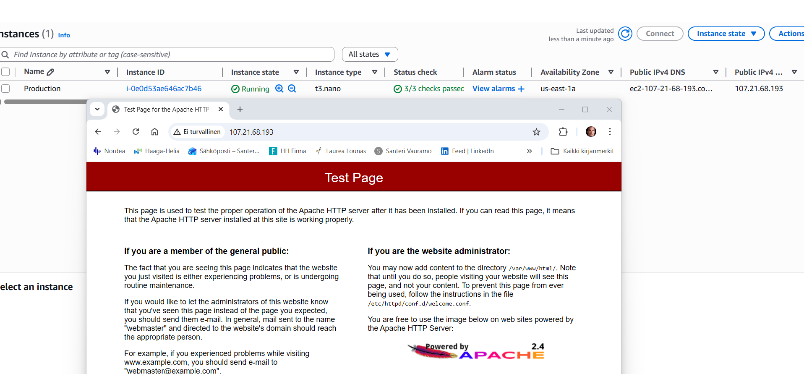
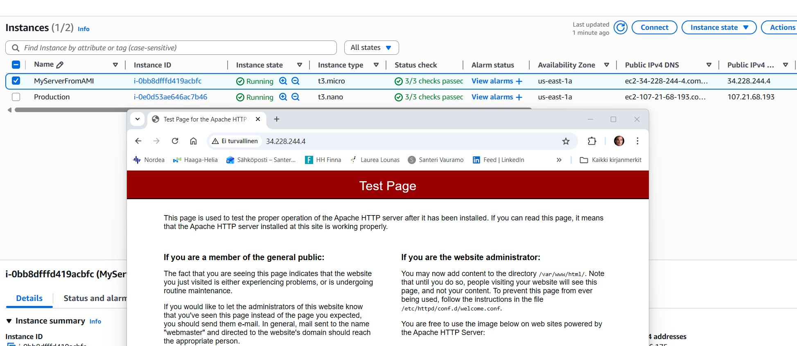

# Task 6: Custom VM Image

### Task goals:

- Find some application that can be tested with http protocol (80, no TLS).
- Some possible apps: Apache, Nginx, Lighttpd
- Prepare CLI commands to install application on VM
- Test public Internet access to prepared VM and include screenshot about passing test to task README.txt
- Create VM Image when setup is verified to work.
- Create VM from VM Image
- Test public Internet access to image based VM and include screenshot about passing test to task README.txt

---

### Upload the CloudFormation template "vpc-santeri-vauramo.yaml" to AWS Sandbox CloudShell. (This had to be done in LearnerLab, in sandbox the custom AMI instance could not be launched due to permission error)

### Run the following CLI commands to create the stack and key pair:

```bash
aws cloudformation validate-template --template-body file://vpc-santeri-vauramo.yaml
```
```bash
aws ec2 create-key-pair --key-name learner-vm-key --query 'KeyMaterial' --output text > learner-vm-key.pem
chmod 400 learner-vm-key.pem
aws cloudformation create-stack --stack-name SanteriVPC --template-body file://vpc-santeri-vauramo.yaml --capabilities CAPABILITY_NAMED_IAM CAPABILITY_AUTO_EXPAND --parameters ParameterKey=KeyName,ParameterValue=learner-vm-key ParameterKey=EnvironmentName,ParameterValue=Production
```

### Check the IP of the EC2 instance by searching by Course tag, or check it out from AWS GUI console
```bash
aws ec2 describe-instances \
  --filters "Name=tag:Course,Values=Cloud Architectures - AWS" \
  --query "Reservations[].Instances[].[InstanceId, PublicIpAddress, State.Name]" \
  --output table
```
  
#SSH to the IP, replace the IPv4 address for the one you've got #type "yes"
```bash
ssh -i ./learner-vm-key.pem ec2-user@107.21.68.193
```
### or
```bash
aws ec2-instance-connect ssh --instance-id <instance-id-here>
```
### Update package list, install apache2, enable it on startup, and launch it 
```bash
sudo yum update -y
sudo yum install httpd
sudo systemctl enable httpd
sudo systemctl start httpd
```
### Navigate to EC2 ip "http://107.21.68.193", you will see apache2 test page if all is correct.



### Create Image (AMI) from instance.

### Launch new instance from AMI. Test internet access with instance IP



 ### The template file:

```yaml
AWSTemplateFormatVersion: '2010-09-09'
Description:  Task 6

Parameters:
  EnvironmentName:
    Description: VPC Networking
    Type: String

  LatestAmiId:
    Description: The latest Amazon Linux 2 AMI from the Parameter Store
    Type: 'AWS::SSM::Parameter::Value<AWS::EC2::Image::Id>'
    Default: '/aws/service/ami-amazon-linux-latest/amzn2-ami-hvm-x86_64-gp2'

  VpcCIDR:
    Type: String
    Default: 10.25.36.0/22

  PublicSubnet1CIDR:
    Type: String
    Default: 10.25.36.0/24

  PublicSubnet2CIDR:
    Type: String
    Default: 10.25.37.0/24

  PrivateSubnet1CIDR:
    Type: String
    Default: 10.25.38.0/24

  PrivateSubnet2CIDR:
    Type: String
    Default: 10.25.39.0/24

  Course:
    Type: String
    Default: 'Cloud Architectures - AWS'

  ImplementationID:
    Type: String
    Default: 'ICI010AS3AE-3003'

  Task:
    Type: String
    Default: 'Task 6'

  Learner:
    Type: String
    Default: 'Santeri'

  KeyName:
    Type: AWS::EC2::KeyPair::KeyName
    Default: learner-vm-key

  DeploymentType:
    Type: String
    Default: 'Console'
    AllowedValues:
      - Console
      - CLI
      - IaC
      - IaC with Configuration Management
      - CI/CD
      - CI/CD with Configuration Management
    ConstraintDescription: Type of deployment of the resources

  InstanceType:
    Description: EC2 instance type
    Type: String
    Default: t3.nano
    AllowedValues:
      - t2.nano
      - t2.micro
      - t2.small
      - t3.nano
      - t3.micro
      - t3.small
    ConstraintDescription: EC2 instance types supported by AWS Sandbox

Mappings:
  RegionMap:
    us-east-1:
      AMI: ami-0c02fb55956c7d316
    us-east-2:
      AMI: ami-0fb653ca2d3203ac1
    us-west-1:
      AMI: ami-0d382e80be7ffdae5
    us-west-2:
      AMI: ami-083ac7c7ecf9bb9b0
    eu-west-1:
      AMI: ami-0c1c30571d2dae5c9
    eu-central-1:
      AMI: ami-0dcc0ebde7b2e00db
    ap-southeast-1:
      AMI: ami-0fa377108253bf620
    ap-northeast-1:
      AMI: ami-0d52744d6551d851e

Resources:

  SanteriVPC:
    Type: AWS::EC2::VPC
    Properties:
      CidrBlock: !Ref VpcCIDR
      EnableDnsSupport: true
      EnableDnsHostnames: true
      Tags:
        - Key: Name
          Value: !Ref EnvironmentName
        - Key: AccountId
          Value: !Ref "AWS::AccountId"
        - Key: Region
          Value: !Ref "AWS::Region"
        - Key: StackName
          Value: !Ref AWS::StackName
        - Key: Course
          Value: !Ref Course
        - Key: ImplementationID
          Value: !Ref ImplementationID
        - Key: Learner
          Value: !Ref Learner
        - Key: Task
          Value: !Ref Task
        - Key: DeploymentType
          Value: !Ref DeploymentType

  InstanceSecurityGroup:
    Type: AWS::EC2::SecurityGroup
    Properties:
      GroupDescription: "Enable SSH, HTTP, and HTTPS access"
      VpcId: !Ref SanteriVPC
      SecurityGroupIngress:
        - IpProtocol: tcp
          FromPort: 22
          ToPort: 22
          CidrIp: 0.0.0.0/0
        - IpProtocol: tcp
          FromPort: 80
          ToPort: 80
          CidrIp: 0.0.0.0/0
        - IpProtocol: tcp
          FromPort: 443
          ToPort: 443
          CidrIp: 0.0.0.0/0
      SecurityGroupEgress:
        - IpProtocol: -1
          CidrIp: 0.0.0.0/0

  InternetGateway:
    Type: AWS::EC2::InternetGateway
    Properties:
      Tags:
        - Key: Name
          Value: !Ref EnvironmentName
        - Key: AccountId
          Value: !Ref "AWS::AccountId"
        - Key: Region
          Value: !Ref "AWS::Region"
        - Key: StackName
          Value: !Ref AWS::StackName
        - Key: Course
          Value: !Ref Course
        - Key: ImplementationID
          Value: !Ref ImplementationID
        - Key: Learner
          Value: !Ref Learner
        - Key: Task
          Value: !Ref Task
        - Key: DeploymentType
          Value: !Ref DeploymentType

  InternetGatewayAttachment:
    Type: AWS::EC2::VPCGatewayAttachment
    Properties:
      VpcId: !Ref SanteriVPC
      InternetGatewayId: !Ref InternetGateway

  PublicSubnet1:
    Type: AWS::EC2::Subnet
    Properties:
      VpcId: !Ref SanteriVPC
      AvailabilityZone: !Select [ 0, !GetAZs '' ]
      CidrBlock: !Ref PublicSubnet1CIDR
      MapPublicIpOnLaunch: true
      Tags:
        - Key: Name
          Value: !Sub ${EnvironmentName} Public Subnet (AZ1)
        - Key: AccountId
          Value: !Ref "AWS::AccountId"
        - Key: Region
          Value: !Ref "AWS::Region"
        - Key: StackName
          Value: !Ref AWS::StackName
        - Key: Course
          Value: !Ref Course
        - Key: ImplementationID
          Value: !Ref ImplementationID
        - Key: Learner
          Value: !Ref Learner
        - Key: Task
          Value: !Ref Task
        - Key: DeploymentType
          Value: !Ref DeploymentType

  PublicSubnet2:
    Type: AWS::EC2::Subnet
    Properties:
      VpcId: !Ref SanteriVPC
      AvailabilityZone: !Select [ 1, !GetAZs  '' ]
      CidrBlock: !Ref PublicSubnet2CIDR
      MapPublicIpOnLaunch: true
      Tags:
        - Key: Name
          Value: !Sub ${EnvironmentName} Public Subnet (AZ2)
        - Key: AccountId
          Value: !Ref "AWS::AccountId"
        - Key: Region
          Value: !Ref "AWS::Region"
        - Key: StackName
          Value: !Ref AWS::StackName
        - Key: Course
          Value: !Ref Course
        - Key: ImplementationID
          Value: !Ref ImplementationID
        - Key: Learner
          Value: !Ref Learner
        - Key: Task
          Value: !Ref Task
        - Key: DeploymentType
          Value: !Ref DeploymentType

  SanteriEC2:
    Type: AWS::EC2::Instance
    Properties:
      InstanceType: !Ref InstanceType
      KeyName: !Ref KeyName
      ImageId: !FindInMap [RegionMap, !Ref 'AWS::Region', AMI]
      SubnetId: !Ref PublicSubnet1
      SecurityGroupIds:
        - !Ref InstanceSecurityGroup
      UserData: !Base64 |
        #!/bin/bash
        yum update -y
      Tags:
        - Key: Name
          Value: !Ref EnvironmentName
        - Key: AccountId
          Value: !Ref "AWS::AccountId"
        - Key: Region
          Value: !Ref "AWS::Region"
        - Key: StackName
          Value: !Ref AWS::StackName
        - Key: Course
          Value: !Ref Course
        - Key: ImplementationID
          Value: !Ref ImplementationID
        - Key: Learner
          Value: !Ref Learner
        - Key: Task
          Value: !Ref Task
        - Key: DeploymentType
          Value: !Ref DeploymentType

  PrivateSubnet1:
    Type: AWS::EC2::Subnet
    Properties:
      VpcId: !Ref SanteriVPC
      AvailabilityZone: !Select [ 0, !GetAZs  '' ]
      CidrBlock: !Ref PrivateSubnet1CIDR
      MapPublicIpOnLaunch: false
      Tags:
        - Key: Name
          Value: !Sub ${EnvironmentName} Private Subnet (AZ1)
        - Key: AccountId
          Value: !Ref "AWS::AccountId"
        - Key: Region
          Value: !Ref "AWS::Region"
        - Key: StackName
          Value: !Ref AWS::StackName
        - Key: Course
          Value: !Ref Course
        - Key: ImplementationID
          Value: !Ref ImplementationID
        - Key: Learner
          Value: !Ref Learner
        - Key: Task
          Value: !Ref Task
        - Key: DeploymentType
          Value: !Ref DeploymentType

  PrivateSubnet2:
    Type: AWS::EC2::Subnet
    Properties:
      VpcId: !Ref SanteriVPC
      AvailabilityZone: !Select [ 1, !GetAZs  '' ]
      CidrBlock: !Ref PrivateSubnet2CIDR
      MapPublicIpOnLaunch: false
      Tags:
        - Key: Name
          Value: !Sub ${EnvironmentName} Private Subnet (AZ2)
        - Key: AccountId
          Value: !Ref "AWS::AccountId"
        - Key: Region
          Value: !Ref "AWS::Region"
        - Key: StackName
          Value: !Ref AWS::StackName
        - Key: Course
          Value: !Ref Course
        - Key: ImplementationID
          Value: !Ref ImplementationID
        - Key: Learner
          Value: !Ref Learner
        - Key: Task
          Value: !Ref Task
        - Key: DeploymentType
          Value: !Ref DeploymentType


  PublicRouteTable:
    Type: AWS::EC2::RouteTable
    Properties:
      VpcId: !Ref SanteriVPC
      Tags:
        - Key: Name
          Value: !Sub ${EnvironmentName} Public Routes

  DefaultPublicRoute:
    Type: AWS::EC2::Route
    DependsOn: InternetGatewayAttachment
    Properties:
      RouteTableId: !Ref PublicRouteTable
      DestinationCidrBlock: 0.0.0.0/0
      GatewayId: !Ref InternetGateway

  PublicSubnet1RouteTableAssociation:
    Type: AWS::EC2::SubnetRouteTableAssociation
    Properties:
      RouteTableId: !Ref PublicRouteTable
      SubnetId: !Ref PublicSubnet1

  PublicSubnet2RouteTableAssociation:
    Type: AWS::EC2::SubnetRouteTableAssociation
    Properties:
      RouteTableId: !Ref PublicRouteTable
      SubnetId: !Ref PublicSubnet2

  PrivateRouteTable1:
    Type: AWS::EC2::RouteTable
    Properties:
      VpcId: !Ref SanteriVPC
      Tags:
        - Key: Name
          Value: !Sub ${EnvironmentName} Private Routes (AZ1)


  PrivateSubnet1RouteTableAssociation:
    Type: AWS::EC2::SubnetRouteTableAssociation
    Properties:
      RouteTableId: !Ref PrivateRouteTable1
      SubnetId: !Ref PrivateSubnet1

  PrivateRouteTable2:
    Type: AWS::EC2::RouteTable
    Properties:
      VpcId: !Ref SanteriVPC
      Tags:
        - Key: Name
          Value: !Sub ${EnvironmentName} Private Routes (AZ2)

  PrivateSubnet2RouteTableAssociation:
    Type: AWS::EC2::SubnetRouteTableAssociation
    Properties:
      RouteTableId: !Ref PrivateRouteTable2
      SubnetId: !Ref PrivateSubnet2

  PublicNACL:
    Type: AWS::EC2::NetworkAcl
    Properties:
      VpcId: !Ref SanteriVPC
      Tags:
        - Key: AccountId
          Value: !Ref "AWS::AccountId"
        - Key: Region
          Value: !Ref "AWS::Region"
        - Key: StackName
          Value: !Ref AWS::StackName
        - Key: Course
          Value: !Ref Course
        - Key: ImplementationID
          Value: !Ref ImplementationID
        - Key: Learner
          Value: !Ref Learner
        - Key: Task
          Value: !Ref Task
        - Key: DeploymentType
          Value: !Ref DeploymentType
  SSHRule:
    Type: AWS::EC2::NetworkAclEntry
    Properties:
      NetworkAclId: !Ref PublicNACL
      RuleNumber: 100
      Protocol: 6
      RuleAction: allow
      CidrBlock: 0.0.0.0/0
      PortRange:
        From: 22
        To: 22
  HTTPSRule:
    Type: AWS::EC2::NetworkAclEntry
    Properties:
      NetworkAclId: !Ref PublicNACL
      RuleNumber: 110
      Protocol: 6
      RuleAction: allow
      CidrBlock: 0.0.0.0/0
      PortRange:
        From: 443
        To: 443
  HTTPRule:
    Type: AWS::EC2::NetworkAclEntry
    Properties:
      NetworkAclId: !Ref PublicNACL
      RuleNumber: 120
      Protocol: 6
      RuleAction: allow
      CidrBlock: 0.0.0.0/0
      PortRange:
        From: 80
        To: 80
        
  PublicInBackRule:
    Type: AWS::EC2::NetworkAclEntry
    Properties:
      NetworkAclId: !Ref PublicNACL
      RuleNumber: 121
      Protocol: 6
      RuleAction: allow
      CidrBlock: 0.0.0.0/0
      PortRange:
        From: 1024
        To: 65535

  PublicOutboundSSH:
    Type: AWS::EC2::NetworkAclEntry
    Properties:
      NetworkAclId: !Ref PublicNACL
      RuleNumber: 100
      Protocol: 6
      RuleAction: allow
      CidrBlock: 0.0.0.0/0
      PortRange:
        From: 1024
        To: 65535
      Egress: true
  PublicOutboundHTTP:
    Type: AWS::EC2::NetworkAclEntry
    Properties:
      NetworkAclId: !Ref PublicNACL
      RuleNumber: 90
      Protocol: 6
      RuleAction: allow
      CidrBlock: 0.0.0.0/0
      PortRange:
        From: 80
        To: 80
      Egress: true
  PublicOutboundHTTPS:
    Type: AWS::EC2::NetworkAclEntry
    Properties:
      NetworkAclId: !Ref PublicNACL
      RuleNumber: 91
      Protocol: 6
      RuleAction: allow
      CidrBlock: 0.0.0.0/0
      PortRange:
        From: 443
        To: 443
      Egress: true
  PublicOutboundDNS:
    Type: AWS::EC2::NetworkAclEntry
    Properties:
      NetworkAclId: !Ref PublicNACL
      RuleNumber: 92
      Protocol: 6
      RuleAction: allow
      CidrBlock: 0.0.0.0/0
      PortRange:
        From: 53
        To: 53
      Egress: true

  PublicSubnet1NACLAssociation:
    Type: AWS::EC2::SubnetNetworkAclAssociation
    Properties:
      SubnetId: !Ref PublicSubnet1
      NetworkAclId: !Ref PublicNACL
  PublicSubnet2NACLAssociation:
    Type: AWS::EC2::SubnetNetworkAclAssociation
    Properties:
      SubnetId: !Ref PublicSubnet2
      NetworkAclId: !Ref PublicNACL

  PrivateNACL:
    Type: AWS::EC2::NetworkAcl
    Properties:
      VpcId: !Ref SanteriVPC
      Tags:
        - Key: AccountId
          Value: !Ref "AWS::AccountId"
        - Key: Region
          Value: !Ref "AWS::Region"
        - Key: StackName
          Value: !Ref AWS::StackName
        - Key: Course
          Value: !Ref Course
        - Key: ImplementationID
          Value: !Ref ImplementationID
        - Key: Learner
          Value: !Ref Learner
        - Key: Task
          Value: !Ref Task
        - Key: DeploymentType
          Value: !Ref DeploymentType
  PrivateSubnet1NACLAssociation:
    Type: AWS::EC2::SubnetNetworkAclAssociation
    Properties:
      SubnetId: !Ref PrivateSubnet1
      NetworkAclId: !Ref PrivateNACL
  PrivateSubnet2NACLAssociation:
    Type: AWS::EC2::SubnetNetworkAclAssociation
    Properties:
      SubnetId: !Ref PrivateSubnet2
      NetworkAclId: !Ref PrivateNACL
  PrivateSSHInbound:
    Type: AWS::EC2::NetworkAclEntry
    Properties:
      NetworkAclId: !Ref PrivateNACL
      RuleNumber: 100
      Protocol: 6
      RuleAction: allow
      CidrBlock: 10.25.36.0/22
      PortRange:
        From: 22
        To: 22
      Egress: false
  PrivateHTTPSInbound:
    Type: AWS::EC2::NetworkAclEntry
    Properties:
      NetworkAclId: !Ref PrivateNACL
      RuleNumber: 110
      Protocol: 6
      RuleAction: allow
      CidrBlock: 10.25.36.0/22
      PortRange:
        From: 443
        To: 443
      Egress: false
  PrivateHTTPInbound:
    Type: AWS::EC2::NetworkAclEntry
    Properties:
      NetworkAclId: !Ref PrivateNACL
      RuleNumber: 120
      Protocol: 6
      RuleAction: allow
      CidrBlock: 10.25.36.0/22
      PortRange:
        From: 80
        To: 80
      Egress: false
  PrivateDenyAllInbound:
    Type: AWS::EC2::NetworkAclEntry
    Properties:
      NetworkAclId: !Ref PrivateNACL
      RuleNumber: 200
      Protocol: -1
      RuleAction: deny
      CidrBlock: 0.0.0.0/0
      Egress: false
  PrivateAllowAllOutbound:
    Type: AWS::EC2::NetworkAclEntry
    Properties:
      NetworkAclId: !Ref PrivateNACL
      RuleNumber: 100
      Protocol: -1
      RuleAction: allow
      CidrBlock: 0.0.0.0/0
      Egress: true

  NoIngressSecurityGroup:
    Type: AWS::EC2::SecurityGroup
    Properties:
      GroupName: "no-ingress-sg"
      GroupDescription: "Security group with no ingress rule"
      VpcId: !Ref SanteriVPC

Outputs:
  VPC:
    Description: A reference to the created VPC
    Value: !Ref SanteriVPC

  PublicSubnets:
    Description: A list of the public subnets
    Value: !Join [ ",", [ !Ref PublicSubnet1, !Ref PublicSubnet2 ]]

  PrivateSubnets:
    Description: A list of the private subnets
    Value: !Join [ ",", [ !Ref PrivateSubnet1, !Ref PrivateSubnet2 ]]

  PublicSubnet1:
    Description: A reference to the public subnet in the 1st Availability Zone
    Value: !Ref PublicSubnet1

  PublicSubnet2:
    Description: A reference to the public subnet in the 2nd Availability Zone
    Value: !Ref PublicSubnet2

  PrivateSubnet1:
    Description: A reference to the private subnet in the 1st Availability Zone
    Value: !Ref PrivateSubnet1

  PrivateSubnet2:
    Description: A reference to the private subnet in the 2nd Availability Zone
    Value: !Ref PrivateSubnet2

  NoIngressSecurityGroup:
    Description: Security group with no ingress rule
    Value: !Ref NoIngressSecurityGroup

  InstanceId:
    Description: 'Instance ID of the Linux VM'
    Value: !Ref SanteriEC2
  PublicIP:
    Description: 'Public IP address of the Linux VM'
    Value: !GetAtt SanteriEC2.PublicIp
  PublicDNS:
    Description: 'Public DNS name of the Linux VM'
    Value: !GetAtt SanteriEC2.PublicDnsName
  SSHCommand:
    Description: 'SSH command to connect to the instance'
    Value: !Sub 'ssh -i ${KeyName}.pem ec2-user@${SanteriEC2.PublicDnsName}'
```

---

- Based on [Public Cloud Solution Architect](https://pekkakorpi-tassi.fi/courses/pkt-arc/pkt-arc-edu-olt-2025-1e/course.html) course by **Pekka Korpi-Tassi** 2025.
- [Project Prep Tasks](https://pekkakorpi-tassi.fi/courses/pkt-arc/pkt-arc-edu-olt-2025-1e/iac_deployment.html).

Written by **Santeri Vauramo** 2025.
