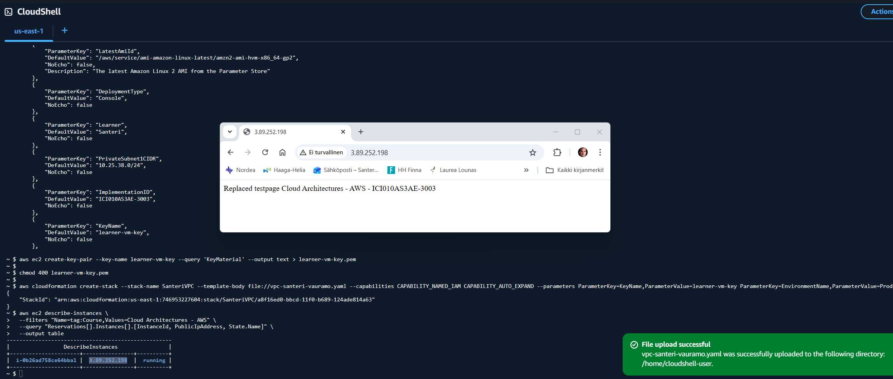

# Task 7: VM Provisioning

### Upload the CloudFormation template "vpc-santeri-vauramo.yaml" to AWS Learner Lab Cloudshell

### Run the following CLI commands to create stack and keys, and hide the key from public:
```bash
aws cloudformation validate-template --template-body file://vpc-santeri-vauramo.yaml
```
```bash
aws ec2 create-key-pair --key-name learner-vm-key --query 'KeyMaterial' --output text > learner-vm-key.pem
chmod 400 learner-vm-key.pem
aws cloudformation create-stack --stack-name SanteriVPC --template-body file://vpc-santeri-vauramo.yaml --capabilities CAPABILITY_NAMED_IAM CAPABILITY_AUTO_EXPAND --parameters ParameterKey=KeyName,ParameterValue=learner-vm-key ParameterKey=EnvironmentName,ParameterValue=Production
```

### Check the IP of the EC2 instance by searching by Course tag, or check it out from AWS GUI console
```bash
aws ec2 describe-instances \
  --filters "Name=tag:Course,Values=Cloud Architectures - AWS" \
  --query "Reservations[].Instances[].[InstanceId, PublicIpAddress, State.Name]" \
  --output table
```

### Update package list, install apache2, replace test page, give Apache rights to view and execute files, enable Apache on startup, and launch it.

### These have been added to the EC2 instances user data. Since user data is run as root, when installing Apache, the permissions will go explicictly to root, so here we give Apache the right permissions for the files.
```yaml
      UserData: !Base64 |
        #!/bin/bash
        yum update -y
        yum install -y httpd
        echo Replaced testpage Cloud Architectures - AWS - ICI010AS3AE-3003|tee /var/www/html/index.html
        chgrp -R apache /var/www/html/
        chmod -R 750 /var/www/html/
        chmod g+s /var/www/html/ #This makes sure that all future files in here will have the same rights.
        systemctl enable httpd
        systemctl start httpd
```

### Wait for status checks to complete. Navigate to EC2 ip "http://<instanceIP>", you will see the overwritten test page if all is correct.




---

- Based on [Public Cloud Solution Architect](https://pekkakorpi-tassi.fi/courses/pkt-arc/pkt-arc-edu-olt-2025-1e/course.html) course by **Pekka Korpi-Tassi** 2025.
- [Project Prep Tasks](https://pekkakorpi-tassi.fi/courses/pkt-arc/pkt-arc-edu-olt-2025-1e/iac_deployment.html).

Written by **Santeri Vauramo** 2025.
