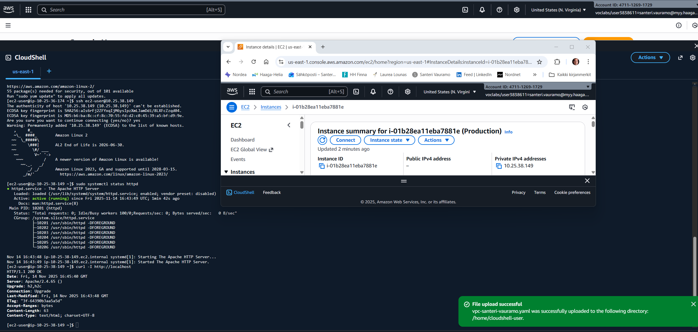

# Task 9: NAT Gateway

### Task goals:

- You need to have Public Subnet and Private Subnet
- Setup NAT Gateway to Public Subnet (Route Tables for Public and Private Subnets are important)
- Create VM to Private Subnet and run app install CLI commands as user data
- Application is downloaded from Internet even if VM is in Private Subnet
- Application install must succeed
- You need to find a way to access VM in Private Subnet
- Run cli commands locally on VM in Private Subnet to verify install succeeded
- Include screenshot about succesfull CLI test on VM to README.txt

---

### NAT Gateway

- I moved the EC2 instance to PrivateSubnet1 and created a PrivateInstanceSecurityGroup.
- Created NatGateway1EIP (Elastic IP).
- Created NatGateway1 in PublicSubnet1.
- Created DefaultPrivateRoute1 referring to PrivateRouteTable1 and NatGateway1 with destination CIDR block 0.0.0.0/0. This gives PrivateSubnet1 access to internet through NatGateway1.
- Gave EC2 instance dependencies to create the resource only after NatGateway1, DefaultPrivateRoute1, and PrivateSubnet1RouteTableAssociation are created.

These have been added to the template:

```yaml
NatGateway1EIP:
Type: AWS::EC2::EIP
DependsOn: InternetGatewayAttachment
Properties:
  Domain: vpc

NatGateway1:
Type: AWS::EC2::NatGateway
Properties:
  AllocationId: !GetAtt NatGateway1EIP.AllocationId
  SubnetId: !Ref PublicSubnet1
  
DefaultPublicRoute:
Type: AWS::EC2::Route
DependsOn: InternetGatewayAttachment
Properties:
  RouteTableId: !Ref PublicRouteTable
  DestinationCidrBlock: 0.0.0.0/0
  GatewayId: !Ref InternetGateway
  
SanteriEC2:
Type: AWS::EC2::Instance
DependsOn: 
  - NatGateway1
  - DefaultPrivateRoute1
  - PrivateSubnet1RouteTableAssociation
Properties:
  InstanceType: !Ref InstanceType
  KeyName: !Ref KeyName
  ImageId: !FindInMap [RegionMap, !Ref 'AWS::Region', AMI]
  SubnetId: !Ref PrivateSubnet1
  SecurityGroupIds:
	- !Ref PrivateInstanceSecurityGroup
```

### Connecting to the EC2 instance in the private subnet

With these changes I had the stack created succesfully. Now I still have to be able to connect to the EC2 instance.

I was searching around [AWS documentation](https://docs.aws.amazon.com/AWSEC2/latest/UserGuide/connect-with-ec2-instance-connect-endpoint.html) for a solution. They mention using an EC2 Instance Connect Endpoint Service.

However, I want to do this in a different way. [Medium.com](https://medium.com/adessoturkey/how-to-connect-to-private-ec2-instance-database-via-bastion-host-5b05a256f9f7) gives good instructions how to set up a basion host. I am going to try this.

- I will use the same key pair, and same image types.
- Only difference to the other EC2 instance is: name, security group, subnet, and no user data:

```yaml
  BastionHost:
    Type: AWS::EC2::Instance
    Properties:
      InstanceType: !Ref InstanceType
      KeyName: !Ref KeyName
      ImageId: !FindInMap [RegionMap, !Ref 'AWS::Region', AMI]
      SubnetId: !Ref PublicSubnet1
      SecurityGroupIds:
        - !Ref InstanceSecurityGroup
```

- Security group for the private instance:

```yaml
  PrivateInstanceSecurityGroup:
    Type: AWS::EC2::SecurityGroup
    Properties:
      GroupDescription: "Private instance security group"
      VpcId: !Ref SanteriVPC
      SecurityGroupIngress:
        - IpProtocol: tcp
          FromPort: 22
          ToPort: 22
          SourceSecurityGroupId: !Ref PublicInstanceSecurityGroup
```

### How to implement

- Upload the CloudFormation template "vpc-santeri-vauramo.yaml" to AWS Learner Lab Cloudshell or SandBox. I actually did this in the SandBox, since it's much faster to start from scratch. This is handy when fixing errors and testing overall usability.
- Run the following CLI commands to validate-template, create stack and keys, and hide the key from public:

```bash
aws cloudformation validate-template --template-body file://vpc-santeri-vauramo.yaml
```
```bash
aws ec2 create-key-pair --key-name learner-vm-key --query 'KeyMaterial' --output text > learner-vm-key.pem
chmod 400 learner-vm-key.pem
aws cloudformation create-stack --stack-name SanteriVPC --template-body file://vpc-santeri-vauramo.yaml --capabilities CAPABILITY_NAMED_IAM CAPABILITY_AUTO_EXPAND --parameters ParameterKey=KeyName,ParameterValue=learner-vm-key ParameterKey=EnvironmentName,ParameterValue=Production
```

- Wait for stack to be created.
- Check the IPv4 addesses of the instances in the AWS GUI console (BastionHost public, SanteriEC2 private):
- Start SSH authN agent, load key to the agent.
- SSH to BastionHost with -A (agent forwarding) --> SSH to SanteriEC2:

```bash
eval $(ssh-agent)
ssh-add ~/learner-vm-key.pem
ssh -A ec2-user@BastionHost-public-ip
ssh ec2-user@SanterEC2-private-ip
```

- Test Apache status and curl localhost header to see that the installation was succesful:

```bash
sudo systemctl status httpd
curl -I http://localhost
```



### The template file:

```yaml
AWSTemplateFormatVersion: '2010-09-09'
Description:  Task 9

Parameters:
  EnvironmentName:
    Description: VPC Networking
    Type: String

  LatestAmiId:
    Description: The latest Amazon Linux 2 AMI from the Parameter Store
    Type: 'AWS::SSM::Parameter::Value<AWS::EC2::Image::Id>'
    Default: '/aws/service/ami-amazon-linux-latest/amzn2-ami-hvm-x86_64-gp2'

  VpcCIDR:
    Type: String
    Default: 10.25.36.0/22

  PublicSubnet1CIDR:
    Type: String
    Default: 10.25.36.0/24

  PublicSubnet2CIDR:
    Type: String
    Default: 10.25.37.0/24

  PrivateSubnet1CIDR:
    Type: String
    Default: 10.25.38.0/24

  PrivateSubnet2CIDR:
    Type: String
    Default: 10.25.39.0/24

  Course:
    Type: String
    Default: 'Cloud Architectures - AWS'

  ImplementationID:
    Type: String
    Default: 'ICI010AS3AE-3003'

  Task:
    Type: String
    Default: 'Task 9'

  Learner:
    Type: String
    Default: 'Santeri'

  KeyName:
    Type: AWS::EC2::KeyPair::KeyName
    Default: learner-vm-key

  DeploymentType:
    Type: String
    Default: 'Console'
    AllowedValues:
      - Console
      - CLI
      - IaC
      - IaC with Configuration Management
      - CI/CD
      - CI/CD with Configuration Management
    ConstraintDescription: Type of deployment of the resources

  InstanceType:
    Description: EC2 instance type
    Type: String
    Default: t3.nano
    AllowedValues:
      - t2.nano
      - t2.micro
      - t2.small
      - t3.nano
      - t3.micro
      - t3.small
    ConstraintDescription: EC2 instance types supported by AWS Sandbox

Mappings:
  RegionMap:
    us-east-1:
      AMI: ami-0c02fb55956c7d316
    us-east-2:
      AMI: ami-0fb653ca2d3203ac1
    us-west-1:
      AMI: ami-0d382e80be7ffdae5
    us-west-2:
      AMI: ami-083ac7c7ecf9bb9b0
    eu-west-1:
      AMI: ami-0c1c30571d2dae5c9
    eu-central-1:
      AMI: ami-0dcc0ebde7b2e00db
    ap-southeast-1:
      AMI: ami-0fa377108253bf620
    ap-northeast-1:
      AMI: ami-0d52744d6551d851e

Resources:

  SanteriVPC:
    Type: AWS::EC2::VPC
    Properties:
      CidrBlock: !Ref VpcCIDR
      EnableDnsSupport: true
      EnableDnsHostnames: true
      Tags:
        - Key: Name
          Value: !Ref EnvironmentName
        - Key: AccountId
          Value: !Ref "AWS::AccountId"
        - Key: Region
          Value: !Ref "AWS::Region"
        - Key: StackName
          Value: !Ref AWS::StackName
        - Key: Course
          Value: !Ref Course
        - Key: ImplementationID
          Value: !Ref ImplementationID
        - Key: Learner
          Value: !Ref Learner
        - Key: Task
          Value: !Ref Task
        - Key: DeploymentType
          Value: !Ref DeploymentType

  PublicInstanceSecurityGroup:
    Type: AWS::EC2::SecurityGroup
    Properties:
      GroupDescription: "Enable SSH, HTTP, and HTTPS access"
      VpcId: !Ref SanteriVPC
      SecurityGroupIngress:
        - IpProtocol: tcp
          FromPort: 22
          ToPort: 22
          CidrIp: 0.0.0.0/0
        - IpProtocol: tcp
          FromPort: 80
          ToPort: 80
          CidrIp: 0.0.0.0/0
        - IpProtocol: tcp
          FromPort: 443
          ToPort: 443
          CidrIp: 0.0.0.0/0
      SecurityGroupEgress:
        - IpProtocol: -1
          CidrIp: 0.0.0.0/0

  PrivateInstanceSecurityGroup:
    Type: AWS::EC2::SecurityGroup
    Properties:
      GroupDescription: "Private instance security group"
      VpcId: !Ref SanteriVPC
      SecurityGroupIngress:
        - IpProtocol: tcp
          FromPort: 22
          ToPort: 22
          SourceSecurityGroupId: !Ref PublicInstanceSecurityGroup
      SecurityGroupEgress:
        - IpProtocol: -1
          CidrIp: 0.0.0.0/0

  InternetGateway:
    Type: AWS::EC2::InternetGateway
    Properties:
      Tags:
        - Key: Name
          Value: !Ref EnvironmentName
        - Key: AccountId
          Value: !Ref "AWS::AccountId"
        - Key: Region
          Value: !Ref "AWS::Region"
        - Key: StackName
          Value: !Ref AWS::StackName
        - Key: Course
          Value: !Ref Course
        - Key: ImplementationID
          Value: !Ref ImplementationID
        - Key: Learner
          Value: !Ref Learner
        - Key: Task
          Value: !Ref Task
        - Key: DeploymentType
          Value: !Ref DeploymentType

  InternetGatewayAttachment:
    Type: AWS::EC2::VPCGatewayAttachment
    Properties:
      VpcId: !Ref SanteriVPC
      InternetGatewayId: !Ref InternetGateway

  PublicSubnet1:
    Type: AWS::EC2::Subnet
    Properties:
      VpcId: !Ref SanteriVPC
      AvailabilityZone: !Select [ 0, !GetAZs '' ]
      CidrBlock: !Ref PublicSubnet1CIDR
      MapPublicIpOnLaunch: true
      Tags:
        - Key: Name
          Value: !Sub ${EnvironmentName} Public Subnet (AZ1)
        - Key: AccountId
          Value: !Ref "AWS::AccountId"
        - Key: Region
          Value: !Ref "AWS::Region"
        - Key: StackName
          Value: !Ref AWS::StackName
        - Key: Course
          Value: !Ref Course
        - Key: ImplementationID
          Value: !Ref ImplementationID
        - Key: Learner
          Value: !Ref Learner
        - Key: Task
          Value: !Ref Task
        - Key: DeploymentType
          Value: !Ref DeploymentType

  BastionHost:
    Type: AWS::EC2::Instance
    Properties:
      InstanceType: !Ref InstanceType
      KeyName: !Ref KeyName
      ImageId: !FindInMap [RegionMap, !Ref 'AWS::Region', AMI]
      SubnetId: !Ref PublicSubnet1
      SecurityGroupIds:
        - !Ref PublicInstanceSecurityGroup
      Tags:
        - Key: Name
          Value: !Ref EnvironmentName
        - Key: AccountId
          Value: !Ref "AWS::AccountId"
        - Key: Task
          Value: !Ref Task
        - Key: DeploymentType
          Value: !Ref DeploymentType


  NatGateway1EIP:
    Type: AWS::EC2::EIP
    DependsOn: InternetGatewayAttachment
    Properties:
      Domain: vpc

  NatGateway1:
    Type: AWS::EC2::NatGateway
    Properties:
      AllocationId: !GetAtt NatGateway1EIP.AllocationId
      SubnetId: !Ref PublicSubnet1

  PublicSubnet2:
    Type: AWS::EC2::Subnet
    Properties:
      VpcId: !Ref SanteriVPC
      AvailabilityZone: !Select [ 1, !GetAZs  '' ]
      CidrBlock: !Ref PublicSubnet2CIDR
      MapPublicIpOnLaunch: true
      Tags:
        - Key: Name
          Value: !Sub ${EnvironmentName} Public Subnet (AZ2)
        - Key: AccountId
          Value: !Ref "AWS::AccountId"
        - Key: Region
          Value: !Ref "AWS::Region"
        - Key: StackName
          Value: !Ref AWS::StackName
        - Key: Course
          Value: !Ref Course
        - Key: ImplementationID
          Value: !Ref ImplementationID
        - Key: Learner
          Value: !Ref Learner
        - Key: Task
          Value: !Ref Task
        - Key: DeploymentType
          Value: !Ref DeploymentType


  PrivateSubnet1:
    Type: AWS::EC2::Subnet
    Properties:
      VpcId: !Ref SanteriVPC
      AvailabilityZone: !Select [ 0, !GetAZs  '' ]
      CidrBlock: !Ref PrivateSubnet1CIDR
      MapPublicIpOnLaunch: false
      Tags:
        - Key: Name
          Value: !Sub ${EnvironmentName} Private Subnet (AZ1)
        - Key: AccountId
          Value: !Ref "AWS::AccountId"
        - Key: Region
          Value: !Ref "AWS::Region"
        - Key: StackName
          Value: !Ref AWS::StackName
        - Key: Course
          Value: !Ref Course
        - Key: ImplementationID
          Value: !Ref ImplementationID
        - Key: Learner
          Value: !Ref Learner
        - Key: Task
          Value: !Ref Task
        - Key: DeploymentType
          Value: !Ref DeploymentType


  PrivateSubnet2:
    Type: AWS::EC2::Subnet
    Properties:
      VpcId: !Ref SanteriVPC
      AvailabilityZone: !Select [ 1, !GetAZs  '' ]
      CidrBlock: !Ref PrivateSubnet2CIDR
      MapPublicIpOnLaunch: false
      Tags:
        - Key: Name
          Value: !Sub ${EnvironmentName} Private Subnet (AZ2)
        - Key: AccountId
          Value: !Ref "AWS::AccountId"
        - Key: Region
          Value: !Ref "AWS::Region"
        - Key: StackName
          Value: !Ref AWS::StackName
        - Key: Course
          Value: !Ref Course
        - Key: ImplementationID
          Value: !Ref ImplementationID
        - Key: Learner
          Value: !Ref Learner
        - Key: Task
          Value: !Ref Task
        - Key: DeploymentType
          Value: !Ref DeploymentType

  PublicRouteTable:
    Type: AWS::EC2::RouteTable
    Properties:
      VpcId: !Ref SanteriVPC
      Tags:
        - Key: Name
          Value: !Sub ${EnvironmentName} Public Routes

  DefaultPublicRoute:
    Type: AWS::EC2::Route
    DependsOn: InternetGatewayAttachment
    Properties:
      RouteTableId: !Ref PublicRouteTable
      DestinationCidrBlock: 0.0.0.0/0
      GatewayId: !Ref InternetGateway

  PublicSubnet1RouteTableAssociation:
    Type: AWS::EC2::SubnetRouteTableAssociation
    Properties:
      RouteTableId: !Ref PublicRouteTable
      SubnetId: !Ref PublicSubnet1

  PublicSubnet2RouteTableAssociation:
    Type: AWS::EC2::SubnetRouteTableAssociation
    Properties:
      RouteTableId: !Ref PublicRouteTable
      SubnetId: !Ref PublicSubnet2

  PrivateRouteTable1:
    Type: AWS::EC2::RouteTable
    Properties:
      VpcId: !Ref SanteriVPC

  DefaultPrivateRoute1:
    Type: AWS::EC2::Route
    Properties:
      RouteTableId: !Ref PrivateRouteTable1
      DestinationCidrBlock: 0.0.0.0/0
      NatGatewayId: !Ref NatGateway1

  PrivateSubnet1RouteTableAssociation:
    Type: AWS::EC2::SubnetRouteTableAssociation
    Properties:
      RouteTableId: !Ref PrivateRouteTable1
      SubnetId: !Ref PrivateSubnet1

  SanteriEC2:
    Type: AWS::EC2::Instance
    DependsOn: 
      - NatGateway1
      - DefaultPrivateRoute1
      - PrivateSubnet1RouteTableAssociation
    Properties:
      InstanceType: !Ref InstanceType
      KeyName: !Ref KeyName
      ImageId: !FindInMap [RegionMap, !Ref 'AWS::Region', AMI]
      SubnetId: !Ref PrivateSubnet1
      SecurityGroupIds:
        - !Ref PrivateInstanceSecurityGroup
      UserData: !Base64 |
        #!/bin/bash
        yum update -y
        yum install -y httpd
        echo "Replaced testpage Cloud Architectures - AWS - ICI010AS3AE-3003" | tee /var/www/html/index.html
        chgrp -R apache /var/www/html/
        chmod -R 750 /var/www/html/
        chmod g+s /var/www/html/ #This makes sure that all future files in here will have the same rights.
        systemctl enable httpd
        systemctl start httpd
      Tags:
        - Key: Name
          Value: !Ref EnvironmentName
        - Key: AccountId
          Value: !Ref "AWS::AccountId"
        - Key: Region
          Value: !Ref "AWS::Region"
        - Key: StackName
          Value: !Ref AWS::StackName
        - Key: Course
          Value: !Ref Course
        - Key: ImplementationID
          Value: !Ref ImplementationID
        - Key: Learner
          Value: !Ref Learner
        - Key: Task
          Value: !Ref Task
        - Key: DeploymentType
          Value: !Ref DeploymentType

  PrivateRouteTable2:
    Type: AWS::EC2::RouteTable
    Properties:
      VpcId: !Ref SanteriVPC
      Tags:
        - Key: Name
          Value: !Sub ${EnvironmentName} Private Routes (AZ2)

  PrivateSubnet2RouteTableAssociation:
    Type: AWS::EC2::SubnetRouteTableAssociation
    Properties:
      RouteTableId: !Ref PrivateRouteTable2
      SubnetId: !Ref PrivateSubnet2

  PublicNACL:
    Type: AWS::EC2::NetworkAcl
    Properties:
      VpcId: !Ref SanteriVPC
      Tags:
        - Key: AccountId
          Value: !Ref "AWS::AccountId"
        - Key: Region
          Value: !Ref "AWS::Region"
        - Key: StackName
          Value: !Ref AWS::StackName
        - Key: Course
          Value: !Ref Course
        - Key: ImplementationID
          Value: !Ref ImplementationID
        - Key: Learner
          Value: !Ref Learner
        - Key: Task
          Value: !Ref Task
        - Key: DeploymentType
          Value: !Ref DeploymentType
  SSHRule:
    Type: AWS::EC2::NetworkAclEntry
    Properties:
      NetworkAclId: !Ref PublicNACL
      RuleNumber: 100
      Protocol: 6
      RuleAction: allow
      CidrBlock: 0.0.0.0/0
      PortRange:
        From: 22
        To: 22
  HTTPSRule:
    Type: AWS::EC2::NetworkAclEntry
    Properties:
      NetworkAclId: !Ref PublicNACL
      RuleNumber: 110
      Protocol: 6
      RuleAction: allow
      CidrBlock: 0.0.0.0/0
      PortRange:
        From: 443
        To: 443
  HTTPRule:
    Type: AWS::EC2::NetworkAclEntry
    Properties:
      NetworkAclId: !Ref PublicNACL
      RuleNumber: 120
      Protocol: 6
      RuleAction: allow
      CidrBlock: 0.0.0.0/0
      PortRange:
        From: 80
        To: 80      
  PublicInBackRule:
    Type: AWS::EC2::NetworkAclEntry
    Properties:
      NetworkAclId: !Ref PublicNACL
      RuleNumber: 121
      Protocol: 6
      RuleAction: allow
      CidrBlock: 0.0.0.0/0
      PortRange:
        From: 1024
        To: 65535
  PublicOutboundSSH:
    Type: AWS::EC2::NetworkAclEntry
    Properties:
      NetworkAclId: !Ref PublicNACL
      RuleNumber: 80
      Protocol: 6
      RuleAction: allow
      CidrBlock: 0.0.0.0/0
      PortRange:
        From: 1024
        To: 65535
      Egress: true
  PublicOutboundHTTP:
    Type: AWS::EC2::NetworkAclEntry
    Properties:
      NetworkAclId: !Ref PublicNACL
      RuleNumber: 90
      Protocol: 6
      RuleAction: allow
      CidrBlock: 0.0.0.0/0
      PortRange:
        From: 80
        To: 80
      Egress: true
  PublicOutboundHTTPS:
    Type: AWS::EC2::NetworkAclEntry
    Properties:
      NetworkAclId: !Ref PublicNACL
      RuleNumber: 91
      Protocol: 6
      RuleAction: allow
      CidrBlock: 0.0.0.0/0
      PortRange:
        From: 443
        To: 443
      Egress: true
  PublicOutboundDNS:
    Type: AWS::EC2::NetworkAclEntry
    Properties:
      NetworkAclId: !Ref PublicNACL
      RuleNumber: 92
      Protocol: 6
      RuleAction: allow
      CidrBlock: 0.0.0.0/0
      PortRange:
        From: 53
        To: 53
      Egress: true
  PublicOutboundSSHToPrivate:
    Type: AWS::EC2::NetworkAclEntry
    Properties:
      NetworkAclId: !Ref PublicNACL
      RuleNumber: 95
      Protocol: 6
      RuleAction: allow
      CidrBlock: 10.25.38.0/24
      PortRange:
        From: 22
        To: 22
      Egress: true
  PublicOutboundEphemeralToPrivate:
    Type: AWS::EC2::NetworkAclEntry
    Properties:
      NetworkAclId: !Ref PublicNACL
      RuleNumber: 96
      Protocol: 6
      RuleAction: allow
      CidrBlock: 10.25.38.0/24
      PortRange:
        From: 1024
        To: 65535
      Egress: true

  PublicSubnet1NACLAssociation:
    Type: AWS::EC2::SubnetNetworkAclAssociation
    Properties:
      SubnetId: !Ref PublicSubnet1
      NetworkAclId: !Ref PublicNACL
  PublicSubnet2NACLAssociation:
    Type: AWS::EC2::SubnetNetworkAclAssociation
    Properties:
      SubnetId: !Ref PublicSubnet2
      NetworkAclId: !Ref PublicNACL

  PrivateNACL:
    Type: AWS::EC2::NetworkAcl
    Properties:
      VpcId: !Ref SanteriVPC
      Tags:
        - Key: AccountId
          Value: !Ref "AWS::AccountId"
        - Key: Region
          Value: !Ref "AWS::Region"
        - Key: StackName
          Value: !Ref AWS::StackName
        - Key: Course
          Value: !Ref Course
        - Key: ImplementationID
          Value: !Ref ImplementationID
        - Key: Learner
          Value: !Ref Learner
        - Key: Task
          Value: !Ref Task
        - Key: DeploymentType
          Value: !Ref DeploymentType
  PrivateSubnet1NACLAssociation:
    Type: AWS::EC2::SubnetNetworkAclAssociation
    Properties:
      SubnetId: !Ref PrivateSubnet1
      NetworkAclId: !Ref PrivateNACL
  PrivateSubnet2NACLAssociation:
    Type: AWS::EC2::SubnetNetworkAclAssociation
    Properties:
      SubnetId: !Ref PrivateSubnet2
      NetworkAclId: !Ref PrivateNACL

  PrivateEphemeralPortsInbound:
    Type: AWS::EC2::NetworkAclEntry
    Properties:
      NetworkAclId: !Ref PrivateNACL
      RuleNumber: 90
      Protocol: 6
      RuleAction: allow
      CidrBlock: 10.25.36.0/22
      PortRange:
        From: 1024
        To: 65535
      Egress: false
  PrivateSSHInbound:
    Type: AWS::EC2::NetworkAclEntry
    Properties:
      NetworkAclId: !Ref PrivateNACL
      RuleNumber: 100
      Protocol: 6
      RuleAction: allow
      CidrBlock: 10.25.36.0/22
      PortRange:
        From: 22
        To: 22
      Egress: false
  PrivateHTTPSInbound:
    Type: AWS::EC2::NetworkAclEntry
    Properties:
      NetworkAclId: !Ref PrivateNACL
      RuleNumber: 110
      Protocol: 6
      RuleAction: allow
      CidrBlock: 10.25.36.0/22
      PortRange:
        From: 443
        To: 443
      Egress: false
  PrivateHTTPInbound:
    Type: AWS::EC2::NetworkAclEntry
    Properties:
      NetworkAclId: !Ref PrivateNACL
      RuleNumber: 120
      Protocol: 6
      RuleAction: allow
      CidrBlock: 10.25.36.0/22
      PortRange:
        From: 80
        To: 80
      Egress: false
  PrivateDenyAllInbound:
    Type: AWS::EC2::NetworkAclEntry
    Properties:
      NetworkAclId: !Ref PrivateNACL
      RuleNumber: 200
      Protocol: -1
      RuleAction: deny
      CidrBlock: 0.0.0.0/0
      Egress: false
  PrivateAllowAllOutbound:
    Type: AWS::EC2::NetworkAclEntry
    Properties:
      NetworkAclId: !Ref PrivateNACL
      RuleNumber: 95
      Protocol: -1
      RuleAction: allow
      CidrBlock: 10.25.36.0/22
      Egress: true
  PrivateOutboundToInternet:
    Type: AWS::EC2::NetworkAclEntry
    Properties:
      NetworkAclId: !Ref PrivateNACL
      RuleNumber: 80
      Protocol: -1
      RuleAction: allow
      CidrBlock: 0.0.0.0/0
      Egress: true
  PrivateEphemeralReturn:
    Type: AWS::EC2::NetworkAclEntry
    Properties:
      NetworkAclId: !Ref PrivateNACL
      RuleNumber: 130
      Protocol: 6
      RuleAction: allow
      CidrBlock: 0.0.0.0/0
      PortRange:
        From: 1024
        To: 65535
      Egress: false
      
  NoIngressSecurityGroup:
    Type: AWS::EC2::SecurityGroup
    Properties:
      GroupName: "no-ingress-sg"
      GroupDescription: "Security group with no ingress rule"
      VpcId: !Ref SanteriVPC

Outputs:
  VPC:
    Description: A reference to the created VPC
    Value: !Ref SanteriVPC

  PublicSubnets:
    Description: A list of the public subnets
    Value: !Join [ ",", [ !Ref PublicSubnet1, !Ref PublicSubnet2 ]]

  PrivateSubnets:
    Description: A list of the private subnets
    Value: !Join [ ",", [ !Ref PrivateSubnet1, !Ref PrivateSubnet2 ]]

  PublicSubnet1:
    Description: A reference to the public subnet in the 1st Availability Zone
    Value: !Ref PublicSubnet1

  PublicSubnet2:
    Description: A reference to the public subnet in the 2nd Availability Zone
    Value: !Ref PublicSubnet2

  PrivateSubnet1:
    Description: A reference to the private subnet in the 1st Availability Zone
    Value: !Ref PrivateSubnet1

  PrivateSubnet2:
    Description: A reference to the private subnet in the 2nd Availability Zone
    Value: !Ref PrivateSubnet2

  NoIngressSecurityGroup:
    Description: Security group with no ingress rule
    Value: !Ref NoIngressSecurityGroup

  InstanceIdSanteriEC2:
    Description: 'Instance ID of the Linux VM'
    Value: !Ref SanteriEC2

  InstanceIdBastionHost:
    Description: 'Instance ID of the Bastion Host Linux VM'
    Value: !Ref BastionHost

```

---

This document may be copied and modified in accordance with the GNU General Public License (version 2 or later). [http://www.gnu.org/licenses/gpl.html](http://www.gnu.org/licenses/gpl.html)

- Based on [Public Cloud Solution Architect](https://pekkakorpi-tassi.fi/courses/pkt-arc/pkt-arc-edu-olt-2025-1e/course.html) course by **Pekka Korpi-Tassi** 2025.
- [Project Prep Tasks](https://pekkakorpi-tassi.fi/courses/pkt-arc/pkt-arc-edu-olt-2025-1e/iac_deployment.html).

Written by **Santeri Vauramo** 2025.
