## x) Lue ja tiivistä

[Command Line Basics Revisited](https://terokarvinen.com/2020/command-line-basics-revisited/?fromSearch=command%20line%20basics%20revisited) [Linkki lisätty jälkikäteen 3.10.2024]

- Linuxin <mark>komentokehote</mark> on vanhempi kuin internet itse, se on erittäin <mark>kätevä</mark> työkalu. 
- $ merkki ilmaisee, että olemme komentokehotteessa, sitä ei itse kirjoiteta. 
- Komentokehotteessa olemme aina jossakin kansiossa, <mark>"cd" ja "cd .."</mark> liikutaan kansioissa ylös ja alas. "pwd" kertoo nykyisen sijainnin, "ls" tulostaa kansion sisällön, "less" komennolla voidaan selata tietoja sivu kerrallaan. 
- "mkdir" luo kansion, "mv" siirtää tai nimeää kansion uudelleen, "cp -r" kopioi kansiosta kansioon sisältöineen, "rmdir" poistaa tyhjän kansion, "rm" poistaa tiedoston, "rm -r" poistaa kansion sisältöineen. 
- SSH <mark>etähallinta</mark>: "ssh foo@esimerkki.fi" <- hallitset etäyhteydellä toista tietokonetta kuin omaasi, "w" näyttää muut käyttäjät palvelimella, "remotecomputer$ exit" poistuu etäyhteydestä. "scp -r KANSIO foo@esimerkki.fi:public_html/" kopioi kansion omalta koneelta etäpalvelimeen. 
-  <mark>"man"</mark> komennolla voi lukea komentojen ohjeita, manuaalit näkyvät "less" tilassa, välilyönti ja "b" navigoi ylös ja alas sivun kerrallaan, "q":lla pääsee pois. 
- Tab täyttää keskeneräisen komennon, kätevä tiedostonimien oikeinkirjoitukseen. Ylös- ja alaspäin nuolilla voi selata käytettäviä komentoja, vasen- ja oikea liikkuu komentorivillä. "history" näyttää aiemmat komentosi. 
- Kannattaa aina käyttää mahdollisimman pieniä oikeuksia. Kuitenkin jotkut toiminnot vaativat korkeampia oikeuksia, näitä suoritetaan "sudo" komennolla. (Karvinen 2020.)  
Huomasin, että selatessa "less" komennolla pitkää listaa, pystyin myös hiiren rullalla liikkumaan ylös ja alas rivin kerrallaan. 

## a) Micro

Ehdin jo tunnilla asentaa micro-editorin, joten nyt poistan sen ja asennan uudelleen. 
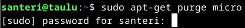

 
Nyt voidaan asentaa micro uudelleen komennolla <mark>"sudo apt-get -y install micro"</mark> 

## b) Apt

1. Tetris peli nimeltä Bastet: 
"sudo apt install bastet", tämän jälkeen peli käynnistyy komennolla "bastet" 

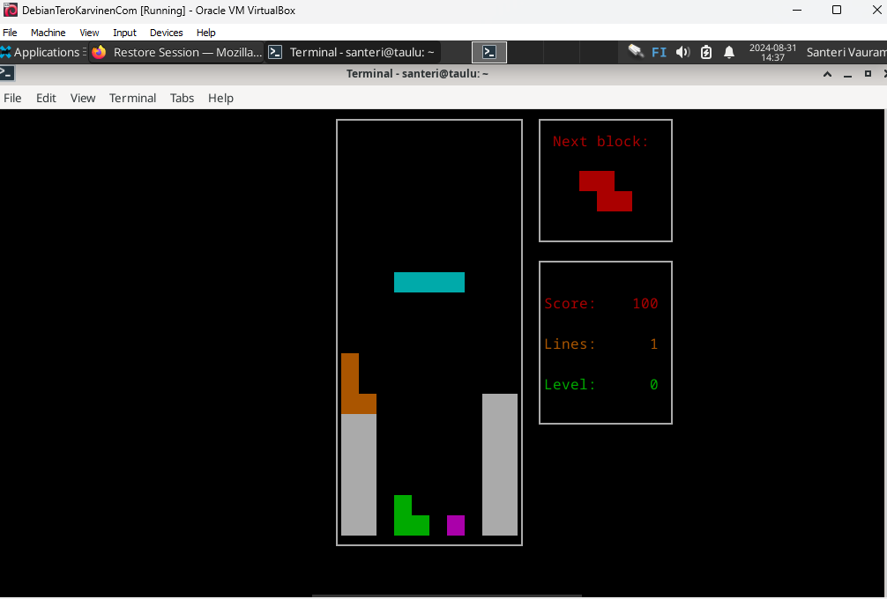 
https://itsfoss.com/best-command-line-games-linux/  

2. nethack console: 
"sudo apt-get -y install nethack-console" 
"nethack-console" ja en jää pelaamaan, kokeilen vain akateemisista syistä. 

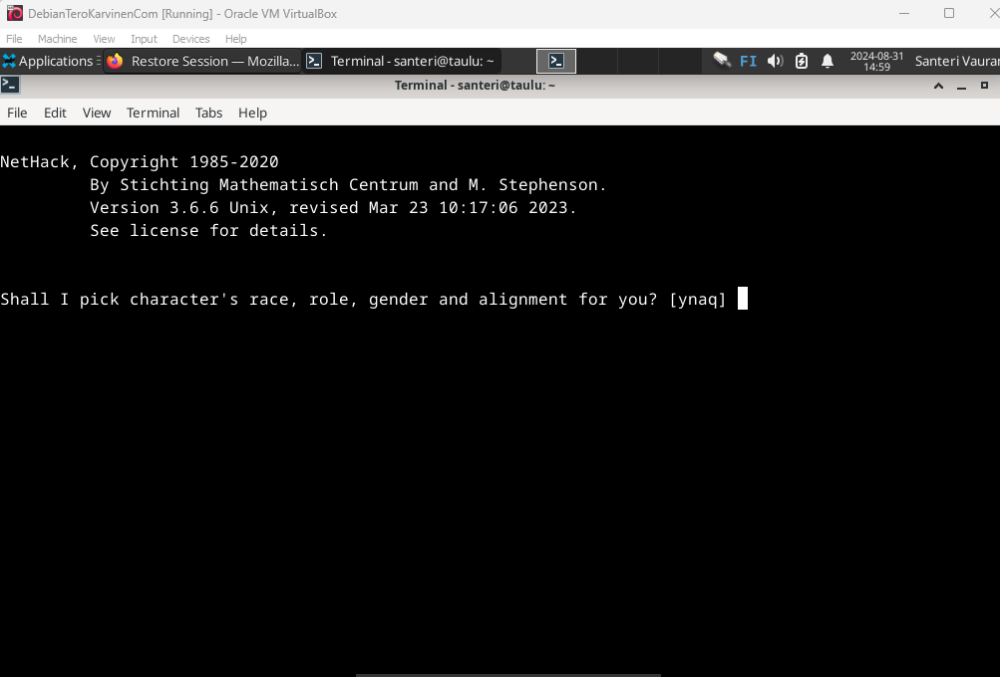 

3. meritous: 
"apt-cache search dungeon adventure" 
 

"sudo apt-get -y install meritous" 
komento "meritous" käynnistää pelin. 

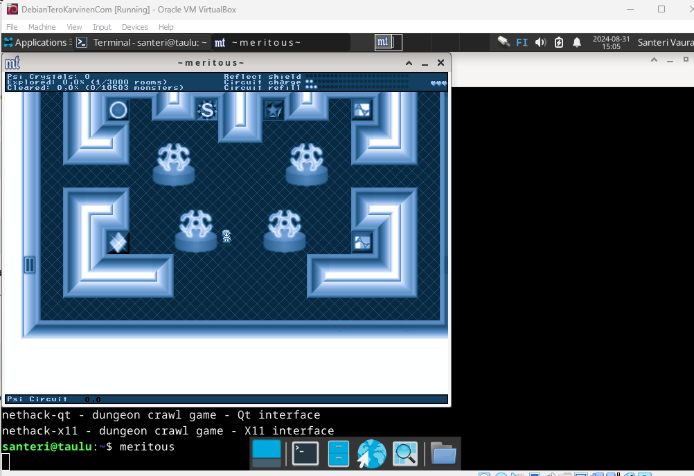 
Tämä ei muuten taida olla komentoriviohjelma, hups.

## c) FHS

1. Liikutaan juurikansioon käyttäen "cd .." komentoa. "pwd":llä tarkistetaan sijainti. "ls":llä nähdään kansion sisältö.  
 

2. Mennään /home kansioon "cd home" 
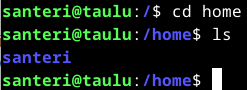 

3. Käyttäjäkansioon santeri "cd santeri"  
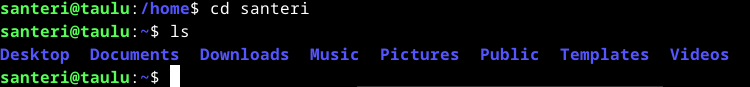 

4. Juurikansioon ja sieltä /etc. "cd ..":llä kunnes ollaan juurikansiossa ja sieltä "cd etc" 
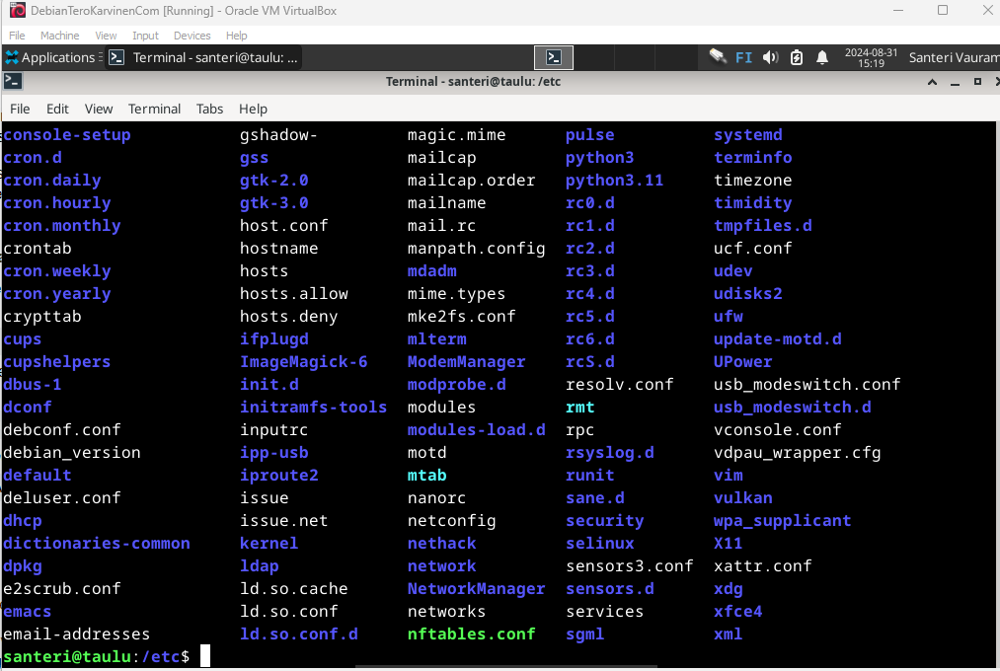 

5. /media/ 
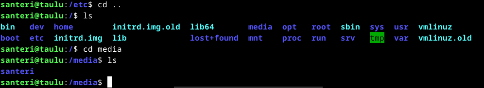 

6. /var/log/ 
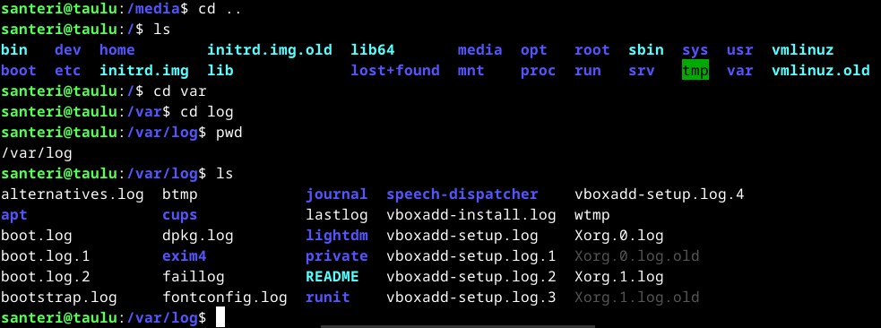

## d) The Friendly M

Luen "man grep" komennolla tietoa grep:stä. En ihan täysin vielä pääse jutun juuresta kiinni, joten jatkan tiedon hakua internetistä. https://www.howtogeek.com/496056/how-to-use-the-grep-command-on-linux/
sivulla kerrotaan hieman ihmisläheisemmällä tavalla grep:stä. 
Loin kansion nimeltä "tekstii" ja tein sinne "teksti.txt" tiedoston micro editorilla ja kirjoitin tiedostoon tekstejä eri riveille, 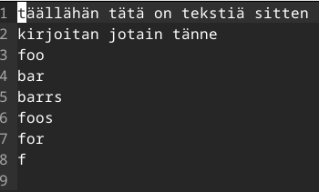
 
ctrl+s tallensin tiedoston, micro editor sulkeutuu ctrl+q https://itsfoss.com/content/images/wordpress/2022/08/micro-command-line-text-editor-cheat-sheet.pdf.  Etsin grep:llä tiedostosta rivit, jotka sisältävät f-kirjaimen. 
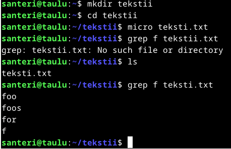 

Seuraavaksi kokeillaan "-v" optiota, joka etsii kaikki rivit, joissa ei ole jotain tiettyä asiaa, tässä tapauksessa sana:"foo". 
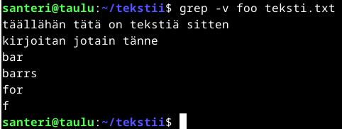 

Viimeisenä kokeillaan "-o" optiota, joka poimii ainoastaan täydelliset vastaavuudet ja tulostaa ainoastaan haetun tekstin: "tä". 

## e) Pipe

Luetaan ensin putkista lisää täältä: https://www.howtogeek.com/438882/how-to-use-pipes-on-linux/. 
Putkilla ("pipes"/"pipe"), merkillä "|" saadaan liitettyä eri komentoja toisiinsa, esimerkiksi: 
Yksinkertaisimmillaan "ls|less" komennolla voidaan tutkia kansion sisältöä sivu kerrallaan. 
 
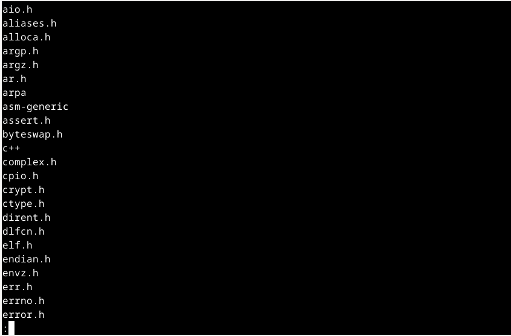

## f) Rauta

Asensin lshw:n eilen. Nyt kokeillaan "sudo lshw -short -sanitize" 
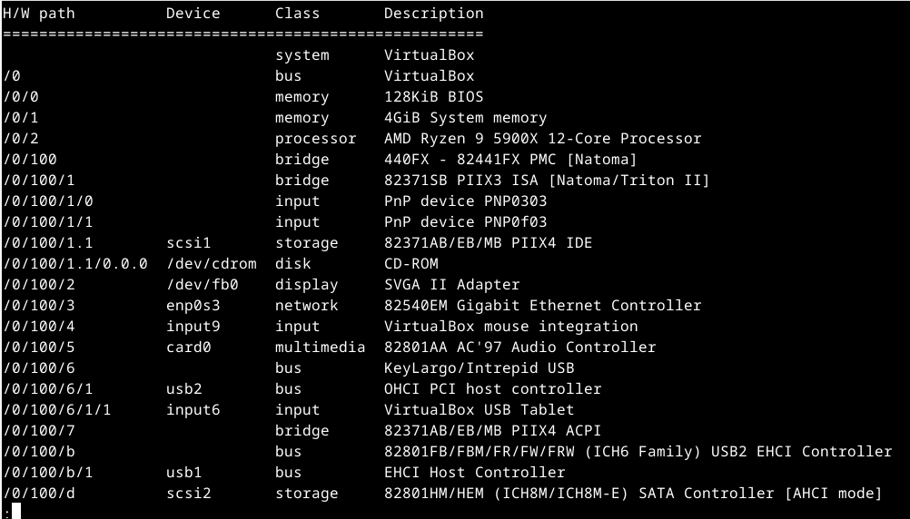 
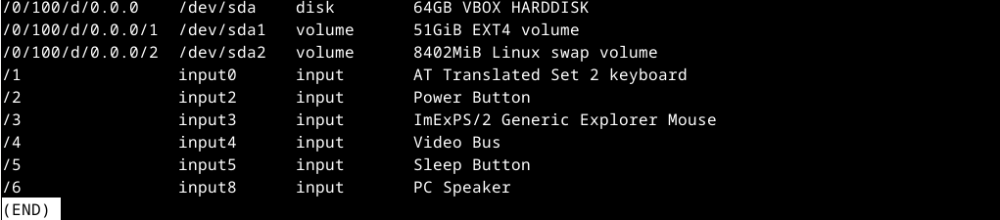 
Kuvassa näkyy VirtualBox väylä ja järjestelmä.  4Gib RAM muistia, jonka annoin virtuaalikoneelle. Erikoisesti tuossa näkyy kuitenkin prosessorina fyysinen AMD Ryzen 9 5900X 12-Core Processor. 
Disk on käsittääkseni virtuaaliasema, kuin myös display: SVGA II Adapter. 
Network on Gigabit verkkokorttini. 
Näyttää menevän ristiin fyysiset ja virtuaaliset komponentit tässä, osa on fyysisiä tietokoneen komponentteja ja osa taas täysin virtuaalisia.

## g) 

Kokeillaan "journalctl -f" 
 
Ylimpänä näkyy edellinen "lshw..." komento. Tässä näkyy kätevästi kaikkien tapahtumien kellonajat. Kauheasti muuta tästä en ymmärrä tässä vaiheessa. 
Erikoinen asia on, että nyt olen vielä tuolla lokissa, mutta en keksi miten pääsen pois. Pikainen Googlaus sivulle: https://askubuntu.com/questions/1175893/after-viewing-logs-with-journalctl-how-do-i-exit-the-screen-that-says-lines-1, kerrotaan että ctrl+c komennolla pääsee pois, ja näin on, kyllä tämä tunnillakin kerrottiin, mutta kaikkea ei muista heti: 
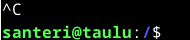  

Kokeilin myös "sudo journalctl" komentoa, tuli niin paljon tietoa että ei ymmärrä paljoakaan. Varmaan **vianselvityksessä** tuolla komennolla voi **löytää tärkeitä asioita**. [3.10.2024 osa tekstistä lihavoitu]

## h)

https://github.com/micro-editor/plugin-channel täältä löysin "wc" nimisen pluginin. Nimestään huolimatta se ei loihdi wc:tä käyttöön vaan laskee sanojen ja merkkien määrän. 
Täältä: https://micro-editor.github.io/plugins.html vielä ohjeet, kuinka asennetaan tuo plugin. 
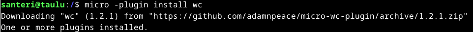 
Nyt kun wc plugin on asennettu, mennään micro editoriin samaiseen tekstitiedostoon. 
En meinannut löytää Googlaamalla ohjeita, miten wc pluginia käytetään joten kysyin ChatGPT:ltä: 
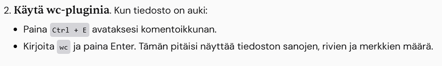 
Hämmästyksekseni se tiesi miten wc toimii. 
Painetaan ctrl+e, jolla päästään komentoriville alhaalla. Kirjoitetaan "wc", nyt näemme micro editorissa rivien, sanojen ja merkkien määrän. 
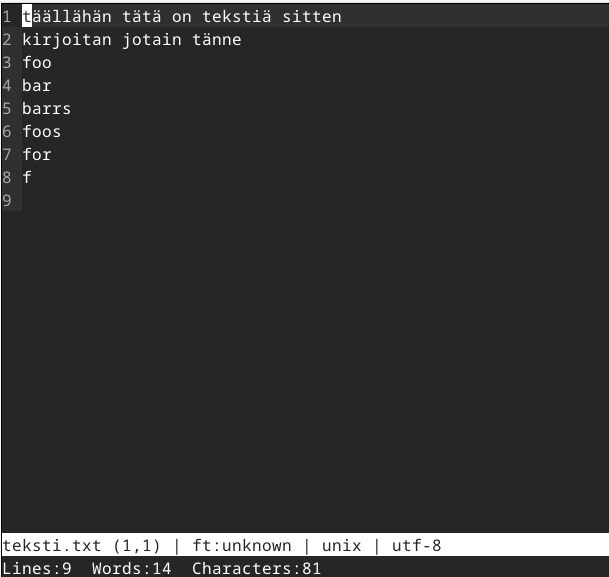  

Huom. nyt veikkaan tietäväni, miksi tehtävässä ehdotettiin kokeiltaviksi plugineiksi run, palettero, tai cheat: 
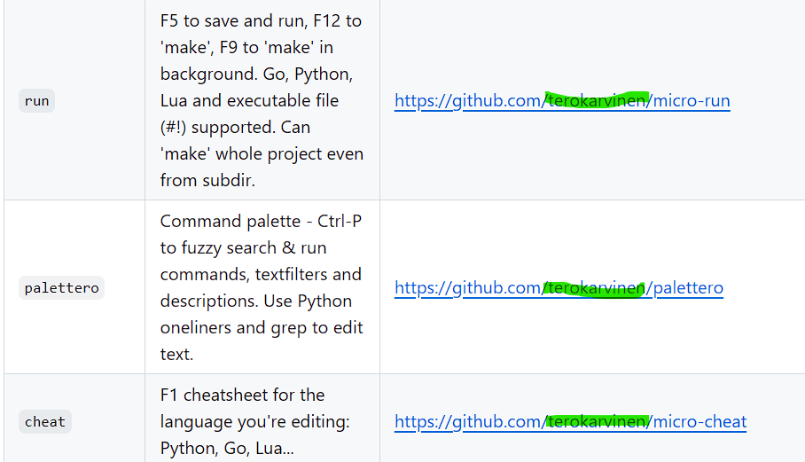 
Kuva: https://github.com/micro-editor/plugin-channel?tab=readme-ov-file

### Lähteet

Karvinen, T. 2020. Command Line Basics Revisited. Luettavissa: https://terokarvinen.com/2020/command-line-basics-revisited/?fromSearch=command%20line%20basics%20revisited. Luettu 31.8.2024 
McKay, D. 2023. How to Use the grep Command on Linux. Luettavissa: https://www.howtogeek.com/496056/how-to-use-the-grep-command-on-linux/. Luettu 1.9.2024
  

Tätä dokumenttia saa kopioida ja muokata GNU General Public License (versio 2 tai uudempi) mukaisesti. http://www.gnu.org/licenses/gpl.html 
Pohjana Tero Karvinen 2012: Linux kurssi, http://terokarvinen.com 
<em>Santeri Vauramo 2024</em>
