# h5 Nimekäs

#### Oma Host kokoonpanoni:

| Komponentti | Kuvaus | Lisätiedot |
| :---        |    :----:   |          ---: |
| Emolevy | MSI B550-A PRO | ATX, AM4 |
| Prosessori   | AMD Ryzen 9 5900X | 12-Core 3.70 GHz |
| RAM   | G.Skill  Ripjaws V |  32GB (4x8GB) DDR4 3600MHz, CL 16, 1.3  |
| Näytönohjain   | Sapphire PULSE AMD Radeon RX 7900 GRE        | 16GB     |
| Kovalevy   | Kingston 1TB        | A2000 NVMe PCIe SSD M.2      |
| Kovalevy   | Crucial 512GB        | MX100 SSD     |
| Kovalevy   | Crucial 256GB        | MX100 SSD     |
| Virtalähde   | Asus 750W TUF Gaming Gold        | ATX 80 Plus      |
| Kotelo   | Phanteks Enthoo Pro       |  Full Tower      |

Käyttöjärjestelmä: Windows 11 Pro 23H2

## aa-) Tämä ei kuulu tehtävänantoon 

*20.9.2024 klo 16:55*

#### Edellisenä läksynä vuokrasin DigitalOceanista palvelimen, joka sijaitsee Saksassa. Nyt kun viime oppitunnilla käytiin läpi SSH-avaimella kirjautuminen, vuokraan palvelimen UpCloudista, koska haluan kotimaisen palvelimen.

Aluksi käyn DigitalOceanissa poistamassa aiemmin vuokraamani "Dropletin"

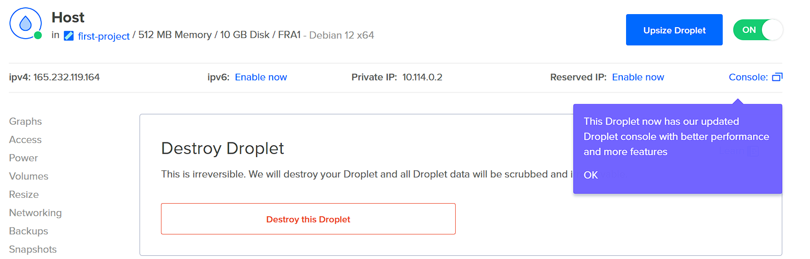

Nyt, kun vanha palvelin on tuhottu, on aika käydä luomassa SSH-avainpari virtuaalikoneelleni luennolla tekemieni muistiinpanojen avulla:

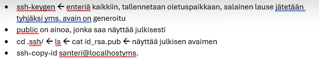

Luonnin jälkeen käyn kopioimassa julkisen avaimen UpCloud-palvelimen luontia varten.

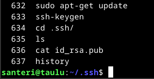

UpCloud haluaa aluksi varmistaa että en ole robotti:

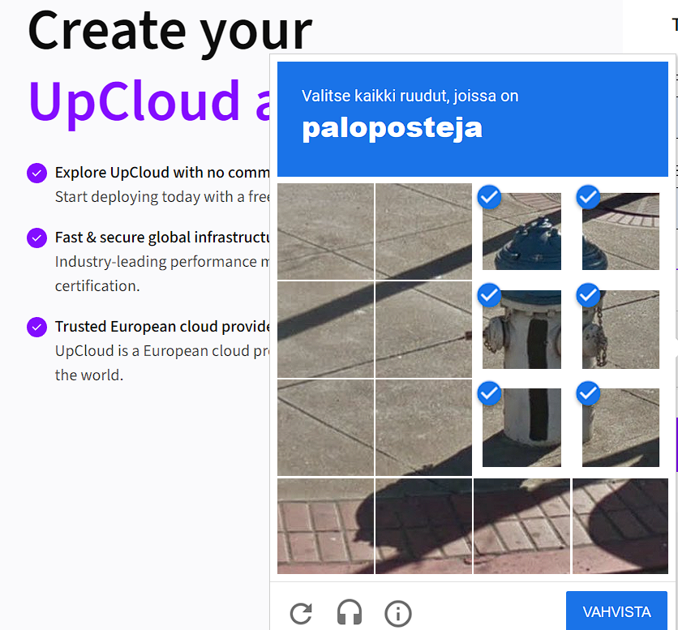

Aloitetaan palvelimen vuokraaminen: ``+Deploy a new server``, valitsen sijainniksi Helsinki, halvin mahdollinen 3€/kk maksava palvelin riittää mainiosti, sillä se on parempi kuin kalliimpi halvin palvelin DigitalOceanissa.

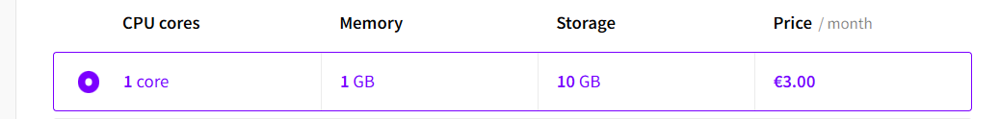

Luonnollisesti valitaan Debian Linux käyttöjärjestelmäksi. Jätetään varmuuskopiot ja muut ylimääräiset palvelut pois. Lisätessä SSH-avainta ilmeni pieni ongelma, en ollut tajunnut, että koko litania tulee kopioida, eikä ainoastaan hämärän näköinen kirjoitus.

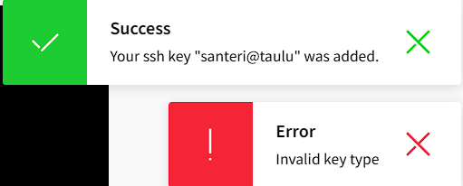

Pienen perus-säädön jälkeen sain palvelimen toimintaan, nyt täytyy tehdä pienimuotoinen sijoitus UpCloudille, jotta palvelimeni pysyy hengissä.

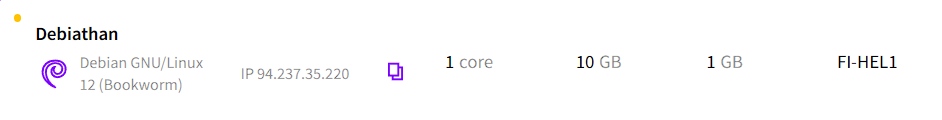

Nyt laitan palvelimen tulille ja samat alkusäädöt, kuin aiemmassa läksyssä. Mikäli ongelmia ei ilmene, en tähän enää vaihe vaiheelta kirjaa kaikkea.

*klo 17:25, aikaa kului 30min*

*root*-käyttäjänä pääsin sisälle palvelimeen luomaan käyttäjätunnuksen ja antamaan sille tarvittavat oikeudet, mutta yhdistämisessä on ongelmia. Täytyy lukea [täältä](https://upcloud.com/resources/tutorials/use-ssh-keys-authentication) lisää ongelman ratkaisemiseksi.

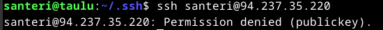

*21.9.2024*

Jätin homman sikseen, kun olin jo väsynyt päivästä. Tänään aamulla kävin säätämässä uudelleen. Menin ensin UpCloudin sivuilta "console" näkymään, kun olin onnistunut vaihtamaan SSH-avaimen lennosta ja lukitsemaan itseni ulos. UpCloudilla on onneksi tämmöinen palvelu, josta pääset selaimella palvelimelle sisään käyttämällä salasanaa, jolla kirjaudutaan UpCloudin nettisivuille.

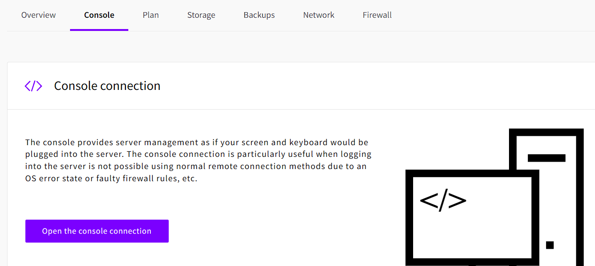

Hyödynsin tätä [ohjetta](https://upcloud.com/resources/tutorials/regaining-access-to-a-server-that-was-deployed-using-ssh-keys)

Consolen avulla pystyin muokkaamaan palvelimen SSH-kansion tiedostoja. ``sudo nano /etc/ssh/sshd_config``, sieltä muutin ensin *.conf tiedoston pois käytöstä, laitoin salasanakirjautumisen päälle, sekä sallin SSH-avaimella kirjautumisen, joka oli mystisesti mennyt pois päältä. Tämän jälkeen lähetin palvelimelle vielä oman SSH-public-avaimen komennolla ``ssh-copy-id santeri@94.237.35.220``, kävin muuttamassa *.conf tiedoston takaisin sallituksi, nyt saatoin kirjautua palvelimelle ilman salasanaa. 

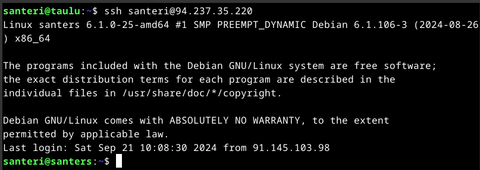

Tämän jälkeen tein perus asennukset ``sudo apt-get update``, ``sudo apt-get install ufw micro apache2``, tein palomuuriin reiät ``sudo ufw allow 22/tcp``, ``sudo ufw allow 80/tcp``, laitoin palomuurin päälle ``sudo ufw enable``

## a) Kotisivu
#### Tehtävä: Tee vähintään kolmen erillisen weppisivun kotisivu ja kopioi se näkymään palvelimellesi. Jos sinulla on oikea palvelin Internetissä, kannattaa käyttää sitä. Käytä name based virtual hosting tekniikkaa. Sivujen muokkaamisen pitää onnistua ilman pääkäyttäjän oikeuksia, niiden kopioiminen pääkäyttäjänä testisivun paikalle ei käy. Kotisivujen ei tarvitse olla hienoja, mutta niiden tulee olla validia HTML:ää ja linkittää toisiinsa.

*21.9.2024 klo 13:34*

Toisella kurssilla tehdään parhaillaan kotisivuja, jotka myöhemmin lisään tänne. Nyt kuitenkin teen hyvin yksinkertaiset html-testisivut.

Lähden muistelemaan aiemmista tehtävistä, ajoin seuraavat komennot, samalla laitoin micro-editorin oletukseksi

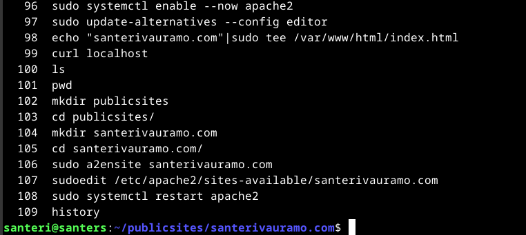

Tässä vaiheessa kirjasin publicsites/santerivauramo.com:iin:

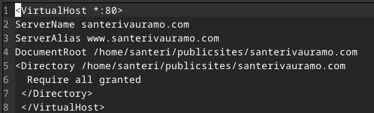

~/publicsites/santerivauramo.com$ kansiossa luon index.html tiedoston komennolla ``micro index.html``, lähden rakentamaan aiemman testisivun päälle, lisään vain linkit kahteen muuhun sivuun samassa kansiossa. Katson vielä ohjeita html:n kirjoittamiseen [täältä](https://www.w3schools.com/html/). Validoin koodin [täällä](https://validator.w3.org/nu/#textarea). Index näyttää tältä:

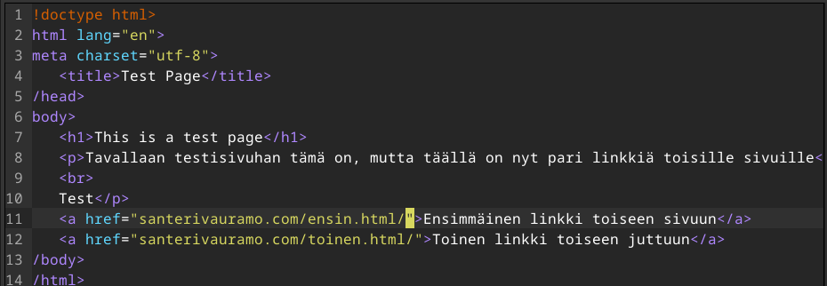

Tässä vaiheessa sivu ei edes toimi, jotakin on unohtunut. Kokeilen ``sudoedit /etc/hosts`` ja lisään santerivauramo.com:n sinne. (myöhemmin tajusin, että tämä oli nimipalvelua simuloidessa tarpeellinen, ei tässä)

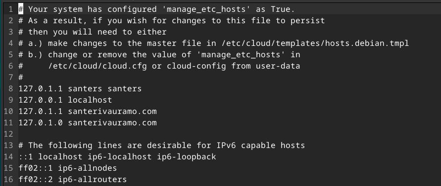

Kuten kuvassa lukee, täytyy tämän toimiakseen käydä ``/etc/cloud/templates/hosts.debian.tmpl``:ssä lisäämässä tiedot myös sinne. Kävin myös [tämän](https://www.codingcommanders.com/LAMP/apache_default_page.php) ohjeen mukaan poistamassa apachen perus index.html:n ja santerivauramo.com näyttää nyt tältä:

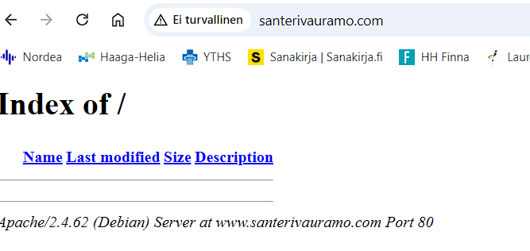

Ei ihan vielä se mitä haetaan. Luen asioita [täältä](https://www.veeble.org/kb/how-to-setup-apache-to-host-a-website-in-linux/) ja myös [täältä](https://stackoverflow.com/questions/1484595/how-to-resolve-var-www-copy-write-permission-denied). Kävin luomassa /var/www kansioon santerivauramo.com kansion, vaan eipä ollut oikeuksia, joten annoin itselleni oikeudet [3.10.2024 Tiedän, että chmod 777 oli huono ajatus, muutin sen myöhemmin järkevämmäksi]

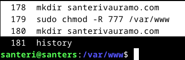

Kävin luomassa public_html kansion ja santerivauramo.com.conf tekstitiedoston

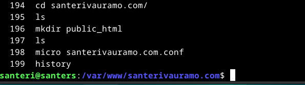

Eipä ollut tarkoitus luoda public_html kansiota, vaan tekstitiedosto. ``rm -r public_html/``, eli poistan kansion ja luon public_html tekstitiedoston ``micro public_html``, sinne laitan seuraavaa: (Myöhemmin huomasin, että juuri se kansio piti luoda, en tiedä mistä tämäkin ajatus tuli)

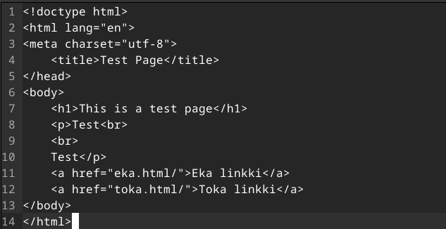

Järjen mukaan tämän pitäisi toimia, kun teen samaan kansioon eka.html ja toka.html tiedostot. Nyt olen saanut apachen kohtalaiseen solmuun:

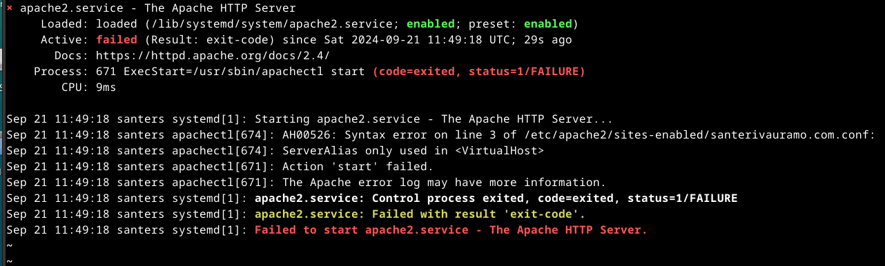

Pistää silmään rivi jossa lukee ``AH00526: Syntax error on line 3 of /etc/apache2/sites-enabled/santerivauramo.com.conf:``, täytynee mennä muokkaamaan ``/etc/apache2/sites-enabled/santerivauramo.com.conf``

Kävin poistamassa tuon koko tiedoston, muuten en saanut apachelle tehtyä mitään, nyt pystyy taas potkimaan demonia. Loin tiedoston uudestaan seuraavilla tiedoilla:

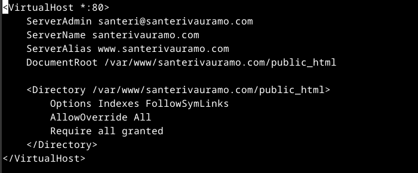

santerivauramo.com sanoo: "404 Not Found". Kello on nyt 15:15, pidän pienen tauon ja katson samalla videon: https://www.youtube.com/watch?v=1CDxpAzvLKY.

*klo 15:45* jatkan vielä hetken ennen ruokailua ja lenkkiä.

https://httpd.apache.org/docs/2.4/vhosts/ Täältä löytyi komento ``apachectl -S``, joka näyttää seuraavaa

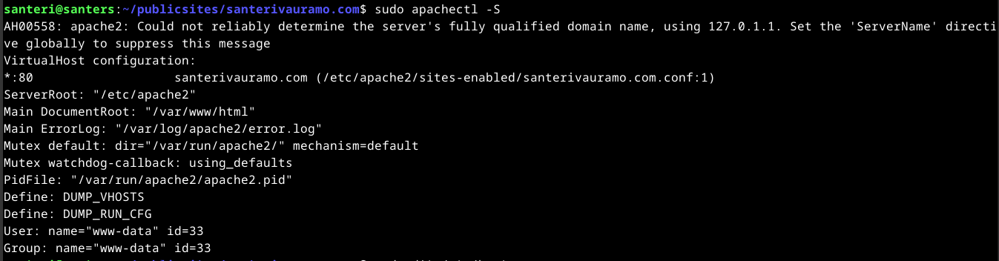

*klo 16:05, tauko*

*klo 18:35* lenkin ja suihkun jälkeen sain uutta virtaa ranteisiin. Yritän https://www.digitalocean.com/community/tutorials/how-to-set-up-apache-virtual-hosts-on-ubuntu-20-04 tämän ohjeen avulla tehdä uusiksi tekemättömän.

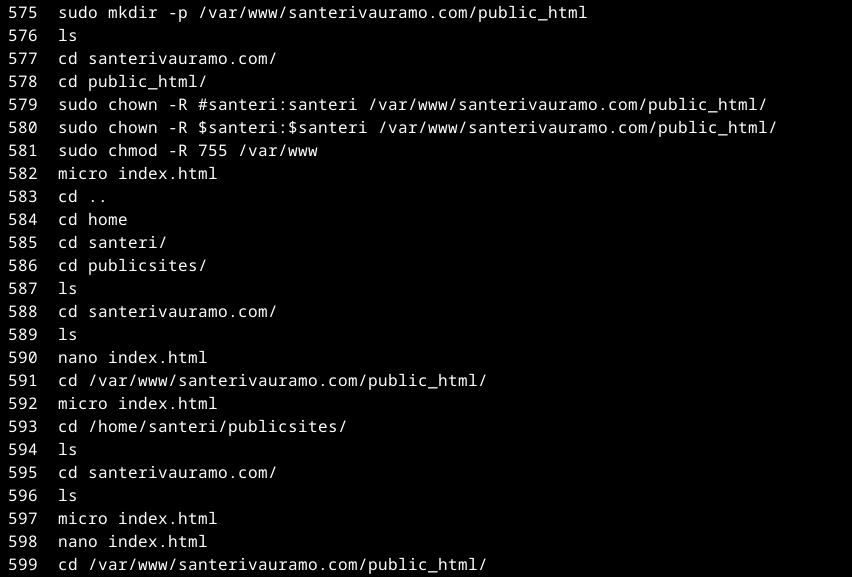

Loin /var/www kansioon omien sivujen kansion, jonne loin public_html-kansion, tämänhän loin jo aiemmin, mutta ymmärsin ohjeet väärin. Seuraavaksi annoin itselle oikeudet muokata kyseistä kansiota ja loin samanlaisen index.html tiedoston minkä aiemmin loin muualle. Muutin ``sudo micro /etc/apache2/sites-available/santerivauramo.com.conf``:sta seuraavanlaisen: [3.10.2024 oikeudet eivät ole menneet perille ylimääräisten merkkien vuoksi "#" ja "$"]

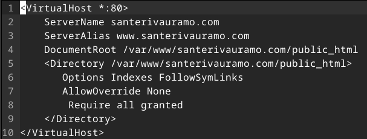

Nyt demonin potkaisun jälkeen pääsin sivuille. Olin jo aiemmin sallinut ``sudo a2ensite santerivauramo.com.conf``:n, ja disabloinut default conffin, joten niitä ei tarvinnut enää nyt tehdä.

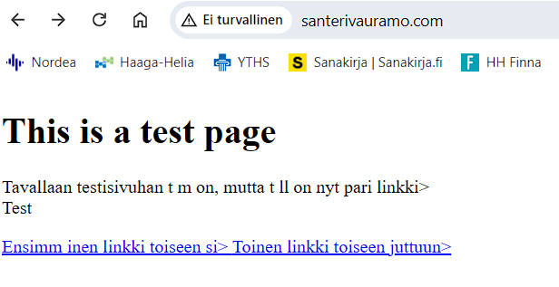

Nyt vaan kopioin html:t kahteen tiedostoon, joten saan linkit toimimaan. www.santerivauramo.com

Huomasin että vasta ``sudo chmod -R 777 /var/www/`` komento antoi luvan muokata tiedostoja normaalin käyttäjän oikeuksin. [3.10.2024 koska en ollut oikeasti laittanut mitään oikeuksia]

Loin kansioon siis ``index.html``, ``eka.html``, ja ``toka.html``-tiedostot. Sisällöt näyttävät kutakuinkin kaikissa tältä:

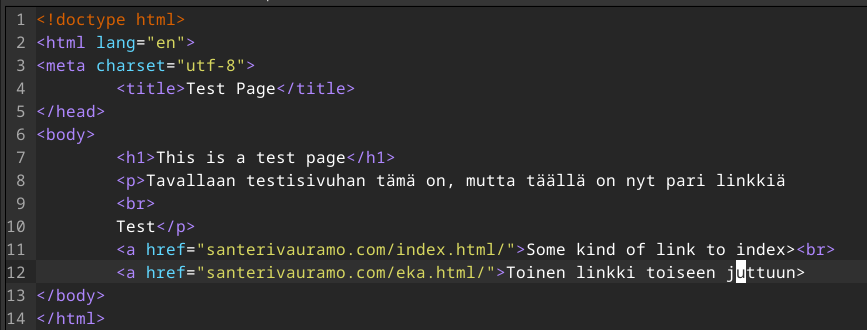

Piti vielä muokata linkit näyttämään tältä, jotta ne toimivat:

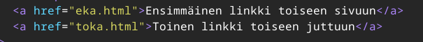

Jostain syystä windowsin chromella ei nyt toimi tuo sivu, mutta kännykällä pääsin ja kaikki linkit toimivat.

*klo 19:18* ei tullut hienoja ja aikaa kului, paljon tässäkin oppi asioita, parempi tehdä virheet tässä vaiheessa, homma jatkuu aikaisintaan seuraavana iltana

## b) Alidomain

#### Tehtävä: Tee kaksi uutta alidomainia, jotka osoittava omaan koneeseesi. Esimerkiksi palvelu on example.com -> linuxkurssi.example.com. Tee toinen alidomain A-tietueella ja toinen CNAME-tietueella. Alidomainit ovat tyypillisesti ilmaisia, kun sinulla on päädomain (example.com).

Aloitan lukemalla ensin A-tietueesta ja CNAME-tietueesta, ennen kuin laitan kellon juoksemaan. Ensin googlasin mikä on tietue englanniksi, koska sitä ei ole tullut aiemmin vastaan, vastaus: record. Namecheapin domainpalvelun omaavana, hain tietoa hakusanalla "A-record namecheap" ja löysin varsin hyödyllisen ohjesivun: https://www.namecheap.com/support/knowledgebase/article.aspx/319/2237/how-can-i-set-up-an-a-address-record-for-my-domain/.

*22.9.2024 klo 17:44*

Kirjaudun Namecheap palveluun ja menen "Domain List", ja sieltä "Manage", ja "Advanced DNS", sama mistä lisättiin nimipalveluun palvelimen IP-osoite alunperin. En ole ihan varma tämän toiminnasta, mikä voisi mennä pieleen, kokeilen tällaisella nimellä:

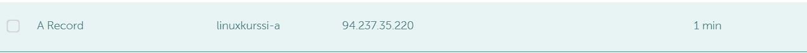

Menin palvelimelleni ja tein ``/var/www/linuxkurssi-a/public_html/`` kansion ja sinne ``index.html`` tiedoston.

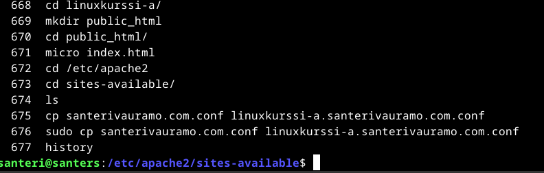

Kopioin myös .conf tiedoston ja muutan sieltä tietoja:

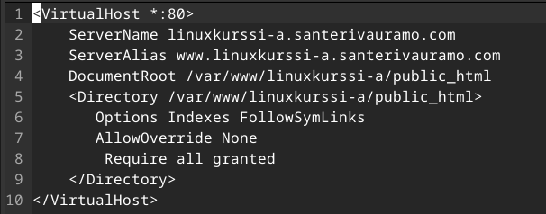

Nyt kun menen https://linuxkurssi-a.santerivauramo.com/ sivulle, tulee sama index.html sivu, joka aiemmin, eli ei toimi näin. Käyn muuttamassa tuon /linuxkurssi-a kansiossa olevan html-tiedoston joksikin muuksi, kuin index.html. ``mv index.html testi-a.html``, nyt kokeilen uudestaan nettisivua. Ei toimi vieläkään, täytyy odotella ja samalla lukea CNAME-tietueesta lisää ja palata asiaan. https://www.namecheap.com/support/knowledgebase/article.aspx/9646/2237/how-to-create-a-cname-record-for-your-domain/

*klo 18:03 tauko* *jatkuu klo 18:15*

Kysyin välissä ChatGPT:ltä neuvoa, miksi tuo ohjaa vieläkin tuolle pääsivulle. Muutin ``sites-available``:sta .conf tiedostoon tiedot niin, että tuo /linuxkurssi-a kansio on ``/var/www/santerivauramo.com/public_html/linuxkurssi-a``, eli kirjaimellisesti tuon pääsivun alla.

Toki vielä täytyy siirtää tuo kansio tuonne oikeaan paikkaan.

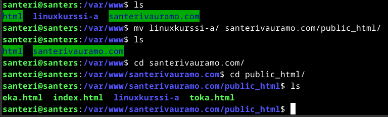

Ja nyt toki täytyy vielä siirtää linuxkurssi-a kansion sisällä olevasta /public_html kansiosta tuo testa-a.html tiedosto oikeaan paikkaan. Kävin vielä lisäämässä .conf tiedostoon ``DocumentRoot`` kohtaan tuon testi-a.html loppuun. Siltikään ei vielä toimi, nyt CNAME:n kimppuun.

Lähden liikkeelle tämmöisellä nimellä namecheapissa.

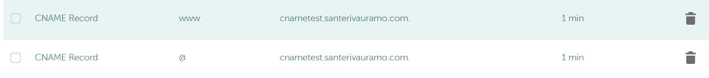

Luon .conf tiedoston näillä tiedoilla:

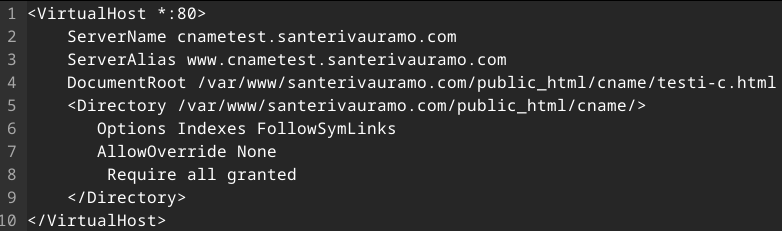

*tauko klo 18:45* Jätän nettisivut tekeytymään, työpäivän jälkeen ei jaksa tämän enempää vaivata päätä, huomiseen.

*23.9.2024 klo 8:40*

Aloin lukemaan täältä lisää aiheesta https://httpd.apache.org/docs/2.4/vhosts/examples.html

``systemctl status apache2.service`` kertoo seuraavaa:

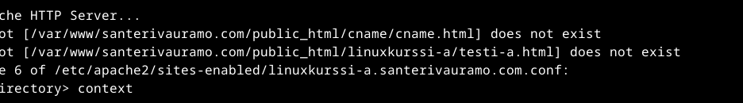

Eli apache ei löydä noita html-tiedostoja. Kävin muokkaamassa .conf tiedostoista DocumentRoot kohdat muotoon ``/var/www/santerivauramo.com/public_html_linuxkurssi-a/``. Nyt pääsen katsomaan a-tietueella luotua sivua internetistä osoittella: http://linuxkurssi-a.santerivauramo.com/testi-a.html, jostain syystä pelkkä http://linuxkurssi-a.santerivauramo.com/ näyttää sivun, josta kyllä pääsee linkin kautta menemään tuolle oikealle sivulle.

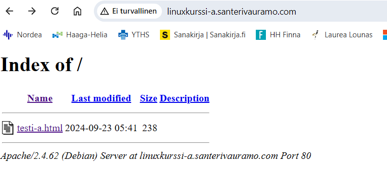

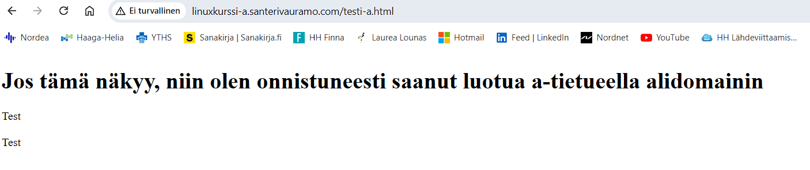

Tyydyn tähän tällä erää, pitänee tunnilla kysyä lisää tästä. Nyt vielä murhetta aiheuttaa tuo CNAME-tietueen toiminta: "Sivustoon ei saada yhteyttä". Aiemmin linkittämäni namecheapin ohje kertoo, että ei voi olla samaa "Host":a CNAME-tietueen kanssa, joten joudun muuttamaan a-tietueen, jossa on "www" Host, muuksi. Nyt täytyy odotella hetki.

Jostakin mieleen tuli tuo ``chmod 777``, jonka aiemmin asetin, luin lisää siitä täältä: https://linuxhandbook.com/chmod-command/. Kävi ilmi, että tuo 777 antaa kaikille kaikki oikeudet tuohon kansioon, jota en halua. Muutin sen takaisin ``sudo chmod -R 755 /var/www/``, ainakin toistaiseksi pystyn muokata ilman pääkäyttäjänoikeuksia kansion tiedostoja.

*klo 9:17, tauko*

 *klo 9:36*

Nyt pääsin sisälle cnametest.santerivauramo.com Chromen incognito-tilassa. Sama asia, kuin a-tietueella, eli ikään kuin kansionäkymä tuolla osoitteella, mutta sieltä pääsee tuohon .html tiedostoon käsiksi. Tyydyn tähän ratkaisuun toistaiseksi myös CNAME:n osalta, tunnilla selvinnee asiasta lisää.

 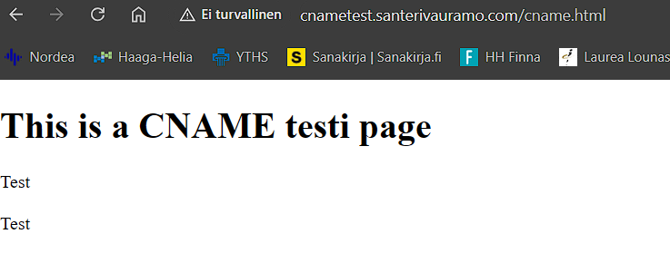

## c) Pubkey

#### Automatisoi kirjautuminen julkisella SSH-avaimella

Tämän tein jo vahingossa kohdassa aa). Kerrataanpa kuitenkin, mitä tuli tehtyä. SSH.com:sta lisää tietoa https://www.ssh.com/academy/ssh/keygen.

Aluksi poistutaan palvelimelta ``exit``, ``ssh-keygen`` luo SSH-avainparin, ``ssh-copy-id santeri@94.237.35.220`` lähettää palvelimelle julkisen avaimen. UpCloudin palvelinta luotaessa oli jo syötettävä julkinen avain.

https://upcloud.com/resources/tutorials/use-ssh-keys-authentication UpCloudin ohje. Saatoin aiemmin mennä joissain kohdissa ansaan ja lukitsin itseni pois, komento ``chmod 700 ~/.ssh`` root käyttäjänä saattoi estää julkisen avaimen lähettämisen palvelimeen. Nyt myöhemmin kuitenkin sen tehtyä, pääsen vielä kirjautumaan normaalisti ilman salasanaa.

*valmis klo 9:45*

## d) Tutki jonkin nimen DNS-tietoja 'host' ja 'dig' -komennoilla

#### Käytä kumpaakin komentoa kaikkiin nimiin ja vertaa tuloksia. Katso man-sivulta, miten komennot toimivat - esimerkiksi miten 'dig' näyttää kaikki kentät. Analysoi tulokset. Etsi tarvittaessa uusia lähteitä haastaviin kohtiin. Sähköpostin todentamiseen liittyvät SPF ja DMARC -tietojen yksityiskohdat on jätetty vapaaehtoiseksi lisätehtäväksi. Tutkittavat nimet:
#### - Oma domain-nimesi. Vertaa tuloksia nimen vuokraajan (namecheap.com, name.com...) weppiliittymässä näkyviin asetuksiin.
#### - Jonkin pikkuyrityksen, kerhon tai yksittäisen henkilön weppisivut. (Ei kuitenkaan kurssikaverin tällä viikolla vuokrattua nimeä).
#### - Jonkin suuren ja kaikkien tunteman palvelun tiedot.

En saanut "dig" komennolla tehtyä mitään, enkä saanut sitä myöskään asennettua ``sudo apt-get install dig``. Yritin vielä etsiä ``apt-cache search dig``, mutta ei löytynyt äkkiseltään mitään tehtävänantoon liittyvää ohjelmaa. Ei hätiä, https://www.cyberciti.biz/faq/debian-9-dig-command-not-found-how-to-install-dig-on-debian/ auttoi asentamisessa ja käytössä, ``sudo apt-get install dnsutils`` paketti sisältää "dig":n, sekä "host":n. Sivulta pääsee myös katsomaan [dig](https://www.cyberciti.biz/faq/linux-unix-dig-command-examples-usage-syntax/):n ja [host](https://www.cyberciti.biz/faq/linux-unix-host-command-examples-usage-syntax/):n käytöstä.

Etsin nuo aiemmat linkit, koska ``man dig`` tai ``man host`` ei tuottanut tuloksia. Kokeilin myös ``man grep`` ja monia muita, mikään ei toiminut. Joten kokeilin ``sudo apt-get install man``, ja "man" asentui palvelimelle. Nyt voin käyttää myös mania. Oletuksena "**host**" komennolla voidaan tehdä DNS (Domain Name System) kyselyjä, joko domain-nimellä tai IP-osoitteella. "man host" kertoo myös, että host komennolla voi etsiä myös paljon muitakin asioita käyttäen valinnaisia lisäargumentteja kuten: "-l". CNAME haut pitää tehdä "-t" lisäyksellä.

**Dig**-komennon oletuskysely on "A", eli osoite (Address). Domain-nimellä haettaessa siis oletuksena dig näyttää IP-osoitteen. Kuten "host", myös "dig":llä tehdään DNS kyselyjä. Monet käyttävät "dig":ä DNS ongelmien selvittämiseen.
**Oletuksena "dig" näyttää kaikki kentät**.

#### - Oma domain vs namecheap.com

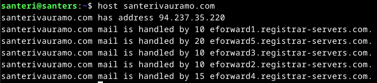

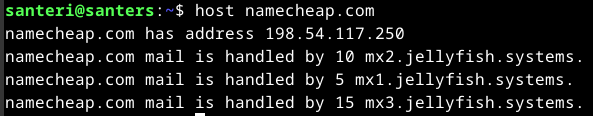

- Host-komento kertoo domain-nimeä vastaavan IP-osoitteen, sekä muita tietoja. Oli pakko kysyä GhatGPT:ltä tuosta "mail is handled by...", koska en löytänyt muista lähteistä mitään järkevää. "Puppusanageneraattorin" mukaan "mail is handled by":n jälkeen oleva numero kertoo millä prioriteetilla tuohon osoitteeseen lähetetyt sähköpostit ohjautuvat mihinkin osoitteisiin, mitä pienempi luku, sitä korkeamppi prioriteetti. Minun palvelin ja namecheap käyttää eri MX-tietueita.

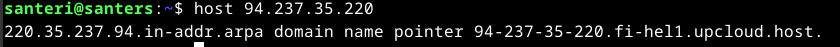

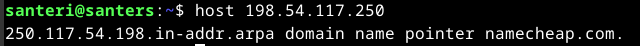

*Tässä vaiheessa muuten vaihdoin palvelimen hostnamen siihen, mikä sen alunperinkin piti olla, ``sudo hostnamectl set-hostname debiathan``, jonka jälkeen ``sudo reboot``, ohjeet löytyy täältä: https://linuxgenie.net/change-hostname-debian-12/#post-10630-_rku68glrm7se.*

IP-osoitteella haettaessa molemmissa näkyy ".in-addr.arpa", eli "Advanced Research Projects Agency", joka liittyy internetin infrastruktuuriin jo ajalta ennen internetiä. Domain name pointer liittyy PTR-recordiin, tästä en kaikkea ihan täysin ymmärtänyt. Jostain syystä namecheapin pointer näyttää ainoastaan "namecheap.com", kun taas minun debiathanissa lukee IP-osoite ja tiedot UpCloudista, tämä lienee ainoastaan nimiasia.

- Seuraavaksi kokeillaan **dig** (Domain Information Groper)-komentoa.

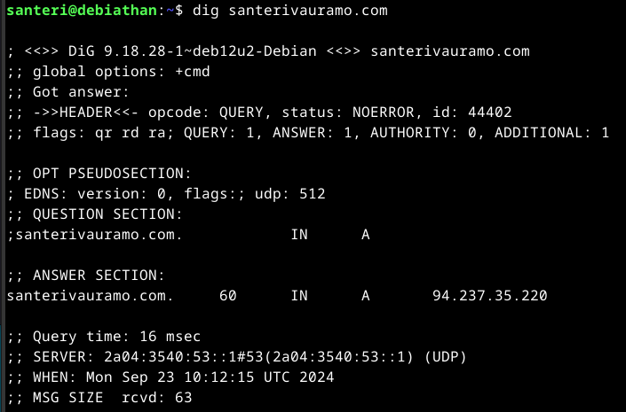

Tietoa tulee enemmän, kuin odotin. Alussa kerrotaan dig versiosta ja käyttöjärjestelmästä, sekä mitä haettiin. 
Pseudosectionissa "udp" viittaa käytössä olleeseen protocollaan, joka voi muuttua myös "tcp":ksi tarvittaessa. "512" on bitteinä udp viestin koko. "Answer section" kertoo varsinaisesti varta itse tiedoja mitä haluttiin löytää, näitä pystyy rajaamaan halutessaan erinäisillä lisäkomennoilla.

``dig +short santerivauramo.com`` kertoo ainoastaan IP-osoitteen.

NS kertoo nimipalvelun, tässä tapauksessa dns2.registrar-servers.com ja dns1.registrar-servers.com

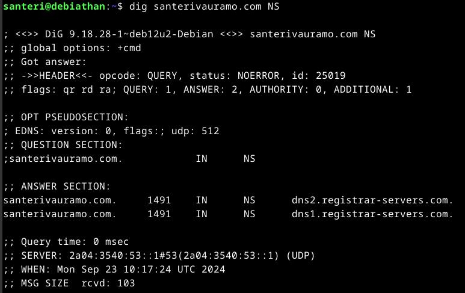

Namecheapilla nimipalveluja on huomattavasti enemmän:

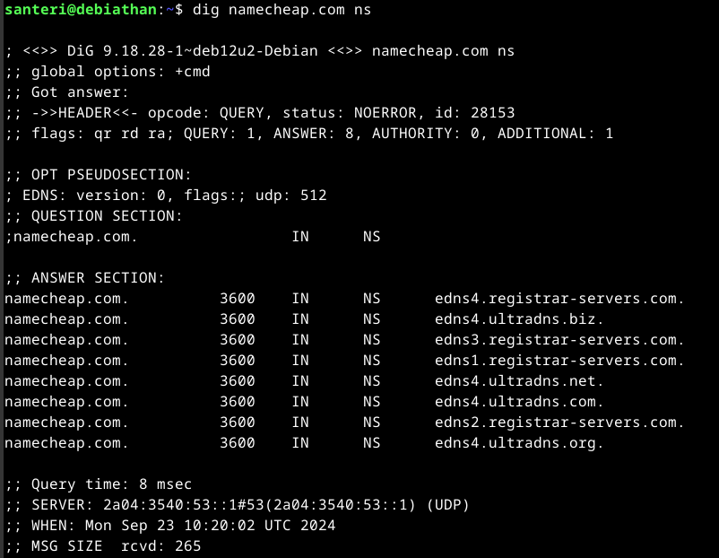

3600 numero ennen IN:ä kertoo ChatGPT:n mukaan TTL arvon, tässä tapauksessa DNS-tietue voidaan varastoida 3600 sekunniksi, eli yhden tunnin ajaksi. IN tarkoittaa internetiä. TTL arvo auttaa nopeuttamaan verkon toimintaa, mutta suuri arvo taas voi johtaa vanhan tiedon näkymiseen käyttäjälle.

#### - Jonkin pikkuyrityksen, kerhon tai yksittäisen henkilön weppisivut

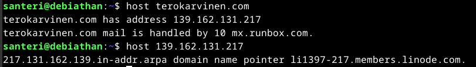

``host terokarvinen.com`` näyttää IP-osoitteeksi 139.162.131.217, sekä että sähköpostia hallitsee mx.runbox.com.

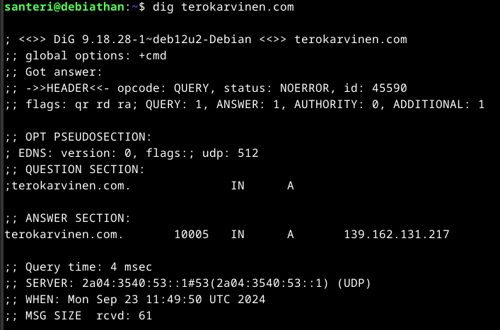

``dig terokarvinen.com`` tiedot näyttää suhteellisen saman kaltaisilta, kuin aiemmissa kyselyissä. Välimuistissa tietoa säilytetään 10005 sekuntia, mikä on varmasti hyvä jos haluaa minimoida palvelimen kuormitusta.

#### - Jonkin suuren ja kaikkien tunteman palvelun tiedot

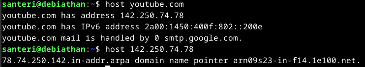

Ei yllätä, että youtube.com:n mail is handled by google, samaa palvelua kuitenkin molemmat. Domain name pointer näyttää uniikilta verrattuna aiempiin.

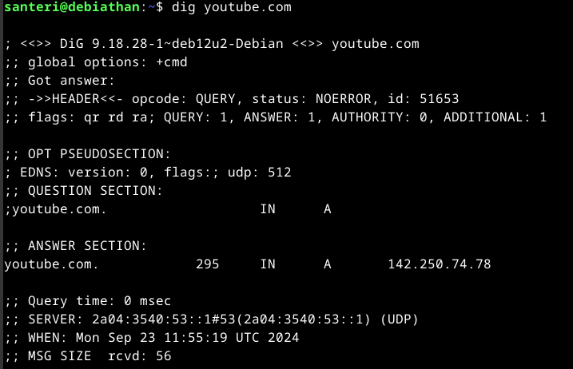

295 sekunnin välimuisti on huomattavan pieni, eli palvelin joutuu kovemmalle rasitukselle, mutta tiedot päivittyvät nopeasti.

---

Tässä meni niin monta tuntia kaiken selvittelyn äärellä, että jätän bonustehtävän välistä. Kaikkineen aikamoinen savotta oli, mutta sitäkin opettavaisempi kokemus.

[30.9.2024 Huom. olen ottanut santerivauramo.com sivut käyttöön toista kurssia varten, joten tämän artikkelin linkit ei enää toimi samalla tavalla]

## Lähteet

Cloudflare. What is a DNS PTR record?. Luettavissa: https://www.cloudflare.com/learning/dns/dns-records/dns-ptr-record/. Luettu 23.9.2024 
Gite, V. 2024. How to install dig on Debian Linux 12/11/10. Luettavissa: https://www.cyberciti.biz/faq/debian-9-dig-command-not-found-how-to-install-dig-on-debian/. Luettu 23.9.2024 
Gite, V. 2024. Luettavissa: https://www.cyberciti.biz/faq/linux-unix-dig-command-examples-usage-syntax/. Luettu 23.9.2024 
Gite, V. 2024. Linux and Unix host Command Examples. Luettavissa: https://www.cyberciti.biz/faq/linux-unix-host-command-examples-usage-syntax/. Luettu 23.9.2024 
Nair, N. 2024. How to setup Apache Web Server to host a website in Linux. Luettavissa: https://www.veeble.org/kb/how-to-setup-apache-to-host-a-website-in-linux/. Luettu 21.9.2024 
Namecheap. Luettavissa: https://www.namecheap.com/ 
Stackoverflow. Keskustelu. Luettavissa: https://stackoverflow.com/questions/1484595/how-to-resolve-var-www-copy-write-permission-denied. Luettu 21.9.2024 
UpCloud. Faq. Luettavissa: https://upcloud.com/resources/tutorials/use-ssh-keys-authentication. Luettu 20.9.2024 
UpCloud. How to regain access to a server that was deployed using SSH keys. Luettavissa: https://upcloud.com/resources/tutorials/regaining-access-to-a-server-that-was-deployed-using-ssh-keys. Luettu 21.9.2024 
Validator. W3Scools. Luettavissa: https://validator.w3.org/nu/#textarea. Luettu 21.9.2024 
W3Schools. HTML. Luettavissa: https://www.w3schools.com/html/. Luettu 21.9.2024

Tätä dokumenttia saa kopioida ja muokata GNU General Public License (versio 2 tai uudempi) mukaisesti. http://www.gnu.org/licenses/gpl.html 
Pohjana Tero Karvinen 2012: Linux kurssi, http://terokarvinen.com  
Kirjoittanut <em>Santeri Vauramo</em>, 2024
