# h6 Hello Django

#### Oma Host kokoonpanoni:

| Komponentti | Kuvaus | Lisätiedot |
| :---        |    :----:   |          ---: |
| Emolevy | MSI B550-A PRO | ATX, AM4 |
| Prosessori   | AMD Ryzen 9 5900X | 12-Core 3.70 GHz |
| RAM   | G.Skill  Ripjaws V |  32GB (4x8GB) DDR4 3600MHz, CL 16, 1.3  |
| Näytönohjain   | Sapphire PULSE AMD Radeon RX 7900 GRE        | 16GB     |
| Kovalevy   | Kingston 1TB        | A2000 NVMe PCIe SSD M.2      |
| Kovalevy   | Crucial 512GB        | MX100 SSD     |
| Kovalevy   | Crucial 256GB        | MX100 SSD     |
| Virtalähde   | Asus 750W TUF Gaming Gold        | ATX 80 Plus      |
| Kotelo   | Phanteks Enthoo Pro       |  Full Tower      |

Käyttöjärjestelmä: Windows 11 Pro 23H2

#### Virtuaalikone
Oracle VirtualBox 7 - Debian 12 GNU/Linux (bookworm) 
6 Prosessoriydintä - 4GB RAM-muistia - 60GB tallennustilaa

#### Palvelin
UpCloud 
Debian 12 GNU/Linux (bookworm) 
1 Prosessoriydin - 1GB RAM-muistia - 10GB tallennustilaa

## a) Tee yksinkertainen esimerkkiohjelma Djangolla

*27.9.2024 klo 11:30*

Tähän käytän tietenkin apuna Karvisen [Django 4 Instant Customer Database Tutorial](https://terokarvinen.com/2022/django-instant-crm-tutorial/):ia

Kirjauduin palvelimelleni ja aluksi päivitetään pakettilista ``sudo apt-get update``

Asennetaan virtualenv virtuaaliympäristö ``sudo apt-get -y install virtualenv``

Luodaan uusi kansio virtualenville, joka sisältää viimeisimmät paketit ``virtualenv --system-site-packages -p python3 env/``

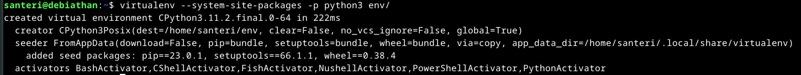

Otetaan virtuaaliympäristö käyttöön ``source env/bin/activate``

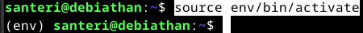

Nyt ollaan virtuaaliympäristössä, emme halua käyttää "pip":iä ilman virtualenviä, eikä sitä saa käyttää "sudo":lla. En halua antaa palvelinta muiden käyttöön, joten noudatan ohjetta tarkasti. Teen kyselyn, jotta varmistutaan, että olemme asentamassa virtuaaliympäristöön

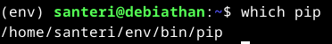

Luon ohjeen mukaan varmuudeksi "requirements.txt." tiedoston microlla, jotta ei vahingossakaan tule kirjoitusvirheitä kun asennetaan django pip:llä. Tiedoston sisään kirjoitan "django" ja tallennan tiedoston "ctrl+s" ja poistun "ctrl+q"

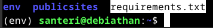

Varmuuden vuoksi kopioin requirements.txt tekstin ja katson vielä ``cat requirements.txt`` komennolla, että siellä varmasti lukee oikein "django"

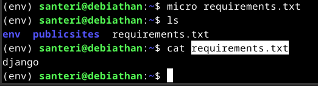

Tämä voi tuntua hätävarjelun liioittelulta, mutta en halua ottaa ylimääräisiä riskejä

Seuraavaksi asennetaan django pip:llä ``pip install -r requirements.txt``, hieman jännittävä toimenpide, mutta siitä selvittiin

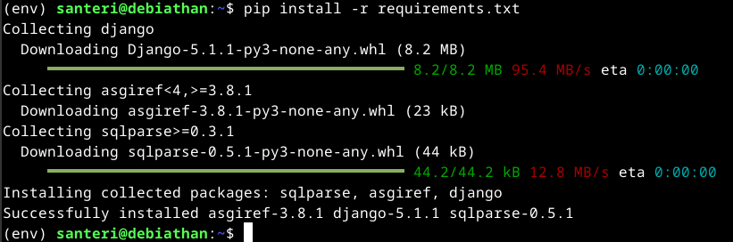

Aloitan uuden Django projektin nimeltä "sant" ``django-admin startproject sant``

Seuraavaksi kokeillaan laittaa Django palvelin toimimaan ohjeen mukaan, menen "sant" kansioon, siellä ``.manage.py runserver``

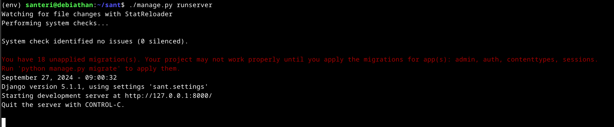

Nyt on tuotantopalvelin päällä. Tätä palvelinta ei kannata päästää internetiin. Kokeillaan mennä selaimella osoitteeseen "http://127.0.0.1:8000/"

Ei toimi, tuo ``.manage.py runserver`` antoi punaisella tekstillä herjaa "You have 18 unapplied migration(s). Your project may not work properly until you apply the migrations for app(s): admin, auth, contenttypes, sessions."              ja korjaukseksi komento ``python manage.py migrate``, joten kokeilen sitä

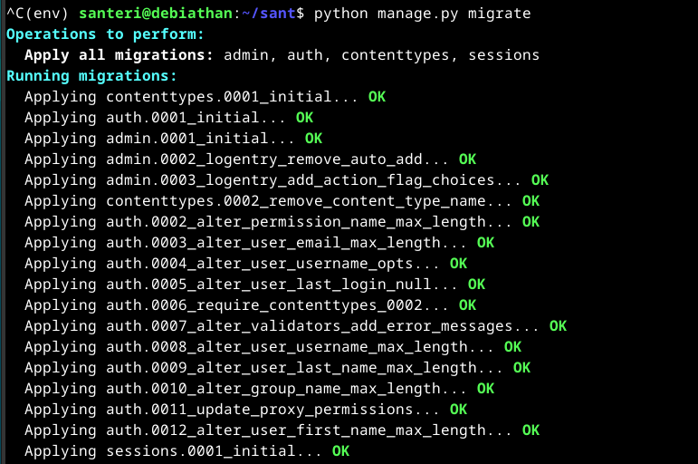

Tämän jälkeen uudestaan ``.manage.py runserver`` ja nyt ei tule virheilmoituksia

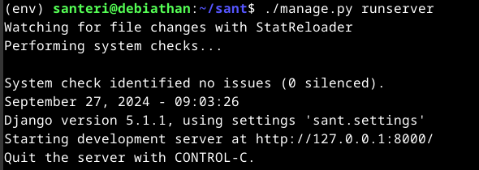

Kokeillaan uudestaan selaimella "http://127.0.0.1:8000/". Eikä toimi vieläkään, tietenkin tämä johtuu siitä, että olen virtuaalipalvelimella, jossa ei ole muuta kuin CLI käyttöliittymä. Pitää siis tehdä kaikki uudestaan paikallisesti. ``exit`` komennolla takaisin "taulu" virtuaalikoneelle. Teen samat asiat kuin aiemmin

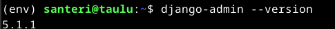

Nyt käynnistettyäni palvelimen, pääsen selaimella "http://127.0.0.1:8000/", ja homma toimii, voi taas äiti olla ylpeä pojastaan

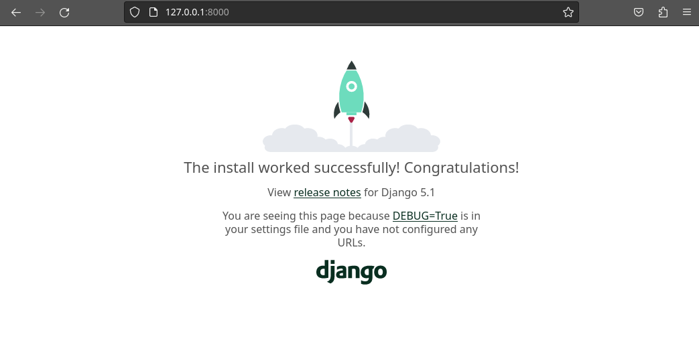

Hauskana yksityiskohtana huomaan, nyt kun palvelin on päällä, palvelin näyttää käyntini tuolla sivulla suoraan reaaliajassa ja herjaa, että favicon.ico:a ei voitu toimittaa, eli se pieni kuvake mikä näkyy selaimen välilehdellä

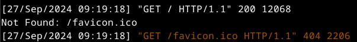

Seuraavaksi lisätään admin url:lle "http://127.0.0.1:8000/admin/" suoraan Karvisen ohjeilla, kätevä tuo salasananluontityökalu

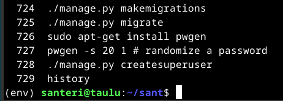

Nyt pääsen admin-kirjautumisikkunaan osoitteella "http://127.0.0.1:8000/admin/"

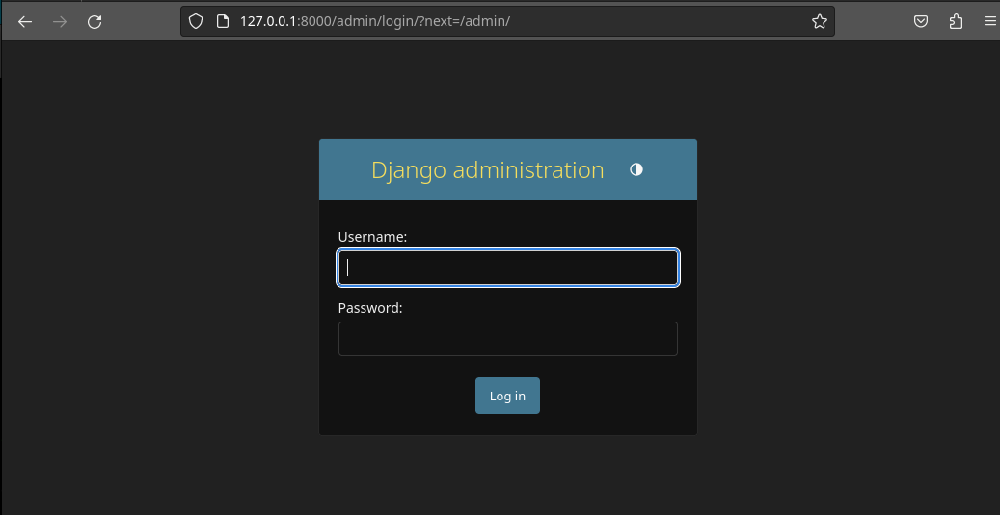

Jätin käyttäjänimikentän tyhjäksi, joten oletuksena käyttäjä on tässä tapauksessa "santeri", olen sisällä

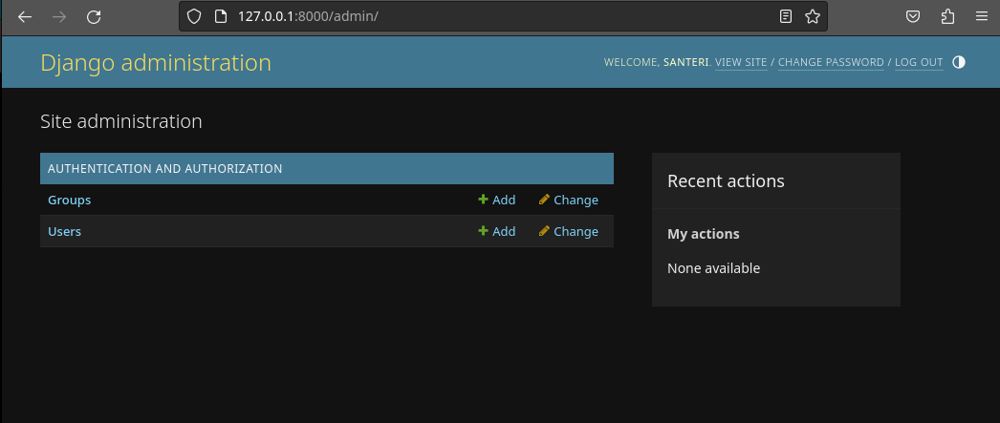

Loin uuden käyttäjän "sant" kohdasta "users - add"

Annoin käyttäjälle "staff", sekä "superuser"-statuksen

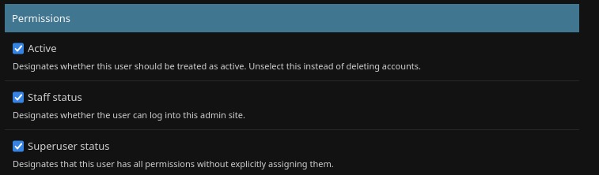

Kirjauduin ulos, ja takaisin sisään, tällä kertaa "sant" nimisenä käyttäjänä

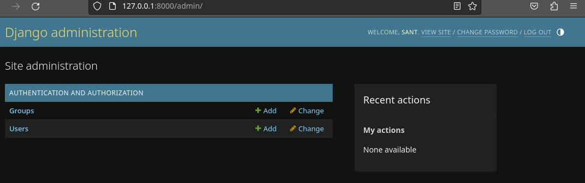

Kokeilin mennä käyttäjienhallintaan muokkaamaan oikeuksia, otin alkuperäiseltä "santeri":lta "staff"-oikeudet pois, todettakoon, että superkäyttäjän oikeudet toimivat tällä uudella käyttäjällä

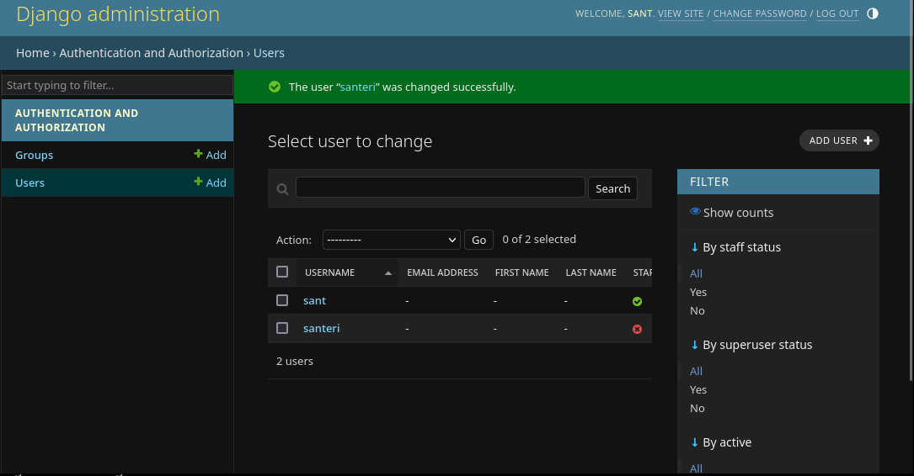

#### Luodaan asiakastietokanta

Luodaan "crm/" kansio CRM-sovellukselle ``./manage.py startapp crm``

Lisätään sovellus asennettuihin sovelluksiin ``micro sant/settings.py``

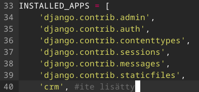

Lisätään modeleja ``micro crm/models.py``. Tiedostossa oli valmiina "from django.db import models". Lisätään sinne vielä ``class Customer(models.Model):
   name = models.CharField(max_length=300)``. Täten tietokantaan tulee "customer"-tietue "name" sarakkeella

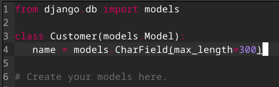

Nyt ajetaan samat ``./manage.py makemigrations`` ja ``./manage.py migrate``

Rekisteröidään tietokanta admin/ kansioon ``micro crm/admin.py``, ja sille lisätään tiedot ``from . import models
admin.site.register(models.Customer)``

Nyt pystytään lisäilemään asiakkaita, tosin niiden nimet ovat luokkaa "Customer object (1)"

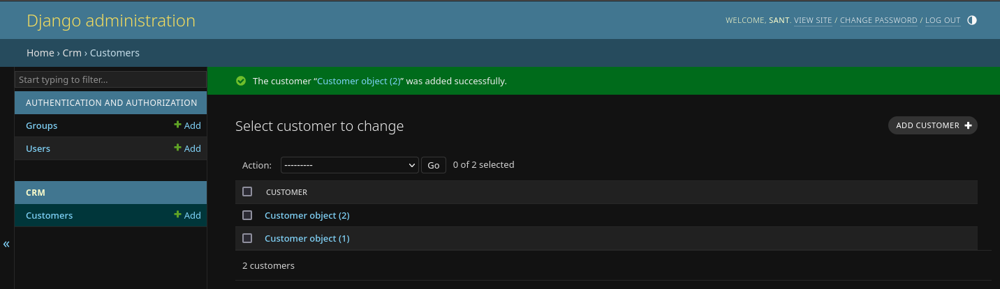

Mennään muokkaamaan models.py tiedostoa ``micro crm/models.py`` ja lisätään sinne pari riviä, jotka saavat asiakkaan nimen näkymään oikein

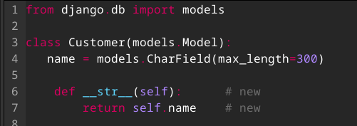

Nyt kun yrittää käynnistää palvelinta, tulee herja

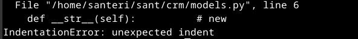

Kopioin suoraan Karvisen ohjeesta tuon koko koodin, jolla sain taas palvelimen käyntiin

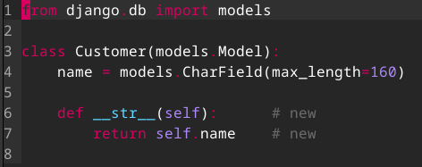

Nyt näkyy asiakkaiden nimet oikein

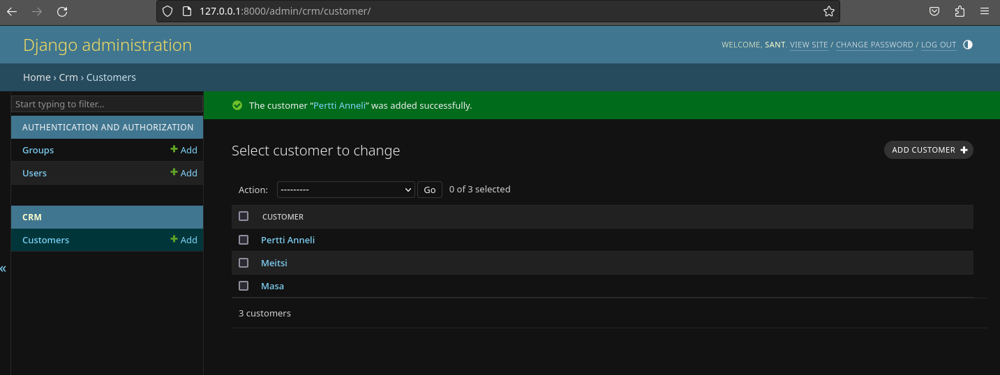

*klo 13:08, aikaa kului 1h 38min*

## b) Tee Djangon tuotantotyyppinen asennus

#### Voit halutessasi tehdä asennuksen omalle, paikalliselle virtuaalikoneelle. Sen ei tarvitse näkyä Internetiin.

*klo 13:30*

Tähän käytän pohjana [Tero Karvisen Deploy Django 4 - Production Install](https://terokarvinen.com/2022/deploy-django/) ohjeita

Teen tämän paikallisella virtuaalikoneellani. Apache2 ja micro on jo asennettu, joten menen suoraan kohtaan "Create some web content as a user"

Luon kansioita tätä varten ``mkdir -p publicwsgi/sant/static/``, sekä .html tiedoston ``echo "Onpas mukava nähdä teitä täällä tänään."|tee publicwsgi/sant/static/index.html``

Käyn varmistamassa, että kyseiset kansiot ja tiedosto tuli luotua oikein

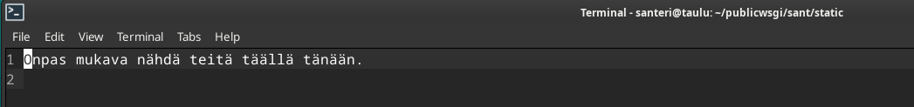

Looking good. Seuraavaksi lisään uuden virtualhostin ``sudoedit /etc/apache2/sites-available/sant.conf`` seuraavilla tiedoilla

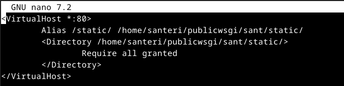

Laitan apachen hyväksymään sivun ``sudo a2ensite sant.conf``, "000-default.conf":n olen jo laittanut pois, mutta lähtötilanteessa ``sudo a2dissite 000-default.conf`` hoitaa sen, laitetaan myös aiemmassa tehtävässä tekemäni "hattu.example.com.conf" ja "tama.juttu.com.conf" pois ``sudo a2dissite`` komennolla

Varmistetaan konfiguraation toimivuus ``/sbin/apache2ctl configtest``

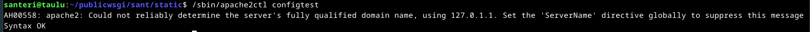

AH00558 herja lienee normaalia, pääasia, että "Syntax OK" ilmestyy lopussa

Potkaistaan demonia, eli käynnistetään apache uudelleen ``sudo systemctl restart apache2`` ja curlataan localhostia ``curl http://localhost/static/``, joten nähdään päästäänkö tietoihin käsiksi

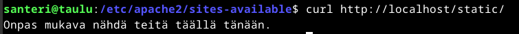

Mennään "~/publicwsgi" kansioon, jossa komennolla ``virtualenv -p python3 --system-site-packages env``. Hypätään virtualenviin ``source env/bin/activate``

``which pip`` "/home/santeri/publicwsgi/env/bin/pip". Tehdään taas requirements.txt ja sinne "django", jonka jälkeen ``pip install -r requirements.txt`` ja ``django-admin --version`` "5.1.1", ok

Kopioin a) kohdassa tekemäni sant/ kansion tuonne publicwsgi/ kansioon home/santeri/ kansiosta ``cp -R sant/ publicwsgi/``

``django-admin startproject sant``, koska sant/ kansio on jo olemassa, joten ei tarvinnut tätä vaihetta näemmä tehdä enää

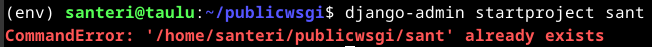

Seuraavaksi yhdistetään Python Apacheen käyttäen mod_wsgi:tä. Ohjeessa kerrotaan, että kaiken toimiakseen, täytyy tietää kolme absoluuttista polkua, joten ne kannattaa ottaa ylös tekstitiedostoon, josta niitä voi kopioida tarvittaessa. 

Tiedostosijainnit ovat: 

- Django-projektin pääkansio, joka sisältää manage.py tiedoston "/home/santeri/publicwsgi/sant"

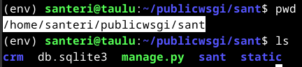

- Polku wsgi.py tiedostoon "/home/santeri/publicwsgi/sant/sant/wsgi.py"

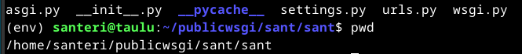

- Virtualenvin site-packages kansio "/home/santeri/publicwsgi/env/lib/python3.11/site-packages"

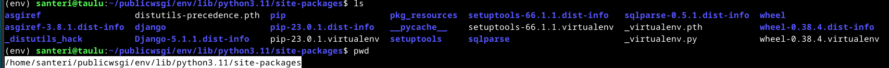

Käyn muokkaamassa sant.conf tiedostoa ``sudoedit /etc/apache2/sites-available/sant.conf``, nyt ohjeessa on niin pitkälti tietoa, jota tuonne tulee, että kopioin suoraan kaiken tiedostoon ja muokkaan omilla poluilla ja nimillä. Tässä tulee hyötykäyttöön äsken hakemani sijainnit, en lähtenyt muuttamaan muuta kuin nuo sijainnit

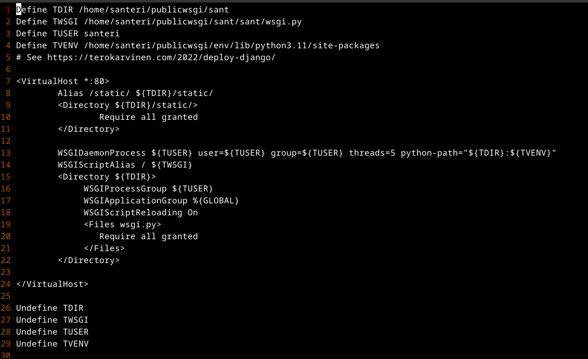

Jatketaan, asennan WSGI moduulin, jotta Apache tietää mitä WSGI komennot tarkoittavat. ``sudo apt-get -y install libapache2-mod-wsgi-py3``

``/sbin/apache2ctl configtest`` antaa "Syntax OK":ta, joten kaikki hyvin. Potkaistaan demonia ``sudo systemctl restart apache2``, kokeillaan ``curl -s localhost|grep title``

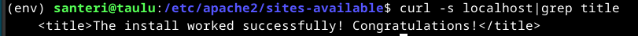

On se helppoa, kun on hyvät ohjeet. Kokeillaan vielä ``curl -sI localhost|grep Server``

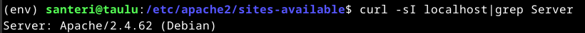

On se Apache, tässä vielä näkymä selaimella

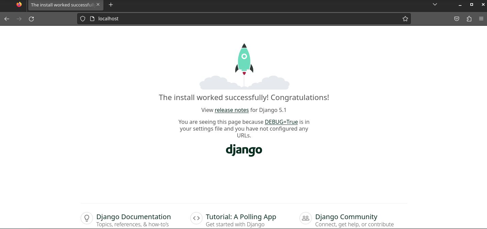

#### Otetaan DEBUG pois käytöstä

Navigoidaan "/home/santeri/publicwsgi/sant/sant" ``micro settings.py``

Sieltä muutetaan 
- DEBUG = False
- ALLOWED_HOSTS = ["localhost"]

Jos menisi oikeaan tuotantoon, laittaisin esim. ["localhost", "testisivu.santerivauramo.com"]

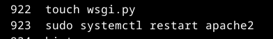

Näillä komennoilla ladattiin uudet asetukset, tämä muutos tarvinnee ``sudo systemctl restart apache2`` toimiakseen

``http://localhost/admin`` selaimeen, pääsee kirjautumaan admin näkymään, mutta näyttää karulta. Aiemmassa vaiheessa luotu "santeri" käyttäjällä pääsee generoidulla salasanalla kirjautumaan. Sivu tosin näyttää tältä: 

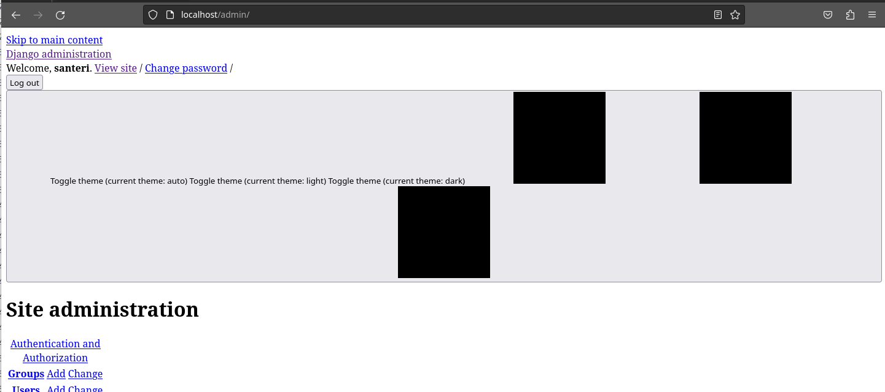

#### Korjataan kauneusvirheet

Mennään uudestaan ``micro settings.py`` ja lisätään sinne

- import os
- STATIC_ROOT = os.path.join(BASE_DIR, 'static/')

Nyt ``cd ..`` ja ``./manage.py collectstatic``, promptiin "yes"

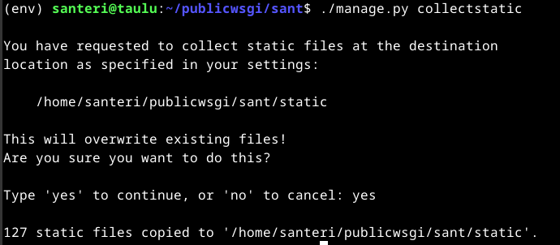

Testataan miltä nyt näyttää "http://localhost/admin", kaunista

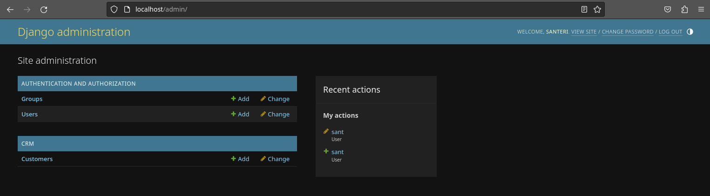

*klo 15:05*

#### Homma kaiketi siinä, jäi vielä mietityttämään kun ohjeessa puhuttiin tästä

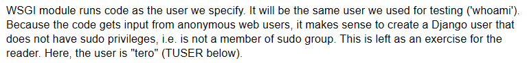

Eli WSGI moduulin ajamiseen ei kannata käyttää sudo käyttäjää, jotein täytyy tehdä uusi käyttäjä tätä varten

Kävin tämän tiimoilta luomassa uuden käyttäjän ilman kummempia oikeuksia ``sudo adduser djangotyyppi``

Jonka jälkeen muokkasin "sudoedit /etc/apache2/sites-available/sant.conf":sta "TUSER":n "djangotyyppi":ksi

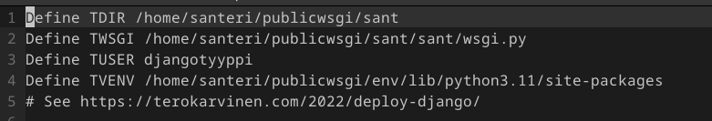

Yritin asentaa "acl" "Access Control List" ohjelmaa käyttäjien hallintaa varten [näillä ohjeilla](https://wiki.debian.org/Permissions), mutta se oli jo asennettu. Piti kuitenkin mountata filesystem acl optiolla, koska ohjelma antoi virheen

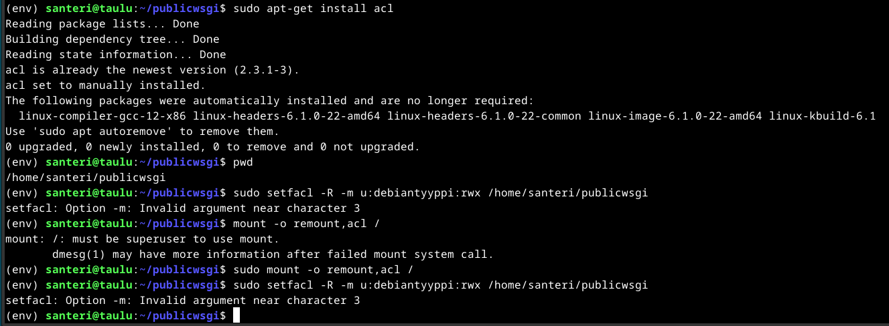

Jostain syystä djangotyyppi oli päässä muuttunut debiantyypiksi, *tarkkuutta mies*

Nyt pystyin antamaan komennolla ``setfacl -R -m user:djangotyyppi:7 /home/santeri/publicwsgi`` djangotyypille oikeudet tuohon kansioon. ``-R`` viittaa tuohon kansioon ja kaikkiin sen alikansioihin ja tiedostoihin

Nyt kokeilen vielä muokata kansioiden sisältöä djangotyypillä. Ensin vaihdetaan käyttäjää komennolla ``su djangotyyppi``

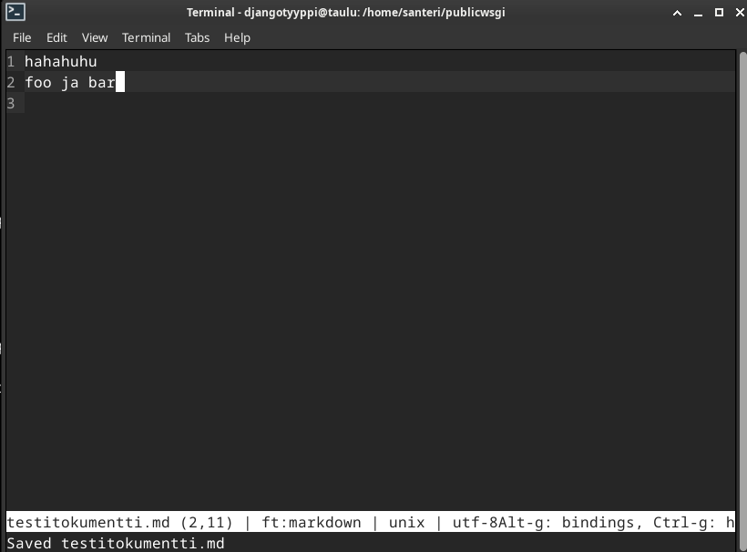

Nyt mennään takaisin santerina ja käydään katsomassa onko tallennettu tiedosto todella tuolla ``su santeri``

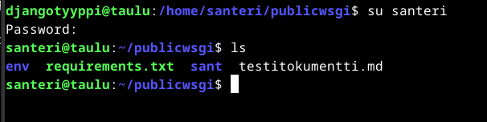

Siellä se on

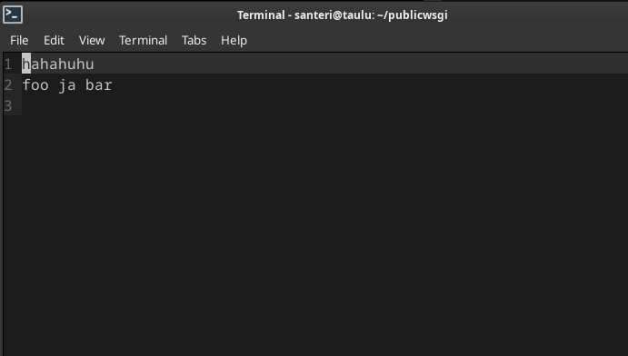

## Lähteet

Debian Wiki. Permissions. Luettavissa: https://wiki.debian.org/Permissions. Luettu 27.9.2024
Django. django-admin and manage.py. Luettavissa: https://docs.djangoproject.com/en/5.1/ref/django-admin/. Luettu 27.9.2024 
Karvinen, T. 2022. Deploy Django 4 - Production Install. Luettavissa: https://terokarvinen.com/2022/deploy-django/. Luettu 27.9.2024 
Karvinen, T. 2022. Django 4 Instant Customer Database Tutorial. Luettavissa: https://terokarvinen.com/2022/django-instant-crm-tutorial/. Luettu 27.9.2024 
W3Schools. Django Tutorial. Luettavissa: https://www.w3schools.com/django/index.php. Luettu 27.9.2024

---

Tätä dokumenttia saa kopioida ja muokata GNU General Public License (versio 2 tai uudempi) mukaisesti. http://www.gnu.org/licenses/gpl.html 
Pohjana Tero Karvinen 2012: Linux kurssi, http://terokarvinen.com  
Kirjoittanut <em>Santeri Vauramo</em>, 2024
