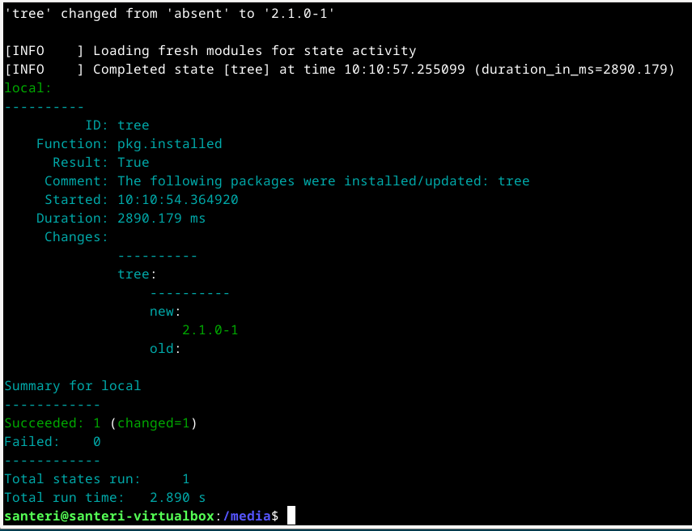
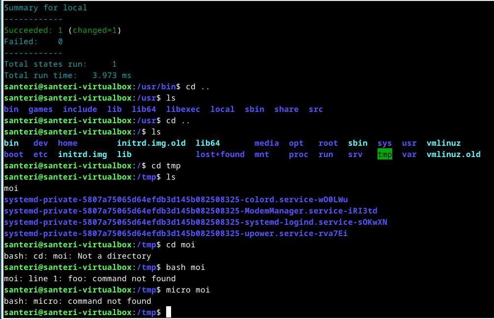
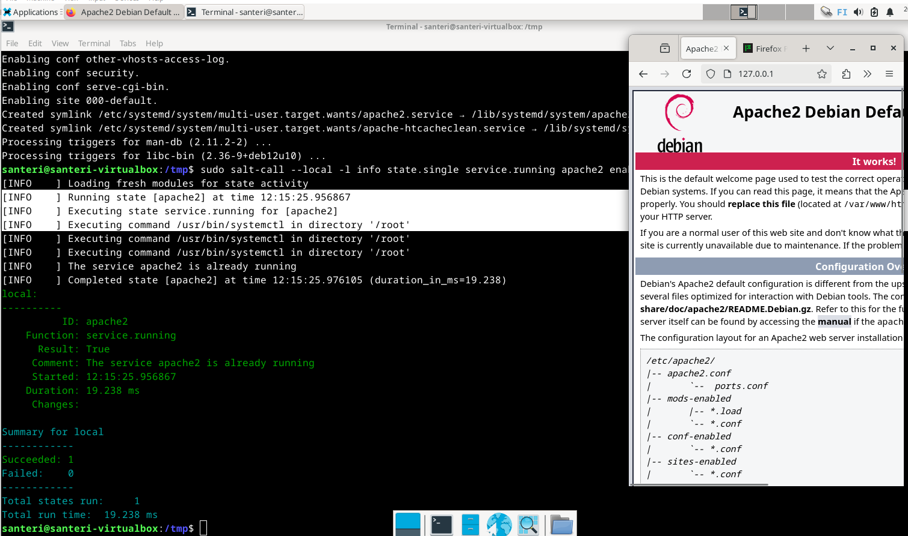
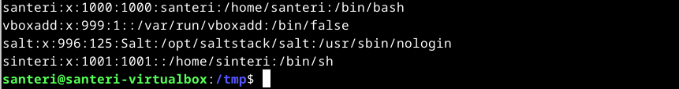
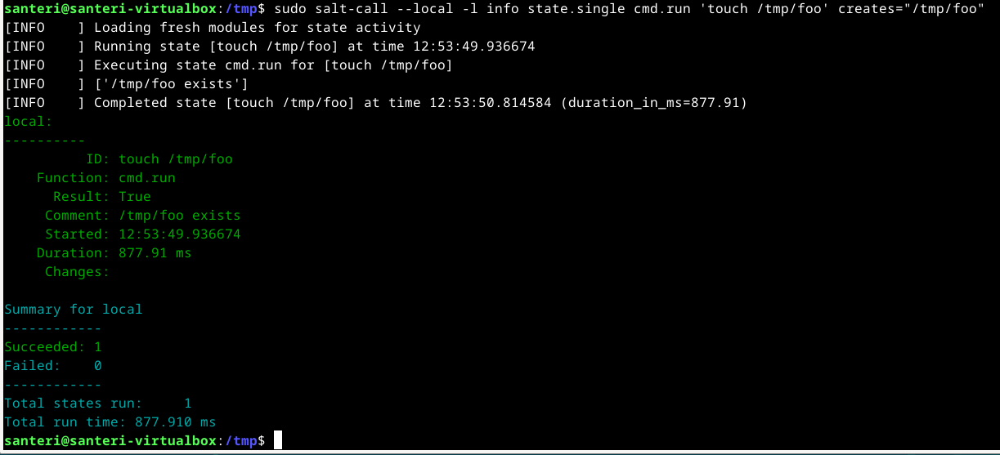
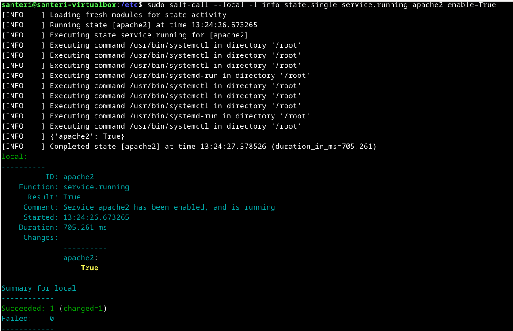
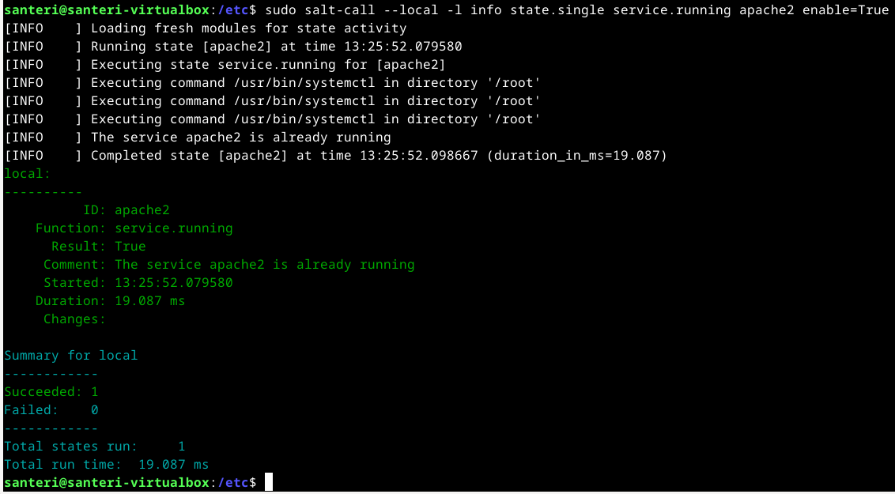

# h1 Viisikko

#### Oma Host kokoonpanoni:

| Komponentti | Kuvaus | Lisätiedot |
| :---        |    :----:   |          ---: |
| Emolevy | MSI B550-A PRO | ATX, AM4 |
| Prosessori   | AMD Ryzen 9 5900X | 12-Core 3.70 GHz |
| RAM   | G.Skill  Ripjaws V |  32GB (4x8GB) DDR4 3600MHz, CL 16, 1.3  |
| Näytönohjain   | Sapphire PULSE AMD Radeon RX 7900 GRE        | 16GB     |
| Kovalevy   | Kingston 1TB        | A2000 NVMe PCIe SSD M.2      |
| Kovalevy   | Crucial 512GB        | MX100 SSD     |
| Kovalevy   | Crucial 256GB        | MX100 SSD     |
| Virtalähde   | Asus 750W TUF Gaming Gold        | ATX 80 Plus      |
| Kotelo   | Phanteks Enthoo Pro       |  Full Tower      |

Käyttöjärjestelmä: Windows 11 Pro 23H2

#### Virtuaalikone
Oracle VirtualBox 7 - Debian 12 GNU/Linux (bookworm) 
6 Prosessoriydintä - 8GiB RAM-muistia - 60GB tallennustilaa

## x) Lue ja tiivistä:

##### Karvinen 2023: [Run Salt Command Locally](https://terokarvinen.com/2021/salt-run-command-locally/)
> - Salt-komentoja voidaan ajaa paikallisesti testimielessä
> - Samat komennot toimivat sekä Linuxissa, että Windowsissa
> - Tärkeimmät funktiot ovat: pkg, file, service, user ja cmd
> - Normaalisti Saltia käytetään ohjaamaan useita orjia verkon yli
##### Karvinen 2018: [Salt Quickstart – Salt Stack Master and Slave on Ubuntu Linux](https://terokarvinen.com/2018/03/28/salt-quickstart-salt-stack-master-and-slave-on-ubuntu-linux/)
> - Saltilla voidaan ohjata jopa tuhansia tietokoneita
> - Ainoastaan master-koneella täytyy olla julkinen osoite, orjat voivat olla "piilossa"
> - Orjat voivat olla NAT:n ja palomuurin takana, tuntemattomassa verkossa
> - Jos masterilla on palomuuri, tulee tehdä reiät palomuurin 4505/tcp ja 4506/tcp portteihin
> - Orjan tulee tietää, missä master on, orjille voi antaa oman id:n, jokaisella orjalla täytyy olla oma id
##### Karvinen 2006: [Raportin kirjoittaminen](https://terokarvinen.com/2006/06/04/raportin-kirjoittaminen-4/)
> - Raportista tulee ilmetä mitä on tehty, sekä mitä seurauksia teoilla on ollut
> - Raporttia kannattaa kirjoittaa suoraan sähköisesti samalla kun tekee tehtäviä
> - Ongelmien tutkimisessa on hyvä kirjoittaa itselle muistiinpanoja, tämä selkeyttää asioita
> - Ympäristö tulee raportoida myös, jotta raportin tulos olisi toistettavissa. Eli siis testikokoonpano
> - Ole täsmällinen raportoidessa
> - Kirjoita selkeää tekstiä
> - Muista merkitä lähteet
> - Älä sepitä, vaan kerro rehellisesti mitä olet tehnyt, älä plagioi
##### WMWare Inc: [Salt Install Guide: Linux (DEB)](https://docs.saltproject.io/salt/install-guide/en/latest/topics/install-by-operating-system/linux-deb.html) (poimi vain olennainen osa)
> - Varmistetaan, että keyrings-kansio on olemassa
> - Ladataan Salt Projectin julkinen avain ja luodaan asetukset, jolla voidaan ladata ja asentaa Salt Project repositorystä **apt-get**:llä
> - Päivitetään metadata **sudo apt update**
> - Asennetaan salt-minion, salt-master, sekä muut Salt-komponentit
> - STS:ää ei suositella tuotantokäyttöön, Salt Project suosittelee LTS-julkaisuja tuotantoympäristöihin

## a) Asenna Debian 12-Bookworm virtuaalikoneeseen. (Poikkeuksellisesti tätä alakohtaa ei tarvitse raportoida, jos siinä ei ole mitään ongelmia. Mutta jos on ongelmia, sitten täsmällinen raportti, jotta voidaan ratkoa niitä yhdessä.)
Minulla oli jo valmiiksi Oraclen Virtual Box ja siinä useampi Debian 12-Bookworm-käyttöjärjestelmällä oleva virtuaalikone. 

Pari päivää sitten käynnistelin pienen tauon jälkeen Virtual Boxin ja sepä ei enää toiminutkaan, virtuaalikoneita ei pystynyt enää käynnistämään.

Lueskelin Oraclen foorumeilta tietoja ja muillakin oli samanlaisia ongelmia.

Poistin asennuksen ja asensin uudelleen pääkäyttäjänä, sama ongelma jatkui.

Lopulta poistin asennuksen, latasin toiseksi uusimman version 7.1 https://www.virtualbox.org/wiki/Download_Old_Builds ja se lähti toimimaan normaalisti.

Loin vielä uuden Debianilla varustetun virtuaalikoeen ja tein perus alkuasetukset

## b) Asenna Salt (salt-minion) Linuxille (uuteen virtuaalikoneeseesi)
Tässä tulee kyseeseen X-kohdassa mainittu sivu https://docs.saltproject.io/salt/install-guide/en/latest/topics/install-by-operating-system/linux-deb.html

- Varmistan, että "keyrings" kansio löytyy komennolla **mkdir -p /etc/apt/keyrings**
- Ladataan Salt Projectin julkinen avain **curl -fsSL https://packages.broadcom.com/artifactory/api/security/keypair/SaltProjectKey/public | sudo tee /etc/apt/keyrings/salt-archive-keyring.pgp**
- Luodaan konfigurointi repositorylle **curl -fsSL https://github.com/saltstack/salt-install-guide/releases/latest/download/salt.sources | sudo tee /etc/apt/sources.list.d/salt.sources**
- Päivitetään pakettilista **sudo apt-get update**

Nyt siirryn Karvisen (2021) ohjeeseen [https://terokarvinen.com/2018/03/28/salt-quickstart-salt-stack-master-and-slave-on-ubuntu-linux/](https://terokarvinen.com/2021/salt-run-command-locally/)

Sekä Karvisen (2018) https://terokarvinen.com/2018/03/28/salt-quickstart-salt-stack-master-and-slave-on-ubuntu-linux/

- Asennetaan salt-minion komennolla **sudo apt-get -y install salt-minion**
- Testaan, että minulla on salt **sudo salt-call --version**, palautuu: "salt-call 3007.1 (Chlorine)", voidaan olettaa, että asennus onnistui

## c) Viisi tärkeintä. Näytä Linuxissa esimerkit viidestä tärkeimmästä Saltin tilafunktiosta: pkg, file, service, user, cmd. Analysoi ja selitä tulokset.

#### pkg
- Komennolla **sudo salt-call --local -l info state.single pkg.installed tree** tapahtui seuraavaa

Täten voimme todeta, että **tree** asentui. Kävin vielä /usr/bin hakemistossa varmistamassa, että tree löytyy sieltä.
Poistetaan **tree** komennolla **sudo salt-call --local -l info state.single pkg.removed tree**

#### file
- Loin tekstitiedoston **sudo salt-call --local -l info state.single file.managed /tmp/hello**
- Poistin samaisen tiedoston **sudo salt-call --local -l info state.single file.absent /tmp/hello**
- Loin tekstitiedoston sisällöltään "foo" **sudo salt-call --local -l info state.single file.managed /tmp/moi contents="foo"**

Kuten kuvasta näkyy, on hieman taidot ruosteessa, mutta ainakin tiedosto sieltä löytyy
- Poistan vielä tuonkin tiedoston **sudo salt-call --local -l info state.single file.absent /tmp/moi**

#### service
Tätä varten täytyy ensin asentaa apache2: **sudo apt-get -y install apache2**
- Nyt voidaan käskeä saltia käynnistämään apache2 **sudo salt-call --local -l info state.single service.running apache2 enable=True**

Toimii
- Nyt voidaan sammuttaa saltilla apache2 **sudo salt-call --local -l info state.single service.dead apache2 enable=False**

#### user
- Luodaan saltilla uusi käyttäjä **sudo salt-call --local -l info state.single user.present sinteri**
- Katson onko käyttäjä luotu **cat /etc/passwd**

Sieltä löytyy
- Nyt voin poistaa käyttäjän sinteri komennolla **sudo salt-call --local -l info state.single user.absent sinteri**

#### cmd
cmd moduulilla voidaan ajattaa ehdollisia komentoja [salt.states.cmd](https://docs.saltproject.io/en/3006/ref/states/all/salt.states.cmd.html)
- Kosketetaan tiedostoa "foo" komennolla "touch" **sudo salt-call --local -l info state.single cmd.run 'touch /tmp/foo' creates="/tmp/foo"**

Touch muuttaa tiedoston aikaleimaa muuttamatta muuten itse tiedostoa.

Ajoin komennon uudelleen ja nyt tuli tällainen vastaus

> [INFO    ] Executing state cmd.run for [touch /tmp/foo]
> 
> [INFO    ] ['/tmp/foo exists']
> 
> [INFO    ] Completed state [touch /tmp/foo] at time 12:53:50.814584 (duration_in_ms=877.91)

Näkisin, että tuo keskimmäinen rivi kertoo, että tuo tiedosto on jo olemassa. Ensimmäisellä kerralla tätä ei tullut. Eli tällä komennolla "touch" tapahtuu ainoastaan, jos "foo" nimistä tiedostoa ei vielä ole olemassa.

## d) Idempotentti. Anna esimerkki idempotenssista. Aja 'salt-call --local' komentoja, analysoi tulokset, selitä miten idempotenssi ilmenee.

Pakko lukea hieman aiheesta lisää ennen kuin alan väittelemään asiantuntijoiden kanssa. Nopealla googlauksella löysin tällaisen sivun: https://www.vpnunlimited.com/fi/help/cybersecurity/idempotence?srsltid=AfmBOorT1SZsUTWF3ssKdpj9vLexmDboTxrkzPebgf19PoLfy46Jw-pe

Käytännössä siis idempotentti komento on sellainen, jonka suorittaminen useita kertoja, vaikuttaa samalla tavalla, kuin saman komennon suorittaminen yhden kerran. Lopputulos ei muutu, jos komentoa ajetaan useamman kerran.

Luon saltilla käyttäjän *moikkelis*
- ajan komennon **sudo salt-call --local -l info state.single user.present moikkelis**

> [INFO    ] Loading fresh modules for state activity
> 
> [INFO    ] Running state [moikkelis] at time 13:17:56.889526
> 
> [INFO    ] Executing state user.present for [moikkelis]
> 
> [INFO    ] Executing command /usr/sbin/useradd in directory '/root'
> 
> [INFO    ] {'gid': 1001, 'groups': ['moikkelis'], 'home': '/home/moikkelis', 'name': 'moikkelis', 'passwd': 'x', 'shell': '/bin/sh', 'uid': 1001, 'fullname': '', 'roomnumber': '', 'workphone':
>
>  '', 'homephone': '', 'other': ''}
>  
> [INFO    ] Completed state [moikkelis] at time 13:17:56.928796 (duration_in_ms=39.27)

- Nyt ajan saman komennon uudelleen

> [INFO    ] Loading fresh modules for state activity
> 
> [INFO    ] Running state [moikkelis] at time 13:20:07.115855
> 
> [INFO    ] Executing state user.present for [moikkelis]
> 
> [INFO    ] User moikkelis is present and up to date
> 
> [INFO    ] Completed state [moikkelis] at time 13:20:07.138252 (duration_in_ms=22.397)

- Ensimmäisellä kerralla toiseksi viimeisessä kohdassa luotiin käyttäjä *moikkelis* ja kotikansiot ym.
- Toisella ajokerralla todettiin, että moikkelis niminen käyttäjä on olemassa, joten ei tarvinnut enää luoda uutta käyttäjää.

Kokeillaan käynnistää apache2 komennolla **sudo salt-call --local -l info state.single service.running apache2 enable=True**

Seuraavaksi ajetaan sama komento uudelleen

- Taas voidaan todeta, että ensimmäisellä kerralla apache2 käynnistettiin
- Toisella kerralla todettiin, että apache2 on jo käynnissä, eikä ollut tarvetta käynnistää apachea

---

Tätä dokumenttia saa kopioida ja muokata GNU General Public License (versio 2 tai uudempi) mukaisesti. http://www.gnu.org/licenses/gpl.html 
Pohjana Tero Karvinen 2025: Palvelinten Hallinta - Configuration Management Systems course - 2025 spring, http://terokarvinen.com  
Kirjoittanut <em>Santeri Vauramo</em>, 2025
