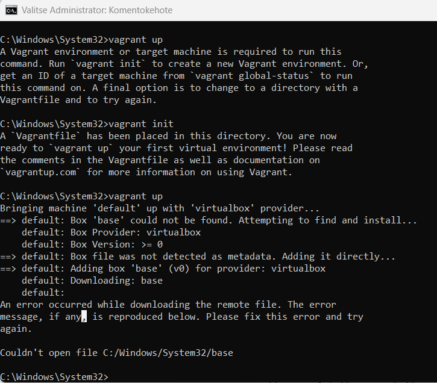
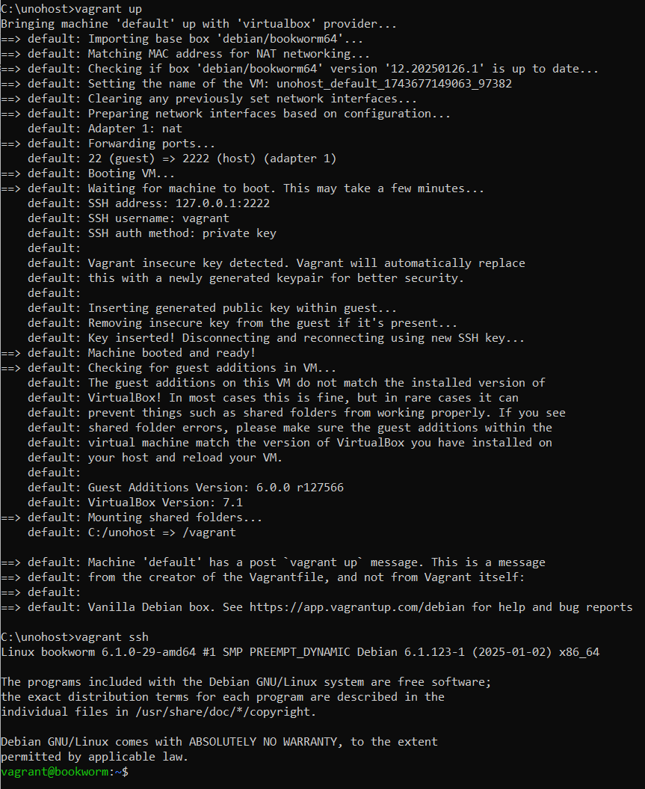
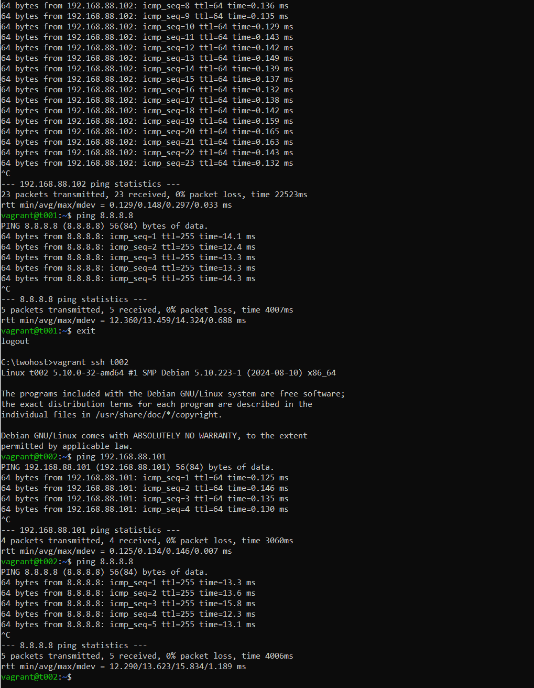
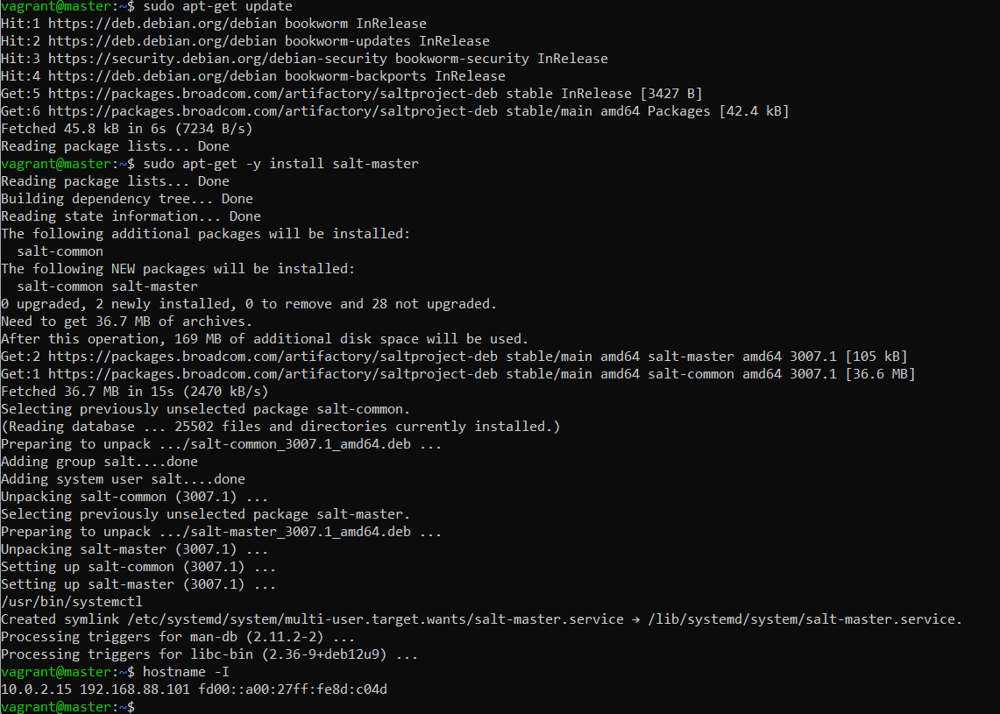
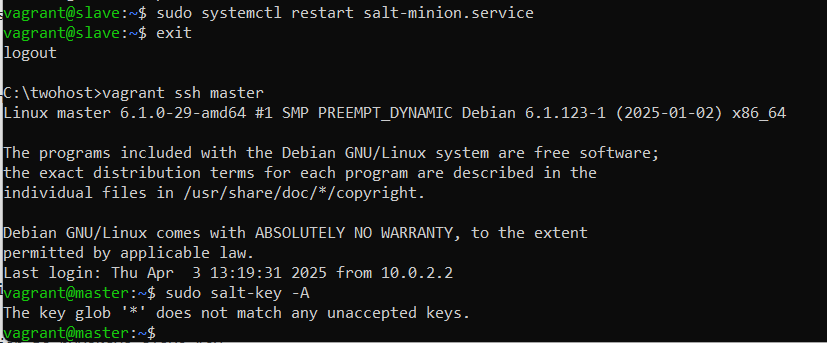
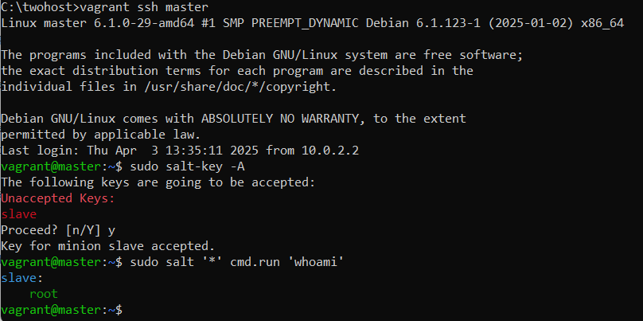
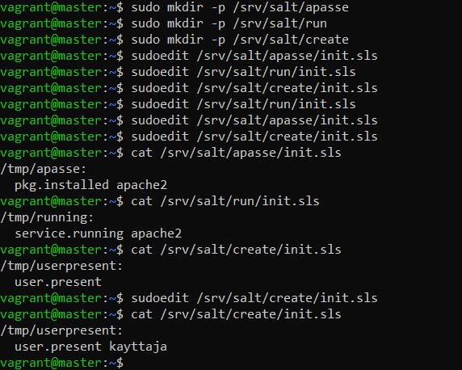
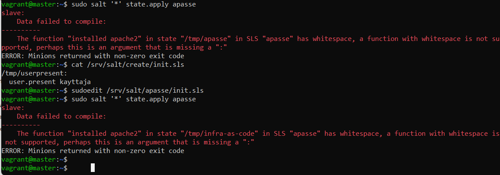
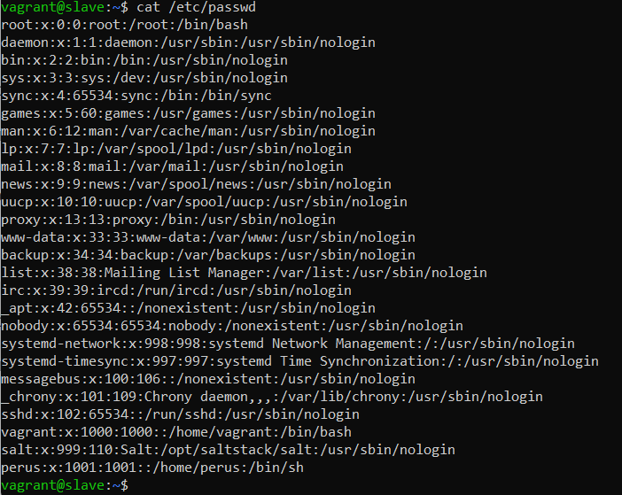
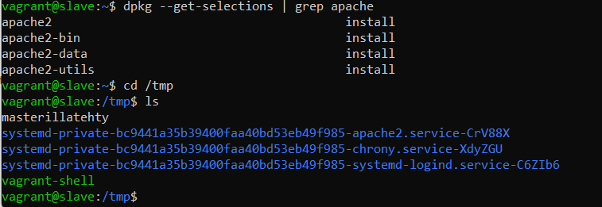

# h2 Soitto kotiin

#### Oma Host kokoonpanoni:

| Komponentti | Kuvaus | Lisätiedot |
| :---        |    :----:   |          ---: |
| Emolevy | MSI B550-A PRO | ATX, AM4 |
| Prosessori   | AMD Ryzen 9 5900X | 12-Core 3.70 GHz |
| RAM   | G.Skill  Ripjaws V |  32GB (4x8GB) DDR4 3600MHz, CL 16, 1.3  |
| Näytönohjain   | Sapphire PULSE AMD Radeon RX 7900 GRE        | 16GB     |
| Kovalevy   | Kingston 1TB        | A2000 NVMe PCIe SSD M.2      |
| Kovalevy   | Crucial 512GB        | MX100 SSD     |
| Kovalevy   | Crucial 256GB        | MX100 SSD     |
| Virtalähde   | Asus 750W TUF Gaming Gold        | ATX 80 Plus      |
| Kotelo   | Phanteks Enthoo Pro       |  Full Tower      |

Käyttöjärjestelmä: Windows 11 Pro 24H2

## x) Lue ja tiivistä. (Tässä x-alakohdassa ei tarvitse tehdä testejä tietokoneella, vain lukeminen tai kuunteleminen ja tiivistelmä riittää. Tiivistämiseen riittää muutama ranskalainen viiva. Ei siis vaadita pitkää eikä essee-muotoista tiivistelmää.)

#### Karvinen 2021: [Two Machine Virtual Network With Debian 11 Bullseye and Vagrant](https://terokarvinen.com/2021/two-machine-virtual-network-with-debian-11-bullseye-and-vagrant/) (Huomaa: nykyinen Debian stable on 12-Bookworm, Vagrantissa "debian/bookworm64". Vanhentunutta 11-bullseye:ta ei enää käytetä)
- Vagrant: pystyttää automaattisesti Virtualbox koneita, automatisoi SSH-kirjautumisen, ei vaadi graafista käyttöliittymää
- Vagrant asennetaan Linuxiin apt-get:llä: **sudo apt-get install vagrant virtualbox**
- Jos käytät Windowsia tai Mac:ia, tulee ladata Vagrant installer pääkäyttöjärjestelmällesi. (Vagrant ei virtualisoi virtualisoinnin päällä (Karvinen luento 2.4.2025))(Tässä vaiheessa myös asensin Vagrantin Windowsilleni ja käynnistin koneen uudelleen, koska niin täytyy tehdä asentaessa Windowsille)
- Vagrantilla luodut hostit pystyvät ottamaan yhteyden toisiinsa, sekä internetiin

#### Karvinen 2018: [Salt Quickstart – Salt Stack Master and Slave on Ubuntu Linux](https://terokarvinen.com/2018/salt-quickstart-salt-stack-master-and-slave-on-ubuntu-linux/?fromSearch=salt%20quickstart%20salt%20stack%20master%20and%20slave%20on%20ubuntu%20linux) (Huomaa: Nykyisin ennen Saltin asentamista on asennettava ensin varasto [package repository], ohje h1 vinkeissä)
- Salt:lla pystyy hallitsemaan halutessaan vaikka tuhatta konetta kerralla
- Tulee olla yksi master, joka hallitsee orjia
- Salt master asennetaan master koneeseen **sudo apt-get -y install salt-master**, jos master on palomuurin takana, tulee tehdä palomuuriin reiät 4505/tcp, sekä 4506/tcp
- Salt slave asennetaan slave koneeseen **sudo apt-get -y install salt-minion**
- Orjan täytyy tietää, missä master on, jokaisella orjalla täytyy olla yksilöllinen ID **sudoedit /etc/salt/minion**, tämän jälkeen potkaistaan demonia **sudo systemctl restart salt-minion.service**
```
master: 10.0.0.88
id: tero
```
- Hyväksytään uudet orjat masterilla **sudo salt-key -A**

#### Karvinen 2023: [Salt Vagrant - automatically provision one master and two slaves](https://terokarvinen.com/2023/salt-vagrant/#infra-as-code---your-wishes-as-a-text-file) vain kohdat **Infra as Code - Your wishes as a text file** ja **top.sls - What Slave Runs What States**

##### Infra as Code

- Jos Salt:ssa halutaan luoda infraa koodina, on luotava kansio, esimerkiksi "hello" **sudo mkdir -p /srv/salt/hello** ja kansioon tiedosto **sudoedit /srv/salt/hello/init.sls** (komennot kirjoitetaan init.sls tiedostoon)
```
/tmp/infra-as-code:  
  file.managed
```
- Huom. YAML syntaksia, joten "file.managed" rivillä on kaksi välilyöntiä, ei tabia
- **sudo salt '*' state.apply hello** <- asetetaan tila kaikille orjille tiedoston perusteella
  
##### top.sls

Salt Projectin sivuilta https://docs.saltproject.io/en/3006/ref/states/top.html löysin tähän hieman lisää sisältöä. top.sls on "päällimmäinen" tiedosto, jolla määritetään ryhmille erilaisia rooleja. Esim. web-palvelinkoneella tulee aina olla asennettuna apache2 web-palvelinohjelmisto. Eli kuten Karvisen (2023) ohjeessa lukee: Top-tiedosto määrittää mitä tiloja ajetaan millekin orjille.
```
sudo salt '*' state.apply hello^C
sudoedit /srv/salt/top.sls
cat /srv/salt/top.sls
base:
  '*':
    - hello
```
- ^ Tällä esimerkillä asetetaan kaikille orjille hello.sls:n sisältämät käskyt
- Esimerkissä **- hello** ajaa siis hello.sls tiedoston, lisää tiedostoja voidaan lisätä tuohon alle tarvittaessa

## a) Hello Vagrant! Osoita jollain komennolla, että Vagrant on asennettu (esim tulostaa vagrantin versionumeron). Jos et ole vielä asentanut niitä, raportoi myös Vagrant ja VirtualBox asennukset. (Jos Vagrant ja VirtualBox on jo asennettu, niiden asennusta ei tarvitse tehdä eikä raportoida uudelleen.)

Avasin Windowsin cmd:n järjestelmänvalvojana ja kokeilin ajaa pari Vagrant komentoa, ei mennyt aivan putkeen. En ole varma onko järkevää tehdä tuota System32 kansiossa muutenkaan, koska Vagrant alkaa näemmä tekemään sinne uusia tiedostoja.



Pitää lukea lisää Vagrantista https://developer.hashicorp.com/vagrant/tutorials/get-started/development-environment?productSlug=vagrant&tutorialSlug=getting-started&tutorialSlug=getting-started-boxes ja https://developer.hashicorp.com/vagrant/docs/installation.

Luin vielä ohjeita https://www.vagrantup.com/, Vagrant on siis oikein asentunut, kokeilin vielä **vagrant --help** komentoa, joka toimi ihan oikealla tavalla.

## b) Linux Vagrant. Tee Vagrantilla uusi Linux-virtuaalikone

Hetken jouduin miettimään, että miten saan Windowsin komentokehotteessa muokattua Vagrantfileä, jotta pääsen laittamaan virtuaalikoneita pystyyn. https://superuser.com/questions/186857/how-do-i-edit-text-files-in-the-windows-command-prompt Täältä löytyi ajatus käyttää "notepad tiedostonimi", mutta se avaa graafiseen käyttöliittymään nodepadin, saa kelvata nyt tässä. Toinen tapa samasta lähteestä olisi ladata Windowsille esimerkiksi nano ja käyttää sitä SSH:lla "nano.exe tiedostonimi", tämä kaiketi vaatii että on Git asennettuna.

Luon C:/ asemalle kansion nimeltä unohost ja sinne yhden koneen Vagrantin
```
md unohost
cd unohost
vagrant init debian/bookworm64
vagrant up
vagrant ssh
```


Nyt on Vagrant toiminnassa Windowsin komentokehotteessa. Poistun ja poistan vielä tämän
```
exit
vagrant destroy
```

## c) Kaksin kaunihimpi. Tee kahden Linux-tietokoneen verkko Vagrantilla. Osoita, että koneet voivat pingata toisiaan

Luon kansion "twohost" ja luon sinne kaksi erillistä konetta
```
md twohost
vagrant init debian/bookworm64
```
Kokeilen laittaa Karvisen [(2021)](https://terokarvinen.com/2021/two-machine-virtual-network-with-debian-11-bullseye-and-vagrant/) scriptin Vagrantfileen ja luoda sillä "t001" ja "t002" virtuaalikoneet
```
vagrant up
```
Komennolla Vagrant loi kaksi virtuaalikonetta. Kokeilen ottaa yhteyden koneisiin ja pingailen niillä toisiaan.

Hetken mietin, että mistä tiedän näiden koneiden IP-osoitteet, mutta Karvisen scriptissä koneille annetaan valmiit private_network osoitteet, jotka ovat: **t001 192.168.88.101** ja **t002 192.168.88.102**

Huomion arvoista, että tässä täytyi lopettaa pingaus Ctrl+C:llä, olisi muuten varmaan jatkunut loputtomasti



## d) Herra-orja verkossa. Demonstroi Salt herra-orja arkkitehtuurin toimintaa kahden Linux-koneen verkossa, jonka teit Vagrantilla. Asenna toiselle koneelle salt-master, toiselle salt-minion. Laita orjan /etc/salt/minion -tiedostoon masterin osoite. Hyväksy avain ja osoita, että herra voi komentaa orjakonetta

Poistin edelliset virtuaalikoneet ja menin muokkaamaan Vagrantfile tiedostoa. Tässä vaiheessa huomasin, että olin jättänyt scriptiin debian/bullseye64:n, vaihdan sen bookwormiin, muutan samalla "t001" ja "t002" nimet "master" ja "slave":ksi. vagrant up:lla luon koneet. Seuraavaksi asennetaan Salt molempiin koneisiin ja konfiguroidaan ne toimimaan halutulla tavalla.
```
vagrant up
vagrant ssh master
sudo apt-get update
sudo apt-get -y install salt-master
```
Vaan eipä tietenkään tällä saada Saltia asennettua, koska sitä ei löydy apt-get:sta. Täytyy siis palata h1 tehtävän Salt asennukseen.
```
mkdir -p /etc/apt/keyrings
curl -fsSL https://packages.broadcom.com/artifactory/api/security/keypair/SaltProjectKey/public | sudo tee /etc/apt/keyrings/salt-archive-keyring.pgp
```
Curlia ei ole asennettu, joten asennetaan se
```
sudo apt-get install curl
```
Uudelleen äskeinen curl-komento ja sitten
```
curl -fsSL https://github.com/saltstack/salt-install-guide/releases/latest/download/salt.sources | sudo tee /etc/apt/sources.list.d/salt.sources
```
Näillä luodaan luottamussuhde Saltiin ja voidaan pakettilistan päivityksen jälkeen asentaa Salt. Huomasin seuraavassa kohdassa, että jos pakettilistaa ei tässä vaiheessa päivitä, ei pakettia löydy.
```
sudo apt-get update
sudo apt-get -y install salt-master
hostname -I
exit
```
Otan IP:t talteen myöhempää käyttöä varten



Nyt teen saman alustuksen slavelle ja asennan salt-minionin. Koska orjan täytyy tietää missä herra sijaitsee, on kerrottava orjalle herran sijainti. Nyt tulee kyseeseen aiemmin talteen otettu masterin IP-osoite, lisään IP-osoitteen tekstitiedoston alkuun. Tämän jälkeen käynnistän salt-minion demonin uudelleen
```
sudo apt-get update
sudo apt-get -y install salt-minion
sudoedit /etc/salt/minion
```
```
master 192.168.88.101
```
```
sudo systemctl restart salt-minion.service
```
Nyt voidaan mennä masterina sisään ja hyväksyä slave Key
```
exit
vagrant ssh master
sudo salt-key -A
```



Ilmeisesti annoin väärän IP-osoitteen slavelle, kokeilen käydä muuttamassa sen tuohon **10.0.2.15**, joka näkyi myös masterilla, olin näköjään jättänyt kaksoispisteen pois ":"

Ei toiminut vieläkään, kokeilen vaihtaa IP-osoitteen takaisin, uusi yritys

Ei toimi edelleenkään, kokeilen lisätä ID:n seuraavalle riville, tämäkään ei auta kummallakaan IP-osoitteella, yritin vielä IPv6 osoitteella. Lopulta tajusin ottaa Vagrantfileen lisäämäni masterin IP osoitteen 192.168.88.101 ja sillä toimii. Kokeilen vielä, että master-orja suhde toimii
```
sudo salt '*' cmd.run 'whoami'
```



## e) Kokeile vähintään kahta tilaa verkon yli (viisikosta: pkg, file, service, user, cmd)

Lähdin mahdollisesti haukkaamaan hieman isompaa palasta heti kättelyssä, tarkoituksena on tehdä tiedostot masterille millä kaikille orjille:
- asennetaan apache2
- käynnistetään apache2
- luodaan käyttäjä nimeltä **kayttaja**



Tämän jälkeen ajan komennot
```
sudo salt '*' state.apply apasse
sudo salt '*' state.apply run
sudo salt '*' state.apply create
```
Erroria tulee, ehkä jätän tämän suunnitelman ja teen yksinkertaisemmin



```
sudo salt slave state.single user.present perus
sudo salt slave state.single pkg.installed apache2
sudo salt slave state.single file.managed /tmp/masterillatehty
```
Menen orjana katsomaan toimiko nämä
```
exit
vagrant ssh slave
cat /etc/passwd
```
"perus" käyttäjä löytyy



```
dpkg --get-selections | grep apache
```
Tämän komennon lainasin täältä https://superuser.com/questions/387948/how-can-i-determine-if-apache-is-installed-on-a-system

Navigoin vielä /tmp

```
cd /tmp
ls
```
Apache2 on selkeästi asennettu ja "masterillatehty" löytyy /tmp kansiosta. Näin saatiin masterilla slave tekemään haluamame asiat



---

Tätä dokumenttia saa kopioida ja muokata GNU General Public License (versio 2 tai uudempi) mukaisesti. http://www.gnu.org/licenses/gpl.html<br>
Pohjana Tero Karvinen 2025: Palvelinten Hallinta - Configuration Management Systems course - 2025 spring, https://terokarvinen.com/palvelinten-hallinta/<br><br>
Kirjoittanut <em>Santeri Vauramo</em> 2025
