# h3 Infraa koodina

#### Oma Host kokoonpanoni:

| Komponentti | Kuvaus | Lisätiedot |
| :---        |    :----:   |          ---: |
| Emolevy | MSI B550-A PRO | ATX, AM4 |
| Prosessori   | AMD Ryzen 9 5900X | 12-Core 3.70 GHz |
| RAM   | G.Skill  Ripjaws V |  32GB (4x8GB) DDR4 3600MHz, CL 16, 1.3  |
| Näytönohjain   | Sapphire PULSE AMD Radeon RX 7900 GRE        | 16GB     |
| Kovalevy   | Kingston 1TB        | A2000 NVMe PCIe SSD M.2      |
| Kovalevy   | Crucial 512GB        | MX100 SSD     |
| Kovalevy   | Crucial 256GB        | MX100 SSD     |
| Virtalähde   | Asus 750W TUF Gaming Gold        | ATX 80 Plus      |
| Kotelo   | Phanteks Enthoo Pro       |  Full Tower      |

Käyttöjärjestelmä: Windows 11 Pro 24H2

#### Virtuaalikone
Oracle VirtualBox Version 7.1.4 r165100 (Qt6.5.3) - Debian 12 GNU/Linux (bookworm)<br>
6 Prosessoriydintä - 8GB RAM-muistia - 60GB tallennustilaa

Vagrant 2.4.3

## x) Lue ja tiivistä. (Tässä x-alakohdassa ei tarvitse tehdä testejä tietokoneella, vain lukeminen tai kuunteleminen ja tiivistelmä riittää. Tiivistämiseen riittää muutama ranskalainen viiva.)

#### Karvinen 2014: [Hello Salt Infra-as-Code](https://terokarvinen.com/2024/hello-salt-infra-as-code/)

- Tässä luodaan niin sanottu salt:n "Hello world"
- Aluksi asennetaan salt-minon: **sudo apt-get -y install salt-minion**
- Luodaan kansio "hello" moduulille **sudo mkdir -p /srv/salt/hello/** <-- srv/salt on minionien jaettu kansio, hello/ <-- tulee sisältämään kaikki tähän "hello worldiin" liittyvät tiedostot
- /srv/salt/hello kansioon luodaan ajettava tiedosto "init.sls": **sudoedit init.sls** <-- init.sls sisältää tämän "hello world" projektin koodin, tässä tapauksessa kirjoitetaan tiedostoon:
```YAML
/tmp/hellotero:
  file.managed
```
- Tämän jälkeen voidaan kutsua hello kansion init.sls tiedostoa komennolla **sudo salt-call --local state.apply hello**
- Jos kaikki onnistui, nyt minion on luonut tmp/ kansioon tiedoston "hellotero"
- Idempotenttina käskynä komennon uudelleen ajaminen ei luo uutta tiedostoa, jos semmoinen löytyy jo

#### Salt contributors: [Salt overview](https://docs.saltproject.io/salt/user-guide/en/latest/topics/overview.html#rules-of-yaml) Kohdat: Rules of YAML, YAML simple structure, Lists and dictionaries - YAML block structures

Rules of YAML
- Salt:ssa usein käytetään YAML renderöintiä, YAML renderöinnillä YAML tietorakenne kootaan Python datarakenteeksi Salt:iin
- Data on strukturoitu **key: value** (avain: arvo) pareina
- Kaksoispiste + välilyönti erottaa avaimen ja arvon toisistaan (": ")
- Avainten arvo voi olla monella eri rakenteella
- Kaikkien avainten ja ominaisuuksien kirjainkoolla on merkitystä
- Tabulaattoria ei sallita YAML:ssä, on käytettävä välilyöntejä
- Kommentit alkavat "#" merkillä

YAML simple structure
- YAML sisältää kolme perus elementtiä:
  - **Scalar**, avain: arvo pari, joissa arvo voi olla numero, merkkijono, tai [totuusarvo](https://www.sanakirja.org/search.php?id=90117&l2=17) (boolean)
  ```YAML
  ruoka: makkara
  rakennus: kerrostalo
  ```
  - **List**, avain:, jonka jälkeen voi olla useita arvoja, jokainen arvo on eroteltu rivillä ja väliviivalla
  ```YAML
  ruoka:
    - makkara
    - muusi
  rakennus:
    - kerrostalo
    - rivitalo
  ```
  - **Dictionary**, kokoelma avain: arvo pareista, sekä listoista
  ```YAML
  lounas:
    alkuruoka: salaatti
    juoma: vesi
    pääruoka:
      - hernekeitto
      - maksalaatikko
      - pizza
    jälkiruoka:
      - jäätelö
  ```
  
Lists and dictionaries - YAML block structures
- YAML on organisoitu lohkorakenteiseksi
- Sisennys määrää asiayhteyden. Ominaisuudet ja listat täytyy sisentää yhdellä tai useammalla välilyönnillä, kaksi välilyöntiä on "**standardi**"
- Kokoelma, joka on **list** tai **dictionary**, osoittaa jokaisen merkinnän väliviivalla ja välilyönnillä

## a) Hei infrakoodi! Kokeile paikallisesti (esim 'sudo salt-call --local') infraa koodina. Kirjota sls-tiedosto, joka tekee esimerkkitiedoston /tmp/ -kansioon

Salt-minion oli jo valmiiksi asennettu tälle virtuaalikoneelle, joten sitä ei tarvitse tehdä. Aloitan luomalla "hello" kansion ja navigoin itseni sinne ("-p" luo kansion jos sitä ei jo ole, ei anna erroria jos se on jo olemassa, sekä luo myös ylemmät kansiot tarvittaessa(mkdir --help))
```bash
sudo mkdir -p /srv/salt/hello/
cd /srv/salt/hello/
```
Luon tiedoston init.sls ja kirjoitan sinne koodin
```bash
sudoedit init.sls
```
```YAML
/tmp/hellosantero:
  file.managed
```
**Ctrl+s** <- tallennus ja **Ctrl+q** <- poistuu Micro editorista

Seuraavaksi ajan komennon
```bash
sudo salt-call --local state.apply hello
```
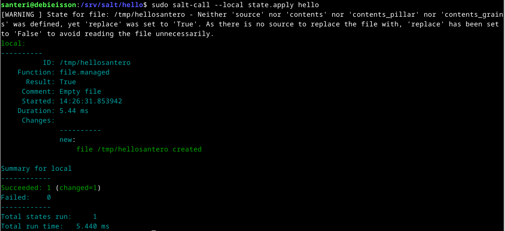

Varoituksen myötä kuitenkin tiedoston luominen onnistui

Ajan komennon vielä uudelleen, ja käyn vielä tarkistamassa, että tiedosto on luotu kansioon
```bash
ls /tmp/hellosantero
```
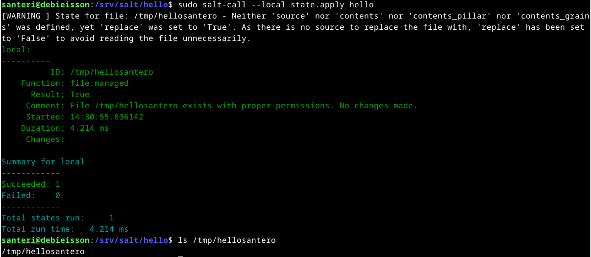

## b) Aja esimerkki sls-tiedostosi verkon yli orjalla.

Tätä varten siirryn Windowsiin ja luon tehtävän h2 ohjeilla https://terokarvinen.com/2023/salt-vagrant/#infra-as-code---your-wishes-as-a-text-file Vagrantilla orjan ja masterin

Luon Windowsissa kansion h3/ ja teen sinne Vagrantfilen, jossa on "master" ja "slave"
```
mkdir h3
cd h3
notepad.exe Vagrantfile
```
Komennolla **vagrant up** tulee seuraavanlainen error

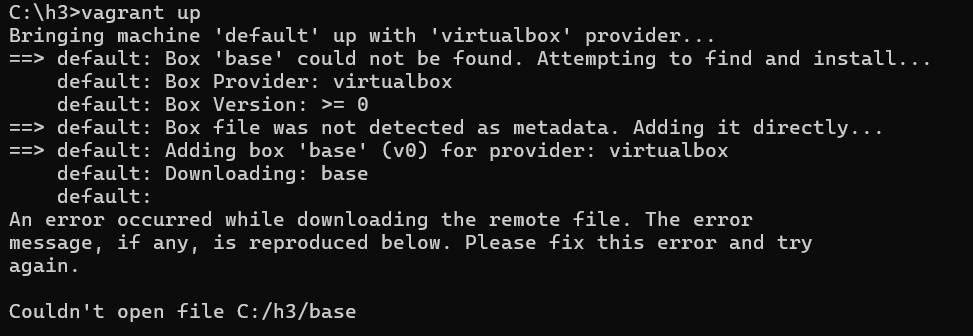

Luin Vagrantin sivuilta https://developer.hashicorp.com/vagrant/docs/cli/init, että aluksi piti ajaa komento **vagrant init**, jolla alustetaan Vagrant toimimaan kyseisessä kansiossa, tämä myös samalla luo Vagrantfilen, jos sitä ei jo ole olemassa. Tässä tapauksessa kuitenkin se tiedosto oli jo olemassa, mutta Vagrant päällekirjoitti tiedoston, joten jouduin laittamaan tiedot uudelleen. Nyt kuitenkin sain **vagrant up**:lla virtuaalikoneet käyntiin

Asennan Salt:n molempiin virtuaalikoneisiin
```bash
vagrant up
vagrant ssh master
sudo apt-get update
sudo apt-get -y install curl
mkdir -p /etc/apt/keyrings
curl -fsSL https://packages.broadcom.com/artifactory/api/security/keypair/SaltProjectKey/public | sudo tee /etc/apt/keyrings/salt-archive-keyring.pgp
curl -fsSL https://github.com/saltstack/salt-install-guide/releases/latest/download/salt.sources | sudo tee /etc/apt/sources.list.d/salt.sources
sudo apt-get update
sudo apt-get -y install salt-master
exit
vagrant ssh slave
sudo apt-get update
sudo apt-get -y install curl
mkdir -p /etc/apt/keyrings
curl -fsSL https://packages.broadcom.com/artifactory/api/security/keypair/SaltProjectKey/public | sudo tee /etc/apt/keyrings/salt-archive-keyring.pgp
curl -fsSL https://github.com/saltstack/salt-install-guide/releases/latest/download/salt.sources | sudo tee /etc/apt/sources.list.d/salt.sources
sudo apt-get update
sudo apt-get -y install salt-minion
```
Käyn antamassa slave:lle masterin osoitteen, käynnistän slaven salt-minion ohjelman uudelleen ja käyn masterilla hyväksymässä slaven id:n
```bash
sudoedit /etc/salt/minion
```
```YAML
master: 192.168.88.101
id: slave
```
```bash
sudo systemctl restart salt-minion.service
exit
vagrant ssh master
sudo salt-key -A
```
Nyt ollaan valmiita komentamaan slavea masterilla. Luon masterilla **hello/** kansion ja sinne **init.sls** tiedoston, jonne laitan tietoja
```bash
sudo mkdir -p /srv/salt/hello/
cd /srv/salt/hello/
sudoedit init.sls
```
```YAML
/tmp/hellosantero:
  file.managed
```
Ajetaan tiedosto slavella
```bash
sudo salt slave state.apply hello
```
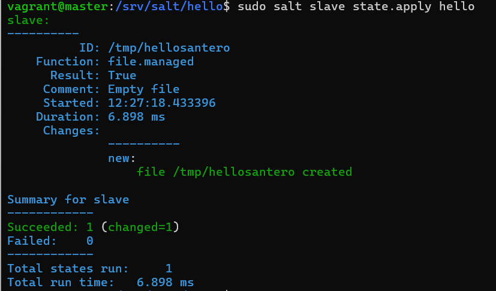

Sitten vielä slavella tarkistamaan, että tiedosto **hellosantero** löytyy **tmp/** kansiosta
```bash
exit
vagrant ssh slave
ls /tmp/hellosantero
```
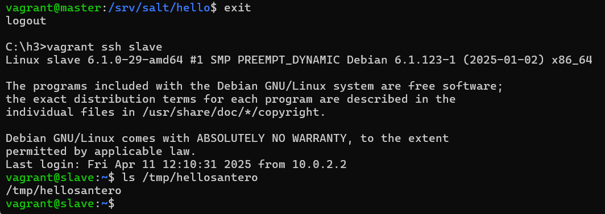

## c) Tee sls-tiedosto, joka käyttää vähintään kahta eri tilafunktiota näistä: package, file, service, user. Tarkista eri ohjelmalla, että lopputulos on oikea. Osoita useammalla ajolla, että sls-tiedostosi on idempotentti.

Tehtävänannossa ei varsinaisesti sanota, että tätä pitäisi tehdä verkon yli, mutta nyt kun vauhtiin päästiin, niin tehdään se master -> slave

Luin vielä lisää .sls tiedostojen luonnista täältä: https://docs.saltproject.io/salt/user-guide/en/latest/topics/states.html#create-the-ssh-state

Masterilla sisään ja luomaan **init.sls** tiedostoa **komennot/** kansioon. 

Tämä tiedosto ajettuna pitää huolen, että slavelle on asennettu ohjelmat: 
- micro
- ufw
- curl (tämähän on jo asennettu, jotta pystyin asentamaan salt-minionin)

Käyttäjät on luotu:
- testuser
- testikauttaja
- hellomasteri

Tiedostot on luotu:
- /tmp/hellosantero:
- /tmp/masteritesti
```bash
vagrant ssh master
cd /srv/salt
sudo mkdir komennot
cd komennot/
sudoedit init.sls
```
```YAML
ohjelmien_asennus:
  pkg.installed:
    - name: micro
    - name: ufw
    - name: curl

kayttajat:
  user.present:
    - name: testuser
    - name: testikauttaja
    - name: hellomasteri

/tmp/heipat:
  file.managed:
    - name: hellosantero
    - name: masteritesti
```
```bash
sudo salt slave state.apply komennot
```
Tällä scriptillä tuli yksi virhe

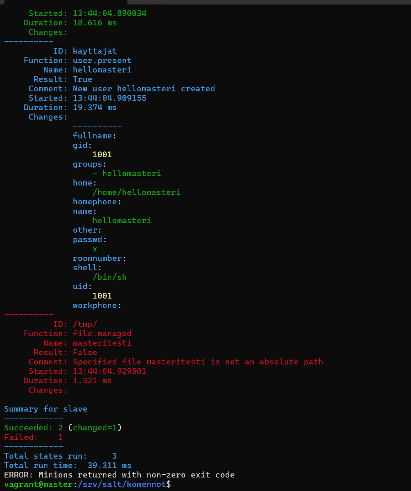

Hetken pyörittelin masteritesti tiedostoa ja /tmp/ hakemistoa tuloksetta. Kysyin hakukoneelta apua ja pääsin sivulle https://docs.saltproject.io/en/3006/ref/states/all/salt.states.file.html, jossa lukee, että 

```YAML
/tmp/:
  file.managed:
    - name: hellosantero
/tmp/:
  file.managed:
    - name: masteritesti
```

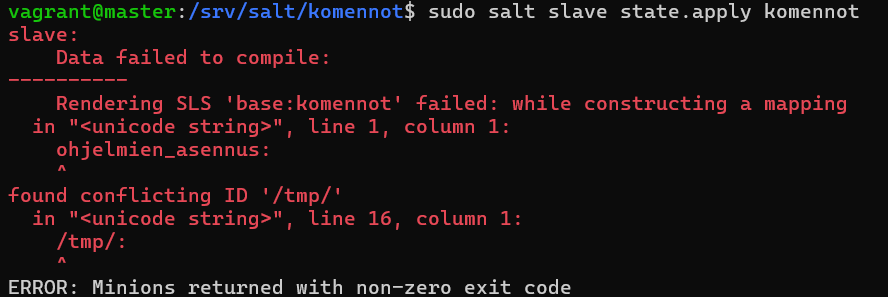

Tuli herja tuosta /tmp/:stä ilmeisesti, koska se on kahteen kertaan tässä, kokeilen vielä että se ei johdu tuosta jälkimmäisestä kauttaviivasta, ei auttanut kauttaviivan poistaminen. Muokkaan vielä tiedoston seuraavaan muotoon:
```YAML
/tmp/hellosantero:
  file.managed:
    - name: /tmp/hellosantero
/tmp/masteritesti:
  file.managed:
    - name: /tmp/masteritesti
```
Nyt komentoa ajaessa ei tule virheitä, Salt ilmoittaa, että molemmat tiedostot on luotu

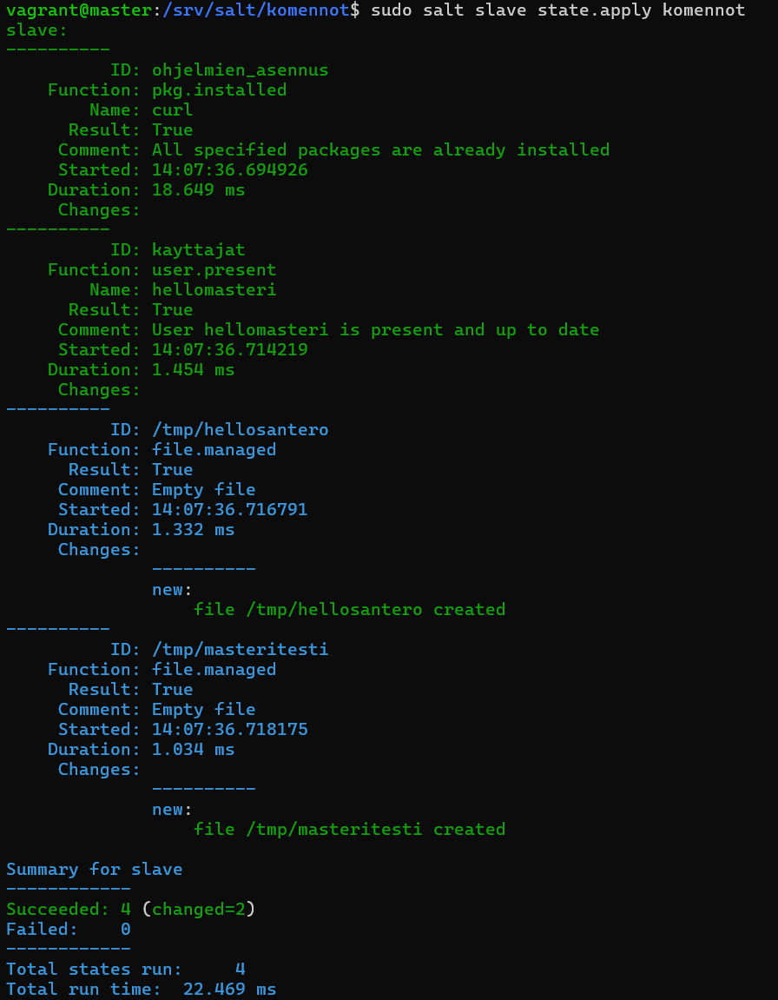

Ajan komennon vielä uudelleen ja seuraan tarkkaan ilmoituksia, jotta varmistutaan siitä, että komento on idempotentti

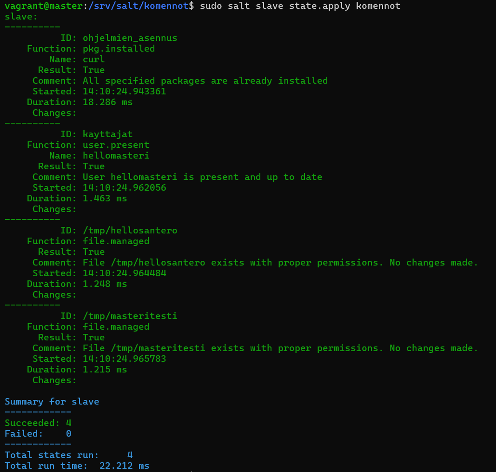

Toisella kerralla ilmoitetaan, että paketit on jo asennettu, käyttäjä on paikalla, sekä tiedostot ovat jo olemassa, joten mitään muutoksia ei tehty.

Käyn vielä slavella tarkistamassa, että kaikki on kuten pitääkin

Yritin slavella käynnistää microa, mutta sitä ei ollut asennettu, pitää muokata tiedostoa, koska kaikki tiedostot, ohjelmat, ja käyttäjät pitää selkeästi laittaa erilleen, josko tämä olisi final-form:
```bash
ohjelma_micro_asennettu:
  pkg.installed:
    - name: micro

ohjelma_ufw_asennettu:
  pkg.installed
    - name: ufw

ohjelma_curl_asennettu:
  pkg.installed
    - name: curl

kayttajat_testuser:
  user.present:
    - name: testuser

kayttajat_testikauttaja:
  user.present:
    - name: testikauttaja

kayttajat_hellomasteri:
  user.present:
    - name: hellomasteri

/tmp/hellosantero:
  file.managed:
    - name: /tmp/hellosantero

/tmp/masteritesti:
  file.managed:
    - name: /tmp/masteritesti
```

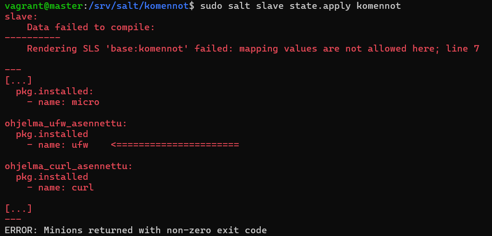

Hetken tutkittua huomasin, että tuolta puuttui kaksoispisteet parilta riviltä, korjasin ne ja ajoin komennon uudelleen, vastaus on sen verran pitkä, että näytän vain loppuosan

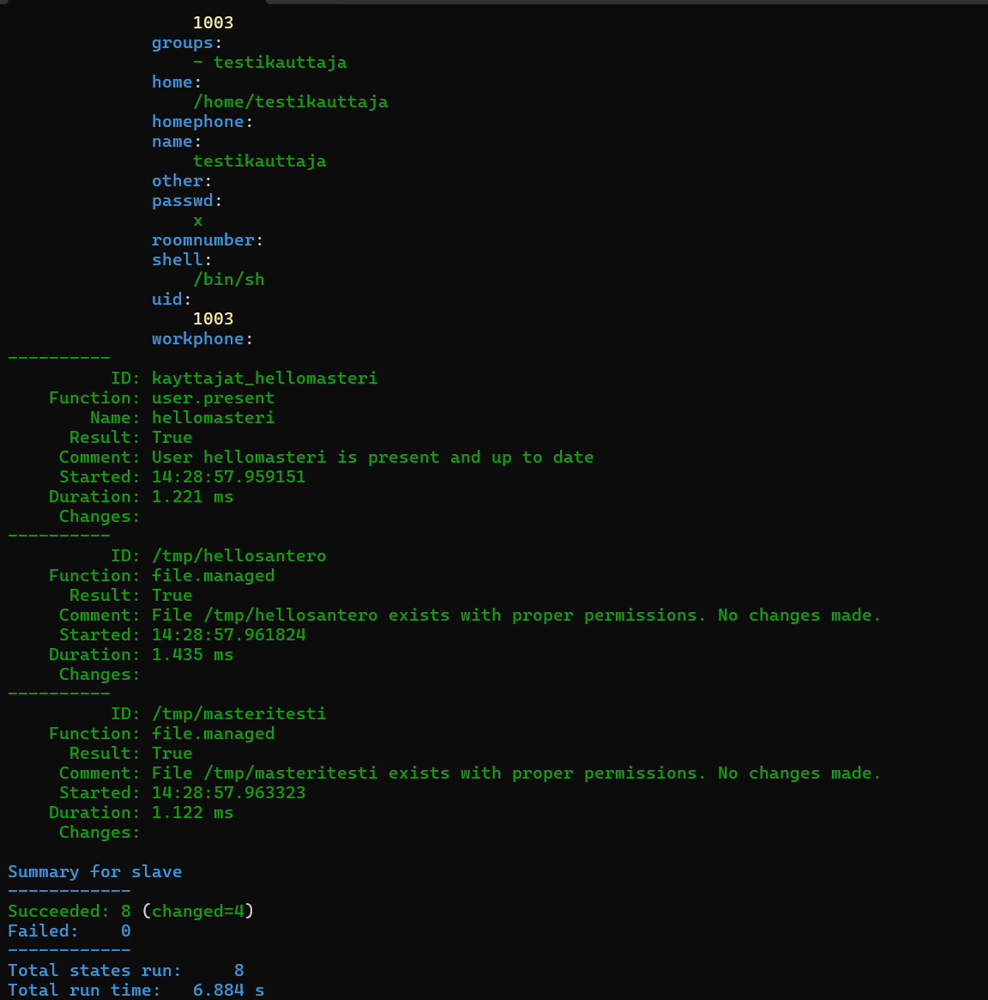

Nyt menen tutkimaan slavea taas 
```bash
dpkg -l micro ufw curl
```

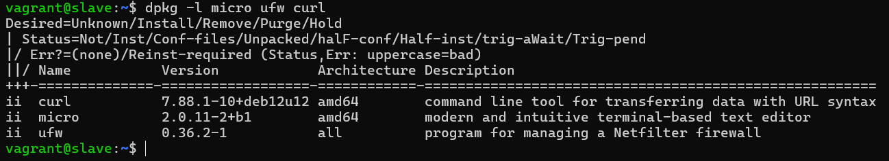

```bash
cat /etc/passwd
```

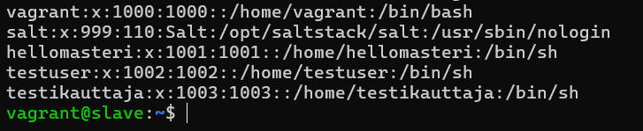

```bash
ls /tmp
```

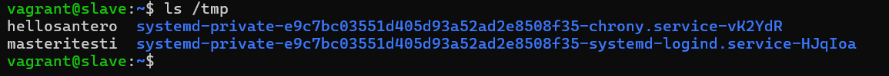

Kaikki mitä luotiin, löytyy. Sammutan vielä virtuaalikoneet muistia viemästä

```bash
vagrant halt
```

---

#### Lähteet
https://terokarvinen.com/2018/03/28/salt-quickstart-salt-stack-master-and-slave-on-ubuntu-linux/

https://terokarvinen.com/2023/salt-vagrant/#infra-as-code---your-wishes-as-a-text-file

https://terokarvinen.com/2021/two-machine-virtual-network-with-debian-11-bullseye-and-vagrant/

https://docs.saltproject.io/salt/user-guide/en/latest/topics/states.html#create-the-ssh-state

https://terokarvinen.com/2024/hello-salt-infra-as-code/

https://developer.hashicorp.com/vagrant/docs/cli/init

https://serverfault.com/questions/77300/tools-to-install-after-a-minimal-linux-install

---

Tätä dokumenttia saa kopioida ja muokata GNU General Public License (versio 2 tai uudempi) mukaisesti. http://www.gnu.org/licenses/gpl.html<br>
Pohjana Tero Karvinen 2025: Palvelinten Hallinta - Configuration Management Systems course - 2025 spring, https://terokarvinen.com/palvelinten-hallinta/<br><br>
Kirjoittanut <em>Santeri Vauramo</em> 2025
