# h4 Pkg-file-service

#### Oma Host kokoonpanoni:

| Komponentti | Kuvaus | Lisätiedot |
| :---        |    :----:   |          ---: |
| Emolevy | MSI B550-A PRO | ATX, AM4 |
| Prosessori   | AMD Ryzen 9 5900X | 12-Core 3.70 GHz |
| RAM   | G.Skill  Ripjaws V |  32GB (4x8GB) DDR4 3600MHz, CL 16, 1.3  |
| Näytönohjain   | Sapphire PULSE AMD Radeon RX 7900 GRE        | 16GB     |
| Kovalevy   | Kingston 1TB        | A2000 NVMe PCIe SSD M.2      |
| Kovalevy   | Crucial 512GB        | MX100 SSD     |
| Kovalevy   | Crucial 256GB        | MX100 SSD     |
| Virtalähde   | Asus 750W TUF Gaming Gold        | ATX 80 Plus      |
| Kotelo   | Phanteks Enthoo Pro       |  Full Tower      |

Käyttöjärjestelmä: Windows 11 Pro 24H2

#### Virtuaalikone
Oracle VirtualBox Version 7.1.4 r165100 (Qt6.5.3) - Debian 12 GNU/Linux (bookworm)<br>
6 Prosessoriydintä - 8GB RAM-muistia - 60GB tallennustilaa

Vagrant 2.4.3

---

## x) Lue ja tiivistä. (Tässä x-alakohdassa ei tarvitse tehdä testejä tietokoneella, vain lukeminen tai kuunteleminen ja tiivistelmä riittää. Tiivistämiseen riittää muutama ranskalainen viiva.)

#### Karvinen 2018: [Pkg-File-Service – Control Daemons with Salt – Change SSH Server Port](https://terokarvinen.com/2018/04/03/pkg-file-service-control-daemons-with-salt-change-ssh-server-port/?fromSearch=karvinen%20salt%20ssh) 
#### Artikkelissa on esimerkkinä jonkun toisen Linux-version sshd_config tiedosto. Jos tekisit samanlaisen, niin käyttäisit tietysti oman järjestelmäsi asetustiedostoa pohjana.
#### Nykyisin suosittelen asentamaan jokaisen modulin omaan kansioonsa, eli /srv/salt/ssh/init.sls (eikä hujan hajan /srv/salt/ssh.sls)

- Artikkelissa näytetään, kuinka verkon yli vaihdetaan SSH palvelimen portti
- Aluksi luodaan salt master-slave arkkitehtuuri
- Luodaan masterille .sls tilatiedosto, jossa **sshd_config** on luotu, käynnissä, sekä sen muuttuessa demoni käynnistetään uudelleen
- sshd_config tiedostoon on muutettu porttinumeroksi 8888
- Ajetaan tila slaveille **sudo salt '*' state.apply sshd**
- Testataan toimivuus ottamalla slaveen ssh-yhteys porttiin 8888

---

## a) Apache easy mode. Asenna Apache, korvaa sen testisivu ja varmista, että demoni käynnistyy
#### - Ensin käsin, vasta sitten automaattisesti.
#### - Kirjoita tila sls-tiedostoon.
#### - pkg-file-service
#### - Tässä ei tarvita service:ssä watch, koska index.html ei ole asetustiedosto

Loin aluksi master-slave arkkitehtuurin Vagrant:lla edellisten tehtävien mukaisesti ja asensin salt:n molempiin

Palasin vielä aiempaan ohjeeseen https://terokarvinen.com/2018/salt-states-i-want-my-computers-like-this/

Joutui hetken pähkäilemään, mutta annoin masterilla komennot:
```bash
sudo salt slave state.single pkg.installed apache2
sudo salt slave state.single file.managed /var/www/html/index.html "Korvattu testisivu"
```
Navigoin Chromella slaven ip:osoitteeseen, Apache2 on käynnissä, mutta testisivu ei päällekirjoittunut tuolla komennolla. Master sanoikin tuosta komennosta että: "Comment: File /var/www/html/index.html not updated"

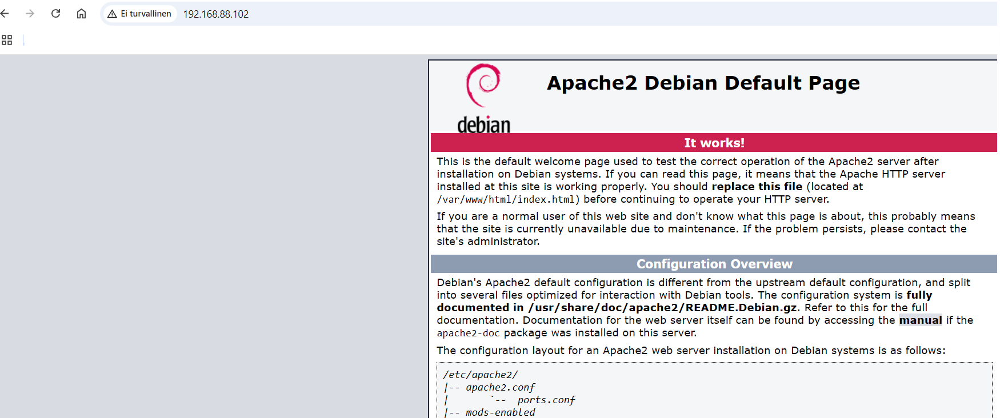

Pitää selvittää, kuinka salt-komennolla päällekirjoitetaan tiedostoon haluamani teksti. Aikani pähkäiltyäni https://docs.saltproject.io/en/3006/ref/states/all/salt.states.file.html sivulla, kokeilen muuttaa jälkimmäisen komennon muotoon:
```bash
sudo salt slave state.single file.managed name=/var/www/html/index.html contents='Korvattu testisivu'
```
Nyt tuli vastauksena:
```
+Korvattu testisivu

Summary for slave
------------
Succeeded: 1 (changed=1)
```
Korvattu testisivu näyttää nyt tältä:

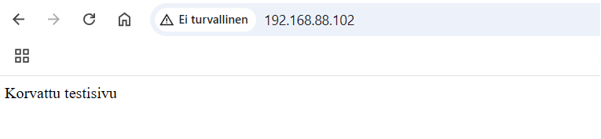

Seuraavaksi poistan apachen slavelta manuaalisesti
```bash
sudo apt-get purge apache2
```
```
(lyhennetty)
(Reading database ... 33272 files and directories currently installed.)
Removing apache2 (2.4.62-1~deb12u2) ...
Processing triggers for man-db (2.11.2-2) ...
(Reading database ... 33221 files and directories currently installed.)
Purging configuration files for apache2 (2.4.62-1~deb12u2) ...
dpkg: warning: while removing apache2, directory '/var/www/html' not empty so not removed
vagrant@slave:~$
```
/var/www/html kansio ei poistunut, mutta sillä ei ole väliä tässä, pitää vaan muuttaa jatkossa "Korvattu testisivu" teksti johonkin muuhun, jotta varmistutaan automatisoinnin onnistuneen

Sitten automatisointiin: luodaan masterille kansio, ja sinne **init.sls** tiedosto, jonne laitetaan YAML argumentit. Käytin hyväksi tätä lähdettä: https://docs.saltproject.io/en/3006/ref/states/all/salt.states.service.html

Ymmärsin tehtävän ohjeista, että mitään **watch** komentoa ei tarvita, mutta silti laitoin tuonne "reload: True"
```bash
sudo mkdir -p /srv/salt/apache
sudoedit /srv/salt/apache/init.sls
cat /srv/salt/apache/init.sls
```
```yaml
asenna_apache:
  pkg.installed:
    - name: apache2

ylikirjoita_paasivu:
  file.managed:
    - name: /var/www/html/index.html
    - contents: 'Korvattu testisivu näyttää tältä'

apache2:
  service.running
    - enable: True
    - reload: True
```
Asetetaan slavelle äskeinen tiedosto ajettavaksi:
```bash
vagrant@master:~$ sudo salt slave state.apply apache
```


Erroria tulee, näköjään unohtui kaksoispiste tuolta **service.running**:n jälkeen, korjauksen jälkeen kokeilen uudelleen

Nyt meni läpi
```
Function: pkg.installed
        Name: apache2
      Result: True
     Comment: The following packages were installed/updated: apache2

 Function: file.managed
        Name: /var/www/html/index.html
      Result: True
     Comment: File /var/www/html/index.html updated

Function: service.running
      Result: True
     Comment: The service apache2 is already running
```
Nyt Chromessa slaven IP-osoite tarjoilee <em>kauneinta</em> unicodeaan:

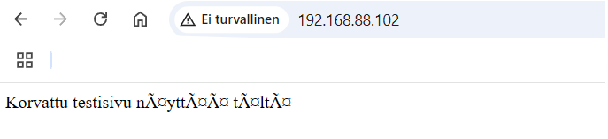

Näin saatiin automatisoitua apachen asennus, pääsivun uudelleenkirjoitus, sekä varmistetaan, että apache2 on käynnissä

---

## b) SSHouto. Lisää uusi portti, jossa SSHd kuuntelee
#### - Jos käytät Vagrantia, muista jättää portti 22/tcp auki - se on oma yhteytesi koneeseen. SSHd:n asetustiedostoon voi tehdä yksinkertaisesti kaksi "Port" riviä, molemmat portit avataan.
#### - Löydät oikean asetuksen katsomalla SSH:n asetustiedostoa
#### - Nyt tarvitaan service-watch, jotta demoni käynnistetään uudelleen, jos asetustiedosto muuttuu masterilla

Luen läpi slaven sshd-tiedoston:
```bash
/etc/ssh/sshd_config
```

Luon masterille **sshd_config** tiedoston salt-kansioon ajettavaksi:
```bash
sudoedit /srv/salt/sshd_config
```
Tiedostoon laitan Karvisen (2018) ohjeen mukaan seuraavat, käytän Vagrantia, joten jätän myös portin 22/tpc auki
```
Port 8888
Port 22/tcp
Protocol 2
HostKey /etc/ssh/ssh_host_rsa_key
HostKey /etc/ssh/ssh_host_dsa_key
HostKey /etc/ssh/ssh_host_ecdsa_key
HostKey /etc/ssh/ssh_host_ed25519_key
UsePrivilegeSeparation yes
KeyRegenerationInterval 3600
ServerKeyBits 1024
SyslogFacility AUTH
LogLevel INFO
LoginGraceTime 120
PermitRootLogin prohibit-password
StrictModes yes
RSAAuthentication yes
PubkeyAuthentication yes
IgnoreRhosts yes
RhostsRSAAuthentication no
HostbasedAuthentication no
PermitEmptyPasswords no
ChallengeResponseAuthentication no
X11Forwarding yes
X11DisplayOffset 10
PrintMotd no
PrintLastLog yes
TCPKeepAlive yes
AcceptEnv LANG LC_*
Subsystem sftp /usr/lib/openssh/sftp-server
UsePAM yes
```
Nyt on tarkoitus ajaa **slavelle** /srv/salt/sshd_config tiedostoon tiedot **masterin** /etc/ssh/sshd_config tiedostosta, kokeilen masterilla seuraavaa komentoa:
```bash
sudo salt slave state.single file.managed name=/etc/ssh/sshd_config source=/srv/salt/sshd_config
```
Tuli seuraavanlainen virhe:

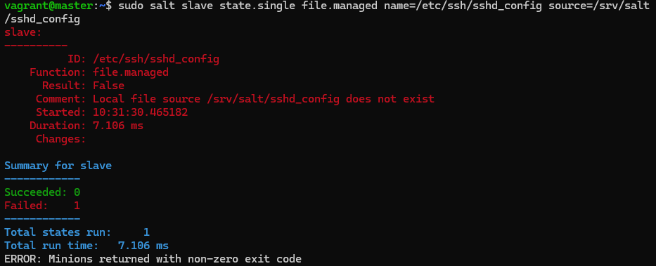

Ilmoituksen mukaan: "Local file source /srv/salt/sshd_config does not exist"

Pitää tutkia, mistä voisi johtua.

Ilmeisesti tuo komento yrittää ylikirjoittaa **slaven** /srv/salt/sshd_config tiedostolla omaa /etc/ssh/sshd_config tiedostoa. Pitäisi saada komento taipumaan niin, että **slave** käyttää **masterin** tiedostoa.

Pähkäilyn jälkeen täältä: https://docs.saltproject.io/salt/user-guide/en/latest/topics/requisites.html löytyi mahdollinen ongelmani. Kokeilen laittaa **source:**:n jälkeen "salt:/", jonka pitäisi kertoa, että lähdetiedosto löytyy **masterilta**
```
sudo salt slave state.single file.managed name=/etc/ssh/sshd_config source=salt://sshd_config
```
Nyt meni läpi:
```
Summary for slave
------------
Succeeded: 1 (changed=1)
Failed:    0
------------
Total states run:     1
Total run time: 397.753 ms
```
Seuraavaksi tarkistamaan, että slavella on portit **8888** ja **22/tpc** auki
```
vagrant@slave:/$ cat /etc/ssh/sshd_config
```

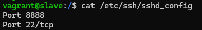

Homma toimi, nyt muokkaan **slavelta** manuaalisesti portin 8888 pois käytöstä
```bash
sudoedit /etc/ssh/sshd_config
cat /etc/ssh/sshd_config
```

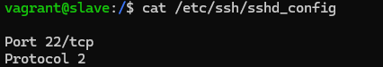

Nyt on siis todistetusti portti 8888 poistunut listalta

Teen **masterille** uuden init.sls tiedoston kansioon /srv/salt/bsshouto/ ja muokkaan sitä
```bash
sudo mkdir -p /srv/salt/bsshouto/
sudoedit /srv/salt/bsshouto/init.sls
```
```yaml
openssh-serveri:
  pkg.installed:
    - name: openssh-server

sshoutojuttu:
  file.managed:
    - name: /etc/ssh/sshd_config
    - source: salt://sshd_config

sshd:
 service.running:
  - name: sshd
  - watch:
      - file: /etc/ssh/sshd_config
```
Tämä siis varmistaa, että open-ssh on asennettu, sshd_config on kopioitu masterilta, sekä tiedoston muuttuessa masterilla, demoni käynnistetään uudelleen

Nyt voidaan kokeilla toimivuutta:
```bash
sudo salt slave state.apply bsshouto
```

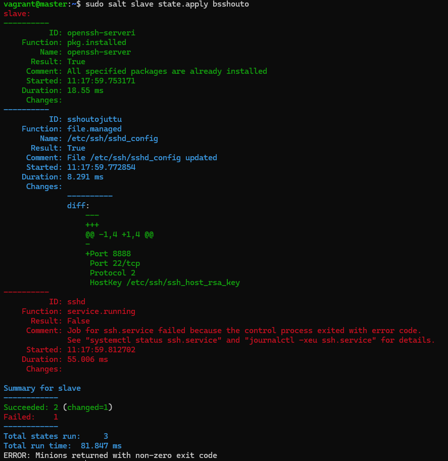

Merkillinen virheilmoitus, olen kuitenkin slavella vielä sisässä ja nyt näkyy taas portit 8888 ja 22/tpc auki, **slavella** näkyy kuitenkin seuraavaa:
```bash
vagrant@slave:/$ systemctl status ssh.service
× ssh.service - OpenBSD Secure Shell server
     Loaded: loaded (/lib/systemd/system/ssh.service; enabled; preset: enabled)
    Drop-In: /etc/systemd/system/ssh.service.d
             └─generate-ssh-keys.conf
     Active: failed (Result: exit-code) since Sun 2025-04-20 11:18:01 UTC; 3min 49s ago
   Duration: 4h 46min 12.841s
       Docs: man:sshd(8)
             man:sshd_config(5)
    Process: 5984 ExecStartPre=/usr/local/sbin/vagrant-generate-ssh-host-keys (code=exited, status=0/>
    Process: 5986 ExecStartPre=/usr/sbin/sshd -t (code=exited, status=255/EXCEPTION)
        CPU: 6ms
lines 1-11/11 (END)
```
Poistin tiedostosta "22/tpc" riviltä tuon "/tcp":n koska:
```
vagrant@slave:/$ sudo /usr/sbin/sshd -t
/etc/ssh/sshd_config line 2: Badly formatted port number.
```
Nyt meni läpi, vasemmalla näkyy master ja oikealla slave. Komennot on menneet läpi, vasemmalla näkyy kun yritän ottaa masterilla ssh-yhteyttä slaveen portista 8888, mutta laitoin salasanan väärin tahallaan, olisi pitänyt kaiketi kirjautua root käyttäjällä "vagrant":n sijasta

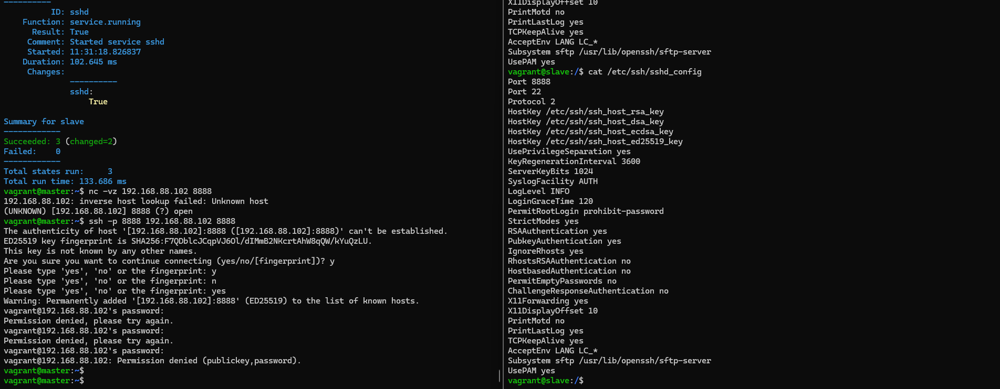

Kokeilen vielä muuttaa masterilla tuota tiedostoa, käyn sitten slavella katsomassa, että slaven ssh-asetukset ovat muuttuneet ilman sen kummempia komentoja

Lisäsin tiedostoon "Port 9999" ja "Port 10001"

https://terokarvinen.com/2018/salt-states-i-want-my-computers-like-this/ tämän ohjeen mukaan muokkaan vielä top-fileä niin, että "bsshouto" on määritelty top-fileen

```bash
sudoedit /srv/salt/top.sls
```
```yaml
base:
  '*':
    - bsshouto
```
```bash
sudo salt '*' state.highstate
```

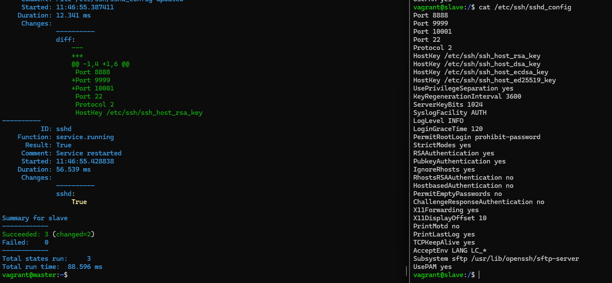

## c) Vapaaehtoinen, haastavahko tässä vaiheessa: Asenna ja konfiguroi Apache ja Name Based Virtual Host. Sen tulee näyttää palvelimen etusivulla weppisivua. Weppisivun tulee olla muokattavissa käyttäjän oikeuksin, ilman sudoa

Tähän hyviä lähteitä ovat:

https://httpd.apache.org/docs/2.4/vhosts/name-based.html, sekä

https://terokarvinen.com/2018/name-based-virtual-hosts-on-apache-multiple-websites-to-single-ip-address/

Aluksi poistan aiemman apache2 asennuksen
```bash
vagrant@slave:/$ sudo apt-get purge apache2
```
Asennan apachen, asetan localhost sivun, luon uuden conf tiedoston ja muokkaan sitä sopivaksi, käynnistän apachen uudelleen, luon kansion index-tiedostolle, luon .index-tiedoston kansioon, sekä asetan Name Based Virtual Hostin:
```bash
sudo apt-get -y install apache2
echo "Testisivu localhost tamanlainen"|sudo tee /var/www/html/index.html
sudoedit /etc/apache2/sites-available/erinimihost.com.conf

vagrant@slave:~$ cat /etc/apache2/sites-available/erinimihost.com.conf

<VirtualHost *:80>
 ServerName erinimihost.com
 ServerAlias www.erinimihost.com
 DocumentRoot /home/vagrant/publicsites/erinimihost.com
 <Directory /home/vagrant/publicsites/erinimihost.com>
   Require all granted
 </Directory>
</VirtualHost>
```
```bash
sudo a2ensite erinimihost.com
sudo systemctl restart apache2
mkdir -p /home/vagrant/publicsites/erinimihost.com/
echo "Moi, tama on sellainen testisivu" > /home/vagrant/publicsites/erinimihost.com/index.html
sudoedit /etc/hosts

vagrant@slave:~$ cat /etc/hosts

127.0.0.1       localhost
127.0.0.2       bookworm
127.0.0.1   erinimihost.com
::1             localhost ip6-localhost ip6-loopback
ff02::1         ip6-allnodes
ff02::2         ip6-allrouters

127.0.1.1 slave slave
```
```bash
curl localhost
curl erinimihost.com
```

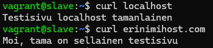

Homma toimii, joten poistan apachen ja teen hieman eri nimillä asiat, joten varmistutaan, että kaikki toimii verkon yli **master-slave** arkkitehtuurilla, nyt oli pakko katsoa lisää ohjeita a2ensite komennolle saltilla täältä: https://docs.saltproject.io/en/3006/ref/states/all/salt.states.apache_site.html, sekä salt file ongelmiin: https://docs.saltproject.io/en/3006/ref/states/all/salt.states.file.html
```
vagrant@slave:/$ sudo apt-get purge apache2
```
```bash
vagrant@master:~$ sudo mkdir -p /srv/salt/apachenamebased
vagrant@master:~$ sudoedit /srv/salt/apachenamebased/namebased
vagrant@master:~$ cat /srv/salt/apachenamebased/namebased
127.0.0.1       localhost
127.0.0.2       bookworm
127.0.0.1   erinimihost.com
::1             localhost ip6-localhost ip6-loopback
ff02::1         ip6-allnodes
ff02::2         ip6-allrouters

127.0.1.1 slave slave
```
```bash
vagrant@master:~$ sudoedit /srv/salt/apachenamebased/host
vagrant@master:~$ cat /srv/salt/apachenamebased/host
<VirtualHost *:80>
 ServerName testierinimihost.com
 ServerAlias www.testierinimihost.com
 DocumentRoot /home/vagrant/publicsites/testierinimihost.com
 <Directory /home/vagrant/publicsites/testierinimihost.com>
   Require all granted
 </Directory>
</VirtualHost>
```
```bash
vagrant@master:~$ sudoedit /srv/salt/apachenamebased/init.sls
vagrant@master:~$ cat /srv/salt/apachenamebased/init.sls
```
```yaml
asenna_apache:
  pkg.installed:
    - name: apache2

ylikirjoita_paasivu:
  file.managed:
    - name: /var/www/html/index.html
    - contents: 'Korvattu testisivu on tassa nain'

apachename:
  file.managed:
    - name: /etc/hosts
    - source: salt://apachenamebased/namebased

apachesite:
  file.managed:
    - name: /etc/apache2/sites-available/testierinimihost.com.conf
    - source: salt://apachenamebased/host

enable testisivu:
  apache_site.enabled:
    - name: testierinimihost.com.conf

apache2:
  service.running:
    - enable: True
    - reload: True
    - watch:
      - file: /etc/apache2/sites-available/testierinimihost.com.conf
```
```bash
vagrant@master:~$ sudo salt slave state.apply apachenamebased
```

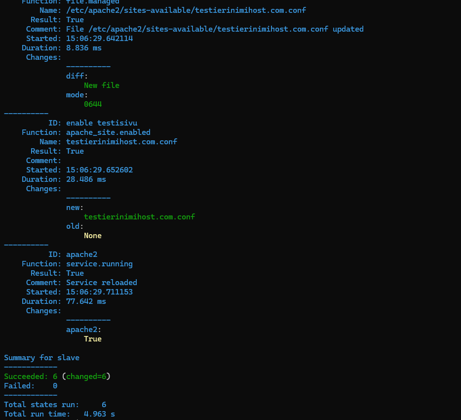

Näin paljon rivejä, eikä yhtään virhettä, näyttää hyvältä. Käyn vielä **slave**lla katsomassa, että kaikki on kuten pitääkin:

```bash
vagrant@slave:~$ curl localhost
Korvattu testisivu on tassa nain
vagrant@slave:~$ curl testierinimihost.com
curl: (6) Could not resolve host: testierinimihost.com
```
testierinimihost.com ei näemmä toiminut toivotulla tavalla, ei tietenkään, kun sille ei ole luotu kansiota, eikä .index-tiedostoa, pitää korjata asia

Lisään tämän **init.sls** tiedostoon, ennen viimeistä "apache2" kohtaa:
```yaml
indextiedosto:
  file.managed:
    - name: /home/vagrant/publicsites/testierinimihost.com/index.html
    - contents: 'Tassa on automatisoitu index-tiedosto'
```
```bash
vagrant@master:~$ sudo salt slave state.apply apachenamebased
```

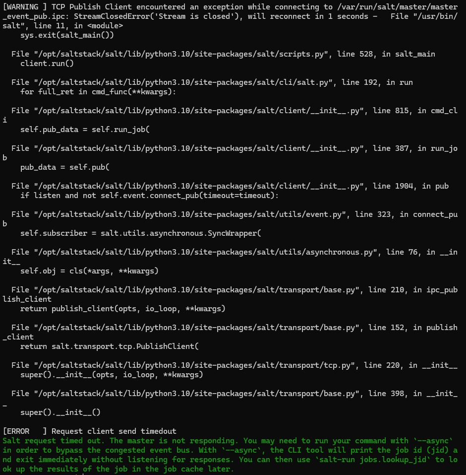

En ihan saa kiinni virheilmoituksesta, mutta tämän on pakko liittyä äskeiseen lisäämääni tietoihin. Ainakaan en erikseen luonut kansiota tuolle index-tiedostolle, syy voisi olla siinä

Syy on juurikin tuossa, koska ajoin komennon uudelleen ja sain erilaisen virheen, salt kuitenkin ajoi muut komennot onnistuneesti:
```
ID: indextiedosto
    Function: file.managed
        Name: /home/vagrant/publicsites/testierinimihost.com/index.html
      Result: False
     Comment: Parent directory not present
     Started: 15:31:32.870589
    Duration: 1.454 ms
     Changes:
```
Lisään komennon ennen index-tiedoston luontia, jolla pitäisi tulla kansio:
```yaml
luokansio:
  file.directory:
    - name: /home/vagrant/publicsites/testierinimihost.com
```
Nyt komento meni onnistuneesti läpi, käyn **slave**lla testaamassa, edelleen "curl: (6) Could not resolve host: testierinimihost.com". Poistan apachen ja kokeilen alusta, koska salt ilmoittaa, että apache2 on jo käynnissä. Ei toimi vieläkään, pitäisi saada apache käynnistymään joka tapauksessa uudelleen tuossa yaml tiedoston lopussa.

Lisään apache2 service.runningin alle "- full_restart: True" ja kokeilen uudelleen, jolla apache pitäisi käynnistyä uudelleen väkisin. Tämäkään ei auttanut.

Lähdin aluksi ehkä hieman liian kaukaa etsimään ongelmaa, kävin **slave**lla tutkimassa kansioita ja huomasin, että tuolla /etc/hosts tiedostossa on edelleen "erinimihost.com" eikä "testierinimihost.com", joten muokkaan **master**in tiedostoa aja kokeilen uudelleen. Curl antaa nyt vain tuota localhostin korvattua testisivua. 

Tarkistin vielä /etc/hosts tiedoston, ja olin vahingossa poistanut sieltä rivin: "127.0.1.1 slave slave", käsittääkseni tällöin **slave** ei pysty toimimaan oikein https://askubuntu.com/questions/754213/what-is-difference-between-localhost-address-127-0-0-1-and-127-0-1-1

lisäsin sen rivin ja nyt toimii oikein:

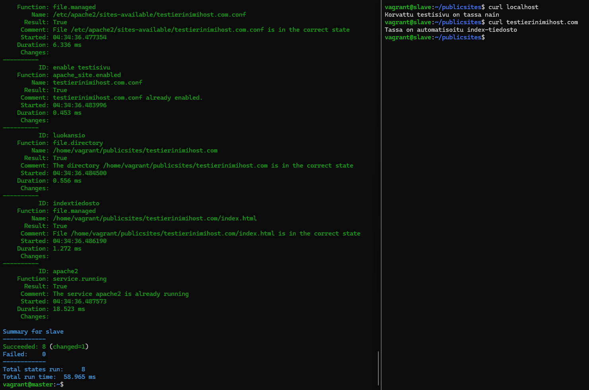

Huomasin salt ohjeita lukiessa, että apachen configuroinnit olisi pystynyt laittamaan suoraan init.sls tiedostoon, ilman erillistä **master**in "source" tiedostoa, jota salt käyttää 

---

[Edit 25.4.2025, tehtävä on jo palautettu, mutta pieni huomio c) tehtävään liittyen:]

Unohdin tuon käyttäjän oikeusjutun aivan kokonaan tehtävän edetessä. Toki siitä ei tullut virheitäkään, koska Vagrantin **slave** toimii käsittääkseni root-käyttäjänä toimittaessaan Salt komentoja, tällöin kansion ja tiedoston luominen onnistuivat.

Vanhoista muistiinpanoistani kaivoin tuohon sopivat käsikomennot:


Tämä antaa rekursiivisesti **vagrant** käyttäjälle omistajaoikeudet kansioon /home/vagrant/publicsites/ kaikkine alikansioineen
```bash
chown -R vagrant /home/vagrant/publicsites/
```
Antaa rekursiivisesti ryhmälle **www-data** ryhmäoikeudet kansioon, ei kuitenkaan muuta kansion omistajaa, apache2 toimii www-data ryhmässä
```bash
chgrp -R www-data /home/vagrant/publicsites/
```
Asettaa rekursiivisesti **omistajalle**: kaikki oikeudet (**7**), **ryhmälle** oikeudet: suorittaa, sekä tarkastella tiedostoja (**5**), sekä kaikille muille: ei mitään oikeuksia (**0**)
```bash
chmod -R 750 kansio.com/
```
Takaa sen että uudet kansion tiedostot saa samat oikeudet
```bash
chmod g+s kansio.com/
```


Katsoin vielä ohjeita Salt käyttöön täältä https://docs.saltproject.io/en/3006/ref/states/all/salt.states.file.html

Salt master-slave arkkitehtuurilla sama c) tehtävään integroituna voisi näyttää tältä:
```yaml
luokansio:
  file.directory:
    - name: /home/vagrant/publicsites/testierinimihost.com
    - user: vagrant
    - group: www-data
    - mode: 750
```

---

Lähteet:

Karvinen 2018: https://terokarvinen.com/2018/04/03/pkg-file-service-control-daemons-with-salt-change-ssh-server-port/?fromSearch=karvinen%20salt%20ssh

https://docs.saltproject.io/salt/user-guide/en/latest/topics/requisites.html

https://terokarvinen.com/2018/salt-states-i-want-my-computers-like-this/

https://docs.saltproject.io/en/3006/ref/states/all/salt.states.service.html

https://terokarvinen.com/2023/salt-vagrant/#infra-as-code---your-wishes-as-a-text-file

https://www.reddit.com/r/saltstack/comments/rkoour/salt_replacing_whole_content_of_a_file/

https://httpd.apache.org/docs/2.4/vhosts/name-based.html

https://docs.saltproject.io/en/3006/ref/states/all/salt.states.apache_site.html

https://askubuntu.com/questions/754213/what-is-difference-between-localhost-address-127-0-0-1-and-127-0-1-1

https://docs.saltproject.io/en/3006/ref/states/all/salt.states.file.html


---

Tätä dokumenttia saa kopioida ja muokata GNU General Public License (versio 2 tai uudempi) mukaisesti. http://www.gnu.org/licenses/gpl.html

Pohjana Tero Karvinen 2025: Palvelinten Hallinta - Configuration Management Systems course - 2025 spring, https://terokarvinen.com/palvelinten-hallinta/

Kirjoittanut: <em>Santeri Vauramo</em> 2025
