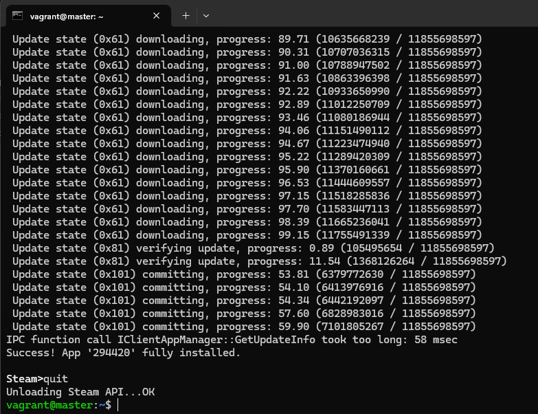
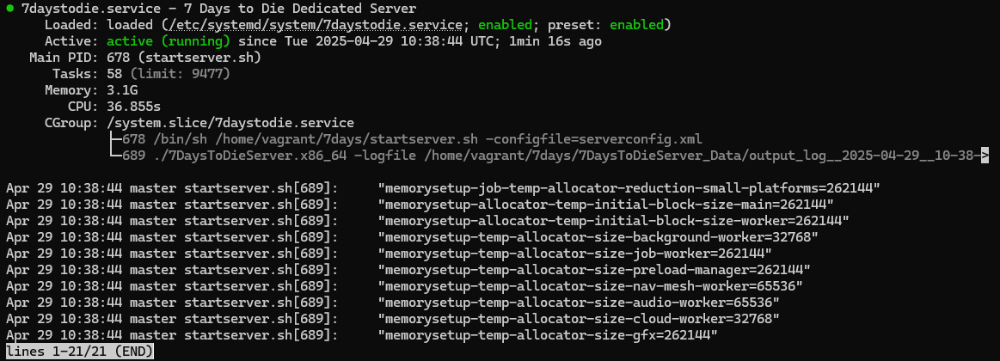
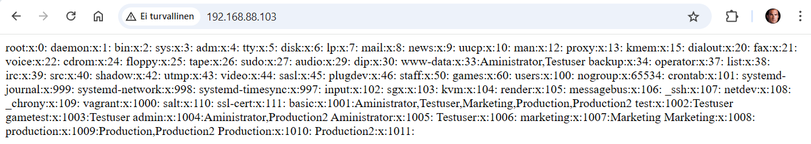
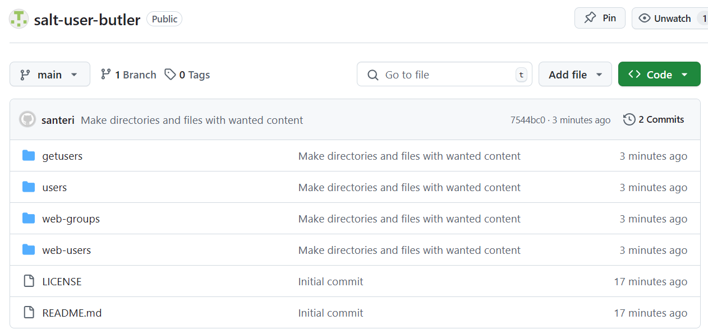
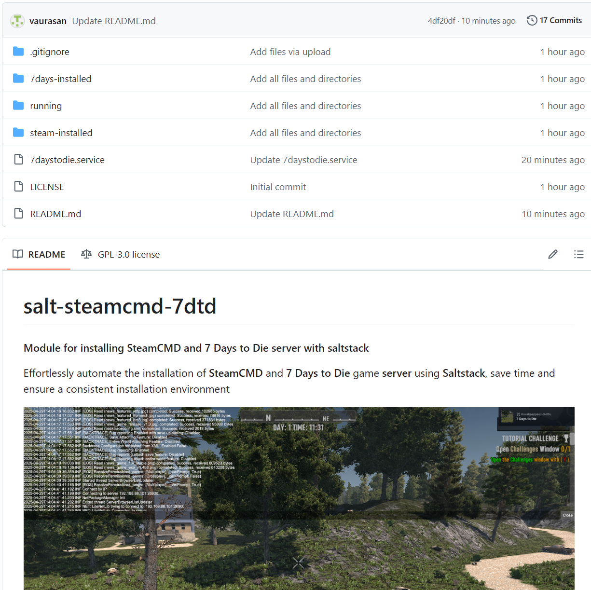

# h5 Miniprojekti

#### Oma Host kokoonpanoni:

| Komponentti | Kuvaus | Lisätiedot |
| :---        |    :----:   |          ---: |
| Emolevy | MSI B550-A PRO | ATX, AM4 |
| Prosessori   | AMD Ryzen 9 5900X | 12-Core 3.70 GHz |
| RAM   | G.Skill  Ripjaws V |  32GB (4x8GB) DDR4 3600MHz, CL 16, 1.3  |
| Näytönohjain   | Sapphire PULSE AMD Radeon RX 7900 GRE        | 16GB     |
| Kovalevy   | Kingston 1TB        | A2000 NVMe PCIe SSD M.2      |
| Kovalevy   | Crucial 512GB        | MX100 SSD     |
| Kovalevy   | Crucial 256GB        | MX100 SSD     |
| Virtalähde   | Asus 750W TUF Gaming Gold        | ATX 80 Plus      |
| Kotelo   | Phanteks Enthoo Pro       |  Full Tower      |

- Käyttöjärjestelmä: Windows 11 Pro 24H2
- Oracle VirtualBox Version 7.1.4 r165100 (Qt6.5.3) - Debian 12 GNU/Linux (bookworm)
- Vagrant 2.4.3

## a) Oma miniprojekti
##### - Modernia keskitettyä hallintaa: idempotentti, infra koodina, yksi totuus
##### - Kannattaa testata lopputulos tyhjällä koneella
##### - Ensin valmista, sitten hienoa

## SteamCMD asennus, 7 Days to Die pelipalvelimen asennus ja konfigurointi Salt:lla

SteamCMD on CLI-versio Steamista, jota käytetään erilaisten Steam-palvelinohjelmien asentamiseen ja päivittämiseen 

Hyvänä lähteenä Steamin asentamiselle Debianiin käytän: https://pimylifeup.com/linux-steamcmd/ ja https://developer.valvesoftware.com/wiki/SteamCMD#Debian

Valve developer communityn mukaan "apt-add-repository non-free" ei enää toimi, joten katsoin myös: https://stackoverflow.com/questions/76688863/apt-add-repository-doesnt-work-on-debian-12 lisää ohjeita, erikoista kyllä, manuaalisesti sen sain ongelmitta tehtyä, mutta salt:n kanssa tuli todella paljon ongelmia

Steam client vaatii normaalisti käyttäjätilin. SteamCMD:hen kuitenkin pystyy kirjautua sisälle "anonymous" käyttäjänä ilman tunnuksia, joten palvelimen pystyyn laittaminen ei vaadi käyttäjätilin luomista, mikä helpottaa tätä tehtävää osaltaan

Annoin vagrantin virtuaalikoneille enemmän muistia tätä varten, koska palvelu ei halunnut käynnistyä vähäisen muistin vuoksi näillä ohjeilla: https://www.josheaton.org/increase-memory-vagrant-virtual-machine/

Tero Karviselta lainaamani Vagrantfile näyttää nyt tältä:
```
# -*- mode: ruby -*-
# vi: set ft=ruby :
# Copyright 2019-2021 Tero Karvinen http://TeroKarvinen.com

$tscript = <<TSCRIPT
set -o verbose
apt-get update
apt-get -y install tree
echo "Done - set up test environment - https://terokarvinen.com/search/?q=vagrant"
TSCRIPT

Vagrant.configure("2") do |config|
	config.vm.synced_folder ".", "/vagrant", disabled: true
	config.vm.synced_folder "shared/", "/home/vagrant/shared", create: true
	config.vm.provision "shell", inline: $tscript
	config.vm.box = "debian/bookworm64"

  config.vm.define "master" do |master|
    master.vm.hostname = "master"
    master.vm.network "private_network", ip: "192.168.88.101"
    master.vm.provider :virtualbox do |vb|
      vb.memory = "4096"
    end
  end

  config.vm.define "slave", primary: true do |slave|
    slave.vm.hostname = "slave"
    slave.vm.network "private_network", ip: "192.168.88.102"
    slave.vm.provider :virtualbox do |vb|
      vb.memory = "8192"
    end
  end
end
```

## Asennus

```bash
sudo apt-get update # päivitetään pakettilista
sudo apt-get upgrade -y # päivitetään paketit ajantasalle
sudo apt-get -y install software-properties-common # varmistetaan, että "software-properties-common" paketti on asennettu
sudo dpkg --add-architecture i386 # Lisätään i386 arkkitehtuuri Linuxiin, tämä vaaditaan, jotta 32-bit kirjastot toimivat
sudo apt-add-repository non-free # SteamCMD ei ole open-source ohjelma, joten tarvitsemme erillisen repositoryn
sudo apt-get update # päivitetään pakettilista uudelleen
sudo apt-get -y install steamcmd # asennetaan SteamCMD
mkdir /home/vagrant/7days
steamcmd # Käynnistetään SteamCMD

# SteamCMD prompt
@sSteamCmdForcePlatformType linux # Pakottaa alustan tyypiksi Linux
force_install_dir /home/vagrant/7days # Asetetaan asennuskansio palvelinohjelmalle
login anonymous # kirjaudutaan sisälle ilman käyttäjätunnuksia, Valve suosittelee asettamaan asennuskansion ennen sisäänkirjautumista
app_update 294420 # Tällä komennolla asennetaan 7 Days to Die pelin palvelinohjelma
quit # Poistutaan Steam promptista
# Tällä tavalla voidaan myös päivittää ohjelma, HUOM päivittäminen saattaa päällekirjoittaa ohjelman konfiguroinnit
```
```
# Voidaan tehdä myös yhdellä rivillä:
steamcmd +@sSteamCmdForcePlatformType linux +force_install_dir /home/vagrant/7days +login anonymous +app_update 294420 +quit
```


Tässä vaiheessa SteamCMD on asennettu "/home/7days" kansioon. "/home/7days" kansio sisältää config tiedostot ja startup scriptin.

## Konfigurointi

Jos palvelu olisi internetissä, se käyttäisi oletuksena porttia 26900, joten tuo portti pitäisi avata liikenteelle

Seuraavaksi vuorossa on 7 Days to Die pelipalvelimen konfigurointi. Konfigurointi tapahtuu muokkaamalla serverconfig.xml tiedostoa.
```bash
cd /home/vagrant/7days # Navigoidaan kansioon

ls
7DaysToDieServer.x86_64  Data      Logos  UnityPlayer.so  platform.cfg      startserver.sh   steamapps
7DaysToDieServer_Data    Licenses  Mods   libstdc++.so.6  serverconfig.xml  steam_appid.txt  steamclient.so

sudo apt-get -y install micro
micro serverconfig.xml
```
Tarvitsen ohjeita https://7daystodie.fandom.com/wiki/Server:_serverconfig.xml ja https://pimylifeup.com/7-days-to-die-server-linux/

Tässä .xml tiedostossa on todella selkeästi kerrottu, mikä asetus tekee mitäkin. Teen joitakin muutoksia, jotka kirjaan tähän, en näytä koko tiedostoa tässä, koska se on kohtuullisen pitkä
```xml
<property name="ServerName"  		value="vaurasan Local Host"/>
<property name="ServerDescription"  	value="A 7 Days to Die server working locally"/>
<property name="Region"  		value="Europe"/>
```

Seuraavaksi muokkaan palvelimen käynnistystiedostoa mukaillen pimylifeup:n ohjetta
```bash
sudo micro /etc/systemd/system/7daystodie.service
```

```
[Unit]
Description=7 Days to Die Dedicated Server
Wants=network-online.target
After=network-online.target

[Service]
Type=simple
Restart=on-failure
RestartSec=10
User=vagrant
Group=vagrant
WorkingDirectory=/home/vagrant/7days
ExecStartPre=/usr/games/steamcmd +@sSteamCmdForcePlatformType linux +force_install_dir /home/vagrant/7days +login anonymous +app_update 294420 +quit
ExecStart=/home/vagrant/7days/startserver.sh -configfile=serverconfig.xml
ExecStop=-/bin/bash -c "echo 'shutdown' | /usr/bin/telnet 127.0.0.1 8081"

[Install]
WantedBy=multi-user.target
```

## Käynnistys/testi

Pystyisin laittamaan itseni palvelimen adminiksi lisäämällä oman Steam-ID:n tiedostoon "serveradmin.xml", mutta en koe sitä tarpeelliseksi tässä

Aluksi annoin käyttäjälle kansion omistajuuden rekursiivisesti, koska jostain syystä täysiä oikeuksia ei ollut:
```bash
sudo chown -R vagrant:vagrant /home/vagrant/7days
```

```bash
sudo systemctl daemon-reload # Ladataan demonit uudelleen, koska asetuksia on muutettu
sudo systemctl start 7daystodie.service # Käynnistetään pelipalvelin
sudo systemctl status 7daystodie.service # Tarkistetaan palvelun tila
```


Palvelin näyttää olevan toiminnassa, pitää vielä kokeilla pelata palvelimella


Kuvassa näkyy tämän vagrant masterin ip osoite "192.168.88.101", johon olen pelissä yhdistänyt

Seuraava askel on automatisoida tämä sama käyttäen Salt master-slave arkkitehtuuria

## Automatisointi

Kaiken tehdyn pohjalta alan luomaan automatisointia, aloitan puhtaalta pöydältä ja asennan Salt:n molemmille virtuaalikoneille aiempien tehtävien mukaisesti

master:
```bash
sudo apt-get update
sudo apt-get -y install curl
mkdir -p /etc/apt/keyrings
curl -fsSL https://packages.broadcom.com/artifactory/api/security/keypair/SaltProjectKey/public | sudo tee /etc/apt/keyrings/salt-archive-keyring.pgp
curl -fsSL https://github.com/saltstack/salt-install-guide/releases/latest/download/salt.sources | sudo tee /etc/apt/sources.list.d/salt.sources
sudo apt-get update
sudo apt-get -y install salt-master
sudo apt-get -y install micro
export EDITOR=micro
```
slave:
```bash
sudo apt-get update
sudo apt-get -y install curl
mkdir -p /etc/apt/keyrings
curl -fsSL https://packages.broadcom.com/artifactory/api/security/keypair/SaltProjectKey/public | sudo tee /etc/apt/keyrings/salt-archive-keyring.pgp
curl -fsSL https://github.com/saltstack/salt-install-guide/releases/latest/download/salt.sources | sudo tee /etc/apt/sources.list.d/salt.sources
sudo apt-get update
sudo apt-get -y install salt-minion
sudo apt-get -y install micro
export EDITOR=micro

sudoedit /etc/salt/minion
```
```
master: 192.168.88.101
id: slave
```
```bash
sudo systemctl restart salt-minion.service
```
Sitten itse asiaan, löysin erittäin hyviä lähteitä, kuten: 

- https://askubuntu.com/questions/506909/how-can-i-accept-the-lience-agreement-for-steam-prior-to-apt-get-install
- https://docs.saltproject.io/en/master/ref/states/all/salt.states.pkg.html#salt.states.pkg.installed
- https://gist.github.com/garbast/ff5e36d55c11c7558a3b
- https://docs.saltproject.io/en/3006/ref/states/all/salt.states.file.html
- https://stackoverflow.com/questions/51023815/upgrade-all-packages-in-a-minion-using-state
- https://docs.saltproject.io/en/3006/ref/states/all/salt.states.module.html

Luon masterille tarvittavat kansiot, init.sls tiedoston, sekä servicefilen aiemman tiedoston perusteella:
```bash
sudo mkdir -p /srv/salt/steam-installed
sudo mkdir -p /srv/salt/7days-installed
sudo mkdir -p /srv/salt/running
sudo micro /srv/salt/servicefile
```
```bash
sudo micro /srv/salt/steam-installed/init.sls
```
Ongelmana oli pitkään, miten tehdä idempotentti komento SteamCMD asennukselle. Tuota asentaessa tulee vielä hyväksyä sopimus, joka tapahtuu painamalla "ESC" + "Nuoli alas" + "Return", ei ole ihan yksinkertaista toteuttaa. Lähteistä löysin tähän kuitenkin kätevän kiertotien. Tässä joutuu joka tapauksessa käyttämään enemmän cmd.run komentoja, kuin haluaisin. Tämänlaiseen "srv/salt/steam-installed/init.sls" asennustiedostoon päädyin:
```yaml
# Päivitetään pakettilista
package_cache_refresh:
  module.run:
    - name: pkg.refresh_db

# Mukaillaan manuaalista asetusta ja asennetaan tarvittavat arkkitehtuurit
software_properties_common:
  pkg.installed:
    - name: python3-software-properties
    - require:
      - module: package_cache_refresh

non_free_repo_added:
  cmd.run:
    - name: apt-add-repository non-free
    - unless: salt.state.single('file.contains', '/etc/apt/sources.list', text='deb .* non-free')

i386_architecture_added:
  cmd.run:
    - name: sudo dpkg --add-architecture i386
    - unless: grep -q "^i386" /proc/cpuinfo

# Uusi päivitys
final_package_cache_refresh:
  module.run:
    - name: pkg.refresh_db
    - require:
      - cmd: non_free_repo_added
      - cmd: i386_architecture_added

steamcmd_dependencies:
  pkg.installed:
    - pkgs:
      - lib32stdc++6
    - require:
      - module: final_package_cache_refresh

# SteamCMD kansio oikeuksineen
steam_directory:
  file.directory:
    - name: /usr/games/
    - user: vagrant
    - group: vagrant
    - mode: 750
    - makedirs: True
    - recurse:
      - user
      - group
      - mode

steamcmd_installed:
  cmd.run:
    - name: |
        cd /usr/games/steamcmd
        curl -sqL "https://steamcdn-a.akamaihd.net/client/installer/steamcmd_linux.tar.gz" | tar zxvf -
    - require:
      - pkg: steamcmd_dependencies
```
Loin 7 Days to Die palvelimen asennustiedoston
```bash
sudo micro /srv/salt/7days-installed/init.sls
```
```yaml
# Pelipalvelimen asennuskansio oikeuksineen
game_directory:
  file.directory:
    - name: /home/vagrant/7days
    - user: vagrant
    - group: vagrant
    - mode: 750
    - makedirs: True
    - recurse:
      - user
      - group
      - mode

# Pelipalvelimen asennus/päivitys
steamcmd_setup:
  cmd.run:
    - name: HOME=/home/vagrant /usr/games/steamcmd +@sSteamCmdForcePlatformType linux +force_install_dir /home/vagrant/7days +login anonymous +app_update 294420 +quit
    - unless: test -f /home/vagrant/7days/steamapps/7DaysToDie Dedicated Server

# Kansio service-tiedostolle
servicefile-directory:
  file.directory:
    - name: /etc/systemd/system/
    - user: vagrant
    - group: vagrant
    - mode: 750
    - makedirs: True

# Oikeudet tallennustilaan
/home/vagrant/.local/share/7DaysToDie:
  file.directory:
    - user: vagrant
    - group: vagrant
    - mode: 750
    - recurse:
      - user
      - group
      - mode

# Service tiedoston kopiointi
/etc/systemd/system/7daystodie.service:
  file.managed:
    - source: salt://servicefile
```

Luon masterille käynnistystiedoston kansioon running:
```bash
sudo micro /srv/salt/running/init.sls
```
```yaml
7daystodie:
  service.running:
    - reload: True
    - enable: True
```
Nyt komennolla **sudo salt slave state.apply running** voidaan käynnistää pelipalvelin etänä

Tässä vaiheessa laitoin manuaalisesti slavelle samat palvelimen käynnistykseen liittyvät asiat, jotka tein aiemmassa vaiheessa ja yritin mennä peliin. Palvelin ei vastannut, joten poistin koko vagrant koneet ja aloitan alusta näillä scripteillä, laitoin slavelle 8GB muistia, jotta palvelu toimisi kunnolla

```bash
sudo salt slave state.apply steam-installed
sudo salt slave state.apply 7days-installed
sudo salt slave state.apply running
```
Pääsin todella pitkälle tämän kanssa ja sain monta kertaa väänneltyä tämän niin, että kaikki toimii. Kuitenkaan en kertaakaan saanut ajettua kaikkia salt state.apply moduuleja puhtaalle virtuaalikoneelle ongelmitta, joten hylkään tämän projektin ja teen jotain helpompaa. Tähän meni aikaa noin kahden työpäivän verran, jos olisin raportoinut jokaisen kohdan ja virheen, olisi aikaa mennyt noin kolme viikkoa

---

## (Uusi moduuli) Standardoitu käyttäjienhallinta

Aloitan alusta koko homman, luon kolme virtuaalikonetta Vagrantilla
- master
- slave
- slave2

Luon yksinkertaisen käyttäjienhallintamoduulin, bisnesnäkökulmasta tällä saavutetaan:
- standardoitu käyttäjien hallinta kaikilla palvelimilla
- automatisoitu, vähemmän virheitä
- nopea käyttöönotto
- yksi totuus

Tein helpon init.sls tiedoston, jossa asennetaan apache, päällekirjoitetaan web-sivu ja laitetaan palvelu käyntiin, luodaan ryhmiä ja käyttäjiä:
```bash
sudo mkdir -p /srv/salt/users/
sudo micro /srv/salt/users/init.sls
```
```yaml
apache_installed:
  pkg.installed:
    - name: apache2

overwrite_mainpage:
  file.managed:
    - name: /var/www/html/index.html
    - contents: 'This is the website'

apache_is_running:
  service.running:
    - name: apache2
    - reload: True
    - enable: True

basic_group:
  group.present:
    - name: basic
test_group:
  group.present:
    - name: test
gametest_group:
  group.present:
    - name: gametest
admin_group:
  group.present:
    - name: admin

Aministrator:
  user.present:
    - fullname: Adam Admin
    - workphone: 050555663
    - home: /home/admin
    - groups:
      - basic
      - admin
      - www-data

Testuser:
  user.present:
    - fullname: Test User
    - workphone: 050555664
    - home: /home/testing
    - groups:
      - basic
      - gametest
      - test
      - www-data

marketing_group:
  group.present:
    - name: marketing

Marketing:
  user.present:
    - fullname: Molly Marketer
    - workphone: 050555665
    - home: /home/marketing
    - groups:
      - marketing
      - basic

production_group:
  group.present:
    - name: production

Production:
  user.present:
    - fullname: Peter Productive
    - workphone: 050555666
    - home: /home/production
    - other:
    - groups:
      - production
      - basic
Production2:
  user.present:
    - fullname: Sam Product
    - workphone: 050555667
    - home: /home/production
    - other: Production manager
    - groups:
      - production
      - basic
      - admin
```
Nyt voin ajaa tiedoston kaikille orjille:
```bash
sudo salt '*' state.apply users
```
Luon myös yksinkertaisen tiedoston "getusers", jolla voi tarkistaa palvelimen kaikki käyttäjät ja ryhmät, salt tulostaa tiedot suoraan
```bash
sudo mkdir -p /srv/salt/getusers/
sudo micro /srv/salt/getusers/init.sls
```
```yaml
get_users:
  cmd.run:
    - name: echo "$(getent passwd)"
    - creates: /tmp/users.txt

get_groups:
  cmd.run:
    - name: echo "$(getent group)"
    - creates: /tmp/groups.txt
```
```bash
sudo salt '*' state.apply getusers
```

Lisään hieman kermaa kakun päälle, jotta asennettu apache2 pääsee töihin:

```bash
sudo mkdir -p /srv/salt/web-groups/
sudo mkdir -p /srv/salt/web-users/
sudo micro /srv/salt/web-groups/init.sls
```
```yaml
delete_webpage:
  file.absent:
    - name: /var/www/html/index.html

show_groups_as_web_page:
  file.copy:
    - name: /var/www/html/index.html
    - source: /etc/group

apache_reload_run:
  service.running:
    - name: apache2
    - reload: True
    - enable: True
```
```bash
sudo micro /srv/salt/web-users/init.sls
```
```yaml
delete_webpage:
  file.absent:
    - name: /var/www/html/index.html

show_users_as_web_page:
  file.copy:
    - name: /var/www/html/index.html
    - source: /etc/passwd

apache_reload_run:
  service.running:
    - name: apache2
    - reload: True
    - enable: True
```
Nyt voin näyttää web-sivulla ryhmien ja käyttäjien tietoja:
```bash
sudo salt '*' state.apply web-groups
sudo salt '*' state.apply web-users
```


Web-selain näyttää nyt haluamani tiedot tarvittaessa, sangen kauniissa muodossa

---

## b) Etusivu. Laita projektisi etusivulle tärkeimmät tiedot
##### - Etusivu voi olla esimerkiksi Github-varasto ja tiedot README.md:ssä
##### - Yritä laittaa keskeisimmät kohdat "taitoksen yläpuolelle", eli näkymään jo ennen skrollausta
##### - Tavoitteena on, että lukija ymmärtää välittömästi ja yhdellä silmäyksellä projektin tarkoituksen (ruutukaappaus + kuvaus)
##### - Tiedot

Käytän tähän Git:ä toiselta virtuaalikoneelta
- luon GitHub repositoryn moduulille
- luon virtuaalikoneelle äsken tekemäni kansiot ja tiedostot tämän raportin perusteella
- lähetän virtuaalikoneelta Git-push:lla moduulin GitHubiin

GitHubin pääsivulta luon uuden repositoryn nimeltään "**salt-user-butler**, lisään README tiedoston ja annan osuvan kuvauksen

Kloonaan tuon repositoryn:
```bash
git clone git@github.com:vaurasan/salt-user-butler.git
```
Luon kansioon virtuaalikoneella kaiken mitä tein tätä moduulia varten, jonka jälkeen lähetän tiedot GitHubiin:
```bash
git add .
git commit
git pull
git push
```


Vielä pitää muokata README.md haluamanilaiseksi ja tehdä testi puhtaalle salt-master-slave kombolle, käyttäen GitHubista kloonaattua **salt-user-butler**:ia

Kaikki toimi juuri kuten pitääkin ja sain tuon repositoryn kuntoon, https://github.com/vaurasan/salt-user-butler


Hieman jäi kaivelemaan tuo pelipalvelimen toiminta salt:n kanssa, pitää vielä palata aiheeseen kun pöly on laskeutunut

---

## Paluu SteamCMD:hen

Kun sain yhden moduulin toimivaksi, palaan vielä **SteamCMD** ja pelipalvelin aiheeseen. Lähdin selvittämään "non-free" repository ongelmaa ja rakentamaan steam-installed/init.sls tiedostoa pala palalta uudestaan

Paljon tässäkin sai vielä säätää, mutta nyt olen vihdoin saanut kaiken toimimaan, viimeiset toimivat init.sls tiedostot ja kaikki muu löytyy nyt **salt-steamcmd-7dtd** moduulistani: https://github.com/vaurasan/salt-steamcmd-7dtd



Seuraavalla komennolla pystyy asennusten jälkeen varmistamaan slave:lta palvelimen toiminnan
```bash
sudo systemctl status 7daystodie.service
```

---

Lähteet:

https://pimylifeup.com/linux-steamcmd/

https://pimylifeup.com/7-days-to-die-server-linux/

https://developer.valvesoftware.com/wiki/SteamCMD#Debian

https://stackoverflow.com/questions/76688863/apt-add-repository-doesnt-work-on-debian-12

https://steamcommunity.com/sharedfiles/filedetails/?l=german&id=360404397

https://7daystodie.fandom.com/wiki/Server:_serverconfig.xml

https://7daystodie.fandom.com/wiki/Linux_Server_with_Debian_Sid

https://www.josheaton.org/increase-memory-vagrant-virtual-machine/

https://gist.github.com/garbast/ff5e36d55c11c7558a3b

https://docs.saltproject.io/en/master/ref/states/all/salt.states.pkg.html#salt.states.pkg.installed

https://askubuntu.com/questions/506909/how-can-i-accept-the-lience-agreement-for-steam-prior-to-apt-get-install

https://docs.saltproject.io/en/3006/ref/states/all/salt.states.file.html

https://stackoverflow.com/questions/51023815/upgrade-all-packages-in-a-minion-using-state

https://github.com/a1702645/steamcmd-garrysmod/blob/master/srv/salt/install_steamcmd/init.sls

https://github.com/RabidCicada/steamcmd-formula/blob/master/steamcmd/init.sls

https://docs.saltproject.io/en/3006/ref/states/all/salt.states.cmd.html

https://docs.saltproject.io/en/3006/ref/states/all/salt.states.module.html

https://docs.saltproject.io/en/3006/ref/modules/all/salt.modules.useradd.html

https://docs.saltproject.io/en/3006/ref/states/all/salt.states.user.html

https://docs.saltproject.io/en/3006/ref/states/all/salt.states.group.html

https://www.reddit.com/r/saltstack/comments/18wp6hv/how_to_make_this_idempotent_not_changed/

https://www.oreilly.com/library/view/salt-essentials/9781491914427/ch04.html

---

Tätä dokumenttia saa kopioida ja muokata GNU General Public License (versio 2 tai uudempi) mukaisesti. http://www.gnu.org/licenses/gpl.html

Pohjana Tero Karvinen 2025: Palvelinten Hallinta - Configuration Management Systems course - 2025 spring, https://terokarvinen.com/palvelinten-hallinta/

Kirjoittanut: <em>Santeri Vauramo</em> 2025
