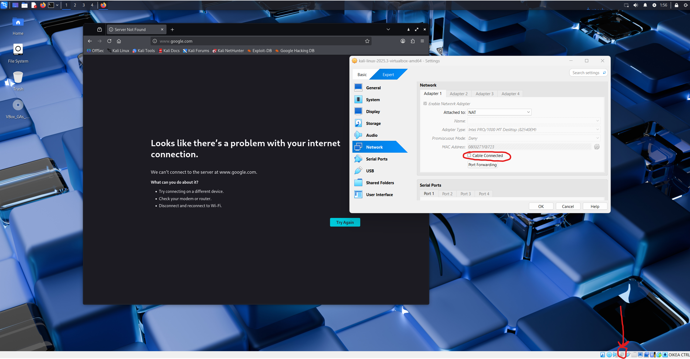
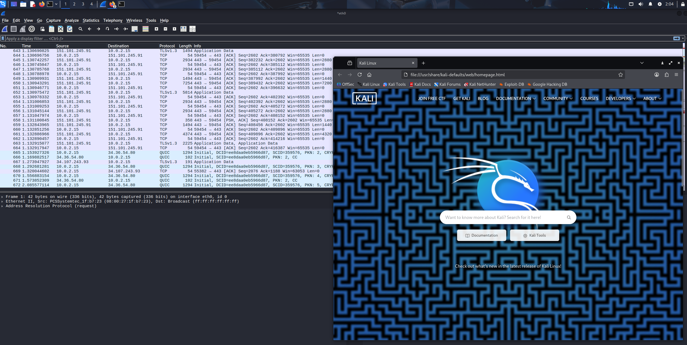
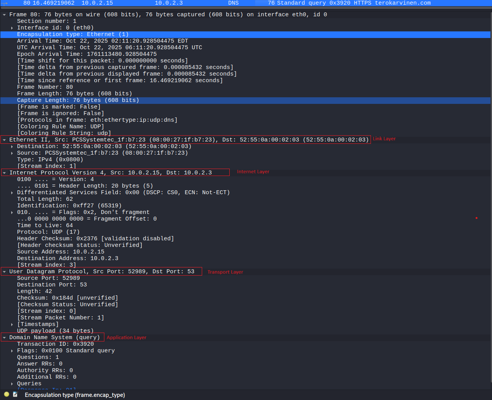
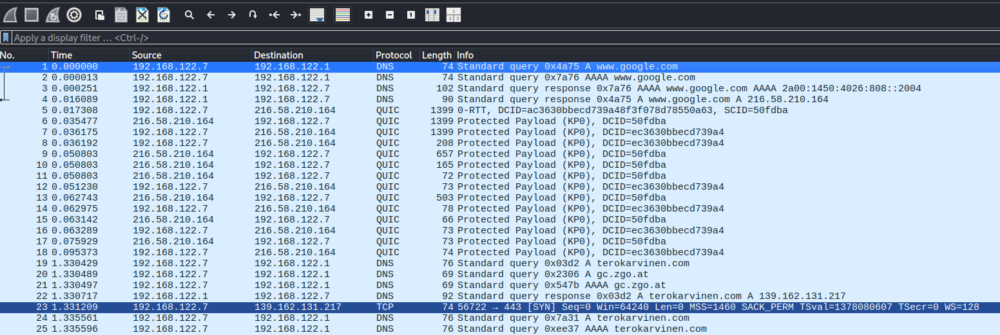
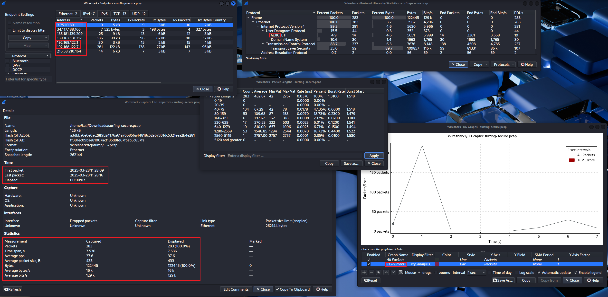
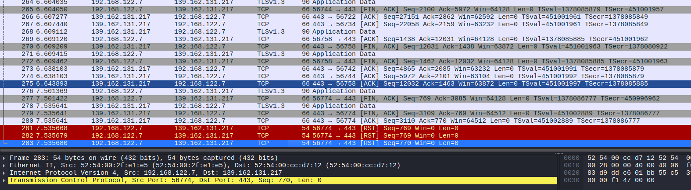
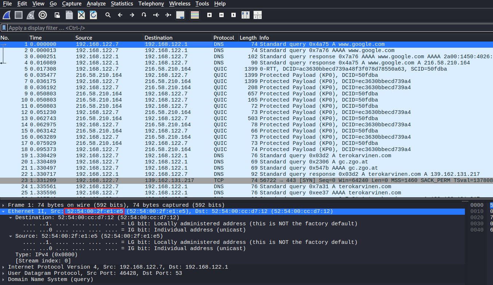
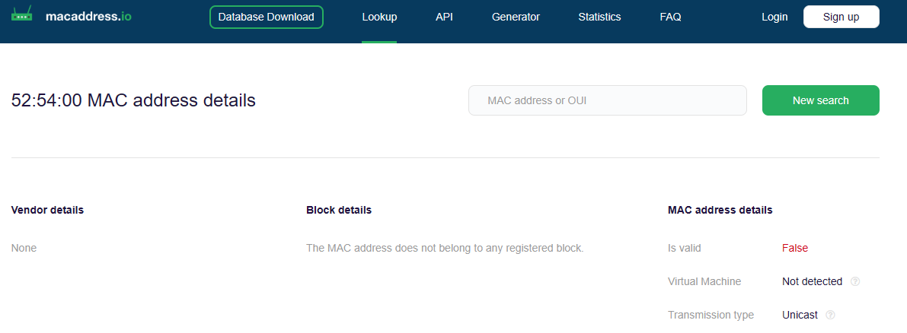
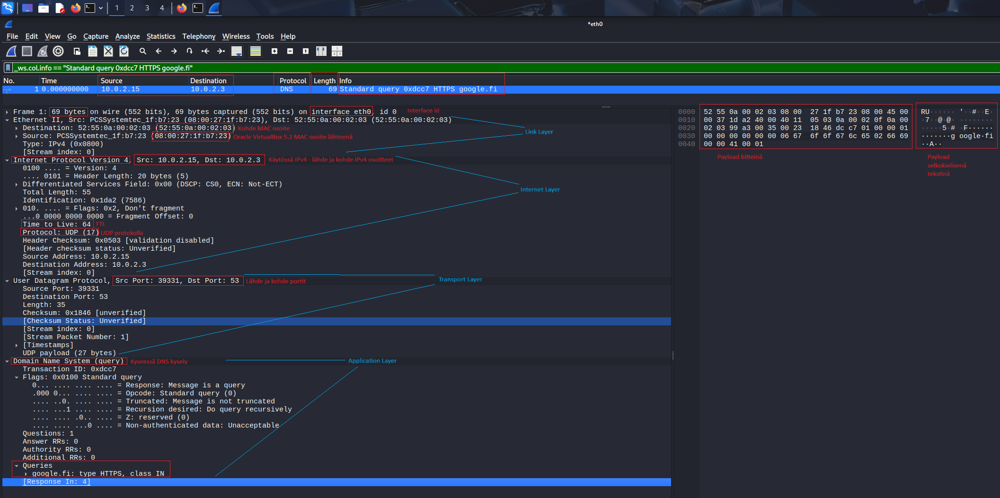
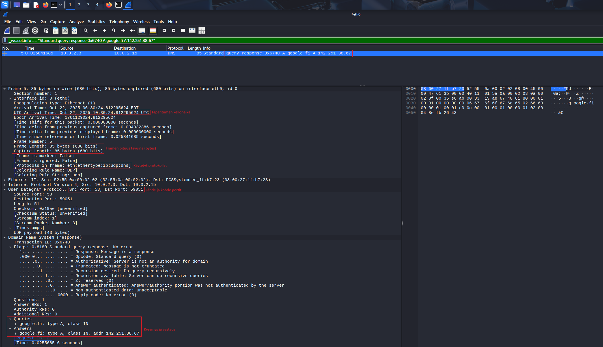

# h1 Sniff

#### Oma host kokoonpanoni:

| Komponentti | Kuvaus | Lisätiedot |
| :---        |    :----:   |          ---: |
| Emolevy | MSI B550-A PRO | ATX, AM4 |
| Prosessori   | AMD Ryzen 9 5900X | 12-Core 3.70 GHz |
| RAM   | G.Skill  Ripjaws V |  32GB (4x8GB) DDR4 3200MHz  |
| Näytönohjain   | Sapphire PULSE AMD Radeon RX 7900 GRE        | 16GB     |
| Kovalevy   | Kingston 1TB        | A2000 NVMe PCIe SSD M.2      |
| Kovalevy   | Crucial 512GB        | MX100 SSD     |
| Kovalevy   | Crucial 256GB        | MX100 SSD     |
| Virtalähde   | Asus 750W TUF       | ATX 80 Plus      |
| Kotelo   | Phanteks Enthoo Pro       |  Full Tower      |

Käyttöjärjestelmä: Windows 11 Pro 25H2

Oracle VirtualBox 7.1.12

kali-linux-2025.3-virtualbox-amd64

## x) Lue ja tiivistä. (Tässä x-alakohdassa ei tarvitse tehdä testejä tietokoneella, vain lukeminen tai kuunteleminen ja tiivistelmä riittää. Tiivistämiseen riittää muutama ranskalainen viiva.)

### Karvinen 2025: [Wireshark - Getting Started](https://terokarvinen.com/wireshark-getting-started/)

- Wiresharkin asentaminen:
```bash
sudo apt-get install wireshark
```
- Non-superkäyttäjille annetaan mahdollisuus kaapata paketteja "Yes", jotta ei tarvitse käyttää isoilla käyttöoikeuksilla.
- Lisätään oma käyttäjä Wiresharkin sallimiin käyttäjiin:
```bash
sudo adduser tero wireshark #<-- korvaa "tero" omalla käyttäjätunnuksella
```
- Tämän jälkeen uudelleenkirjautuminen.
- Komennolla "wireshark" käynnistetään Wiresharkin graafinen käyttöliittymä.
- Aluksi valitaan verkkointerface, jota tutkitaan. Voi myös valita "any", jolloin kaikkien interfacejen liikenne kaapataan.
- Hain evä symbolilla käynnistetään verkkoliikenteen kaappaus, kannattaa kaapata kerralla pieniä määäriä, jotta löydösten tutkiminen on selkeämpää.
- Kaappauksia voidaan tallentaa .pcap tiedostomuotoon, ja avata myöhempää tarkastelua varten.
- **Statistics** menusta näkee nopeasti yleiskuvaa, kuten *Endpoints*, joka näyttää listan päätelaitteista.
- Voit filtteröidä hakusanoilla tietoja kaappauksesta.
- **Follow: TCP Stream**:llä voit seurata *keskustelua* tekstinä, kätevää salaamattomissa yhteyksissä.

### Karvinen 2025: [Network Interface Names on Linux](https://terokarvinen.com/network-interface-linux/)

- *Network interface* on kuin fyysinen verkkokortti, mutta se ei aina ole fyysinen kortti.
- **Debian** ja muut **systemd** distrot käyttävät seuraavanlaista network interfacejen nimeämisjärjestelmää:
  - **en** = Wired **E**ther**n**et.
  - **wl** = **WL**AN, wireless local area network, WiFi.
  - **lo** = **Lo**opback adapter.
- Loopback adapteri on tietokoneen sisäisille yhteyksille: **localhost**. 127.0.0.1 IPv4 local osoitteet ovat 127.0.0.1/8, IPv6 ::1/128.
- Yleisiä network interface nimiä:
  - wlp4s0 = WiFi kortti.
  - enp1s0 = Langallinen ethernet kortti.
  - lo = Loopback adapteri.
  - enx738899738899 = Langallinen ethernet kortti. X:n jälkeinen numero on kortin MAC numero.
- Voit tarkistaa omat interfacet komennoilla:
```bash
ip a
ip route
```

## a) Linux. Asenna Debian tai Kali Linux virtuaalikoneeseen. (Tätä alakohtaa ei poikkeuksellisesti tarvitse raportoida, jos sinulla ei ole mitään ongelmia. Jos on mitään haasteita, tee täsmällinen raportti)

"Asensin" Kali Linuxin Virtualboxiin käyttämällä valmiiksi rakennettua virtuaalikonetta https://www.kali.org/get-kali/#kali-virtual-machines.

Ainoa "haaste" oli saada suomenkielinen näppäimistö asetettua, siihen löytyi tutkimalla polku: **Applications -> Usual Applications -> Settings -> Keyboard -> Layout**, johon lisäsin keyboard layout kohtaan "Finnish" ja poistin oletusnäppäimistön.


## b) Ei voi kalastaa. Osoita, että pystyt katkaisemaan ja palauttamaan virtuaalikoneen Internet-yhteyden.

- Oikeasta alakulmasta Network Adapter -> Network settings.
- Sieltä virtuaalisesti kaapeli irti (täppä pois "Cable Connected"-kohdasta.




## c) Wireshark. Asenna Wireshark. Sieppaa liikennettä Wiresharkilla. (Vain omaa liikennettäsi. Voit käyttää tähän esimerkiksi virtuaalikonetta).

Wireshark oli Kali Linuxissa valmiina, joten käynnistän terminaalin ja kirjoitan "wireshark", joka käynnistää Wiresharkin.

Jos olisin käyttänyt Debiania tai muuta, olisin joutunut asentamaan Wiresharkin: Tero Karvinen 2025: [Wireshark - Getting Started](https://terokarvinen.com/wireshark-getting-started/)
```bash
sudo apt-get update
sudo apt-get install wireshark
sudo adduser santeri wireshark
newgrp wireshark
wireshark
```
Laitan haineväsymbolista verkon kaappauksen päälle ja käynnistän Firefox selaimen. Wiresharkiin ilmestyy liikennettä.



## d) Oikeesti TCP/IP. Osoita TCP/IP-mallin neljä kerrosta yhdestä siepatusta paketista. Voit selityksen tueksi laatikoida ne ruutukaappauksesta. (Voit käyttää vastauksesi osana ruutukaappaustasi h0-tehtävästä, mutta tässä tehtävässä tarvitaan myös sanallinen selitys.)

Laitan Wiresharkin nauhoittamaan liikennettä ja menen selaimella terokarvinen.com:iin. Wiresharkista löytyy muutama rivi DNS kyselyä, jota on hyvä tutkia.

Kuvassa näkyy: 

- **Link Layer**: Source ja destination MAC osoitteet.
- **Ethernet Layer**: IPv4 Internet Protocol version 4.
- **Transport Layer**: UDP User Datagram Protocol, lähde ja kohde portit.
- **Application Layer**: Domain Name System DNS kysely.

Wikipedia: [Internet protocol suite](https://en.wikipedia.org/wiki/Internet_protocol_suite)



## e) Mitäs tuli surffattua? Avaa [surfing-secure.pcap](https://terokarvinen.com/verkkoon-tunkeutuminen-ja-tiedustelu/surfing-secure.pcap). Tutustu siihen pintapuolisesti ja kuvaile, millainen kaappaus on kyseessä. Tässä siis vain lyhyesti ja yleisellä tasolla. Voit esimerkiksi vilkaista, montako konetta näkyy, mitä protokollia pistää silmään. Määrästä voit arvioida esimerkiksi pakettien lukumäärää, kaappauksen kokoa ja kestoa.

- Alussa google.com DNS kysely, josta saadaan lopulta vastaukseksi ip osoite: 216.58.210.164 <-- Tämä osoite vie google.comiin.
- terokarvinen.com DNS kysely, josta vastaus: 139.162.131.217 <-- Tämä vie app.terokarvinen.com:iin
- Tässä kaappauksessa mennään siis google.comin kautta app.terokarvinen.comiin

Kuvassa näkyy kaappaus alkupäästä surfing-secure.pcap:a Wiresharkissa.



Seuraava kuva on Wiresharkin näkymä, johon valitsin kaikki kaappauksen rivit. Otin esille Statisticsista: Endpoints, Protocol Hierarchy, Capture File Properties, Packet Lenghts, sekä I/O Graphs



Kuvasta voimme todeta:

- 7 eri IP osoitetta, joista 192-alkuiset omassa lähiverkossa.
- Kaappaus on kestänyt 7 sekuntia 28.3.2025 klo 11:28:09-11:28:16
- Paketteja 283.
- Yksi TCP virhe.
- Protokollia: IPv4, QUIC, DNS, TCP, TSL, ARP.
- QUIC protokolla on minulle täysin uusi käsite. [Wikipedia](https://en.wikipedia.org/wiki/QUIC) kertoo, että se on Googlla kehitetty, vuonna 2013 julkaistu protokolla, joka ottaa useita UDP yhteyksiä samanaikaisesti eri portteihin.

Viimeisessä kuvassa kaappauksen lopussa tapahtuu TCP yhteyden lopetuksen kättely:

- FIN, ACK
- FIN, ACK
- ACK



## f) Vapaaehtoinen, vaikea: Mitä selainta käyttäjä käyttää? [surfing-secure.pcap](https://terokarvinen.com/verkkoon-tunkeutuminen-ja-tiedustelu/surfing-secure.pcap) (Päivitys 2025-03-31 w14 ma - muutin tehtävän vapaaehtoiseksi Giang:n suosituksesta)

Tutkailin aikani paketteja ja otin selvää, voiko DNS kyselyssä lähtevällä portilla olla jotain tekemistä asian kanssa. Sen verran selvisi: https://learn.microsoft.com/en-us/windows-server/networking/dns/network-ports, että selain usein lähettää kyselyn jostain satunnaisesta portista. Tässä tapauksessa ensimmäinen kysely lähtee portista 46428, eli siis lähtevällä portilla ei ole mitään tekemistä asian kanssa. Suurin osa liikenteestä on salattua, joten en päässyt alkuunkaan jyvälle asiasta.

Katsoin myöhemmin oikean vastauksen tähän tehtävään.

## g) Minkä merkkinen verkkokortti käyttäjällä on? [surfing-secure.pcap](https://terokarvinen.com/verkkoon-tunkeutuminen-ja-tiedustelu/surfing-secure.pcap)

Tutkin ensimmäisen paketin DNS kyselyä. Source MAC osoite on 52:54:00:2f:e1:e5, josta ensimmäisen puoliskon (52:54:00) pitäisi kertoa mikä valmistaja on kyseessä (https://dnschecker.org/mac-lookup.php). Tässä tapauksessa mikään internetin MAC kyselyistä ei löytänyt mitään, olikohan kysymys kompa?



https://macaddress.io/mac-address-lookup/85EQoqbm5e Kyselyllä 52:54:00 tuli seuraavanlainen vastaus:



Tämäkään ei mitään kerro, mutta sain idean tuosta oikeassa alakulmassa lukevista havainnoista. Pähkäilyni tulos on, että kyseessä voisi olla virtuaalikone, ja tällöin MAC osoite on looginen/virtuaalinen, eikä valmistajaa ole.

## h) Millä weppipalvelimella käyttäjä on surffaillut? [surfing-secure.pcap](https://terokarvinen.com/verkkoon-tunkeutuminen-ja-tiedustelu/surfing-secure.pcap) - Huonoja uutisia: yhteys on suojattu TLS-salauksella.

- 3.75.10.80 <- ei löydy.
- 34.117.188.166 <- ei löydy, selain palautti ainoastaan tekstin "fault filter abort".
- 139.162.131.217 <- https://app.terokarvinen.com/.
- 216.58.210.164 <- google.com.
- 192-alkuiset omassa lähiverkossa.

## i) Analyysi. Sieppaa pieni määrä omaa liikennettäsi. Analysoi se, eli selitä mahdollisimman perusteellisesti, mitä tapahtuu. (Tässä pääpaino on siis analyysillä ja selityksellä, joten liikennettä kannattaa ottaa tarkasteluun todella vähän - vaikka vain pari pakettia. Gurut huomio: Selitä myös mielestäsi yksinkertaiset asiat.)

Asetin Firefox selaimen osoiteriville google.fi valmiiksi. Laitoin Wiresharkin tallennuksen päälle ja painoin selaimen osoiterivillä Returnia (Enter). Otan tarkkailuun ensimmäisen framen jossa näkyy lähtevä DNS kysely, ja viidennen framen jossa näkyy vastaus tuohon DNS kyselyyn. Tästä https://www.techtarget.com/searchnetworking/tutorial/Examine-a-captured-packet-using-Wireshark on apua tutkimisessa.

Tässä siis tapahtuu DNS nimikysely google.fi:lle. Merkitsin kuviin punakynällä asioita.



- Ylimpänä näkyy framen yleiset tiedot, lähde ja kohde **IPv4** osoitteet, käytössä oleva protokolla **DNS**, **framen pituus** tavuina, info: kyseessä kysely google.fi:lle.
- **Frame**: 69 tavua pitkä. Interface id **eth0** on vanhaa perua 90-luvulta https://wiki.debian.org/NetworkInterfaceNames.
- Kohde ja lähde **MAC** osoitteet
- **IPv4** protokolla, lähde ja kohde osoitteet
- **Time to Live**, eli TTL. Tarkoittaa kuinka monta kertaa paketti voi liikkuta reitittimeltä toiselle, ennen kuin se dropataan. Tällä vältytään pakettien loputtomilta loopeilta. https://docs.oracle.com/en/operating-systems/solaris/oracle-solaris/11.4/tuning/ttl-parameter-ipv4.html.
- **Protocol**: **UDP** protokolla käytössä, jota käytetään DNS nimikyselyissä.
- **Src (source) Port**: 39331, selaimen käyttämä portti. **Dst (destination) Port**: 53, portti 53 on yleinen käytössä oleva portti DNS:lle. https://learn.microsoft.com/en-us/windows-server/networking/dns/network-ports.
- **Domain Name System (query)**: kertoo kyseessä olevan DNS kysely.
- **Queries**: kertoo mitä on kysytty, tässä tapauksessa google.fi.
- Oikealla ylhäällä näkyy payload bittimuodossa. Vieressä tässä tapauksessa selkokielinen payload, koska yhteys on salaamaton. https://www.techtarget.com/searchnetworking/tutorial/Examine-a-captured-packet-using-Wireshark.



Tähän frame 5 kuvaan otin mukaan tuon "Frame" osion. Kuvassa siis eräs vastaus google.fi DNS nimikyselyyn, jossa näkyy vastauksena IPv4 osoite.

- **UTC Arrival Time**: milloin kaappaus on otettu.
- **Frame Length**: framen pituus tavuina.
- **Capture Length**: kaappauksen pituus tavuina.
- **Protocols in frame**: mitä protokollia frame sisältää.
- User Datagram Protocol, kohde ja lähde portit. Tässä on lähteenä portti 53.
- Lopussa näkyy vastaus google.fi kyselylle, 142.251.38.37.

### Lähteet

https://terokarvinen.com/wireshark-getting-started/

https://terokarvinen.com/network-interface-linux/

https://www.kali.org/get-kali/#kali-virtual-machines

https://en.wikipedia.org/wiki/Internet_protocol_suite

https://en.wikipedia.org/wiki/QUIC

https://learn.microsoft.com/en-us/windows-server/networking/dns/network-ports

https://dnschecker.org/mac-lookup.php

https://macaddress.io/mac-address-lookup/85EQoqbm5e

https://www.techtarget.com/searchnetworking/tutorial/Examine-a-captured-packet-using-Wireshark

https://wiki.debian.org/NetworkInterfaceNames

https://learn.microsoft.com/en-us/windows-server/networking/dns/network-ports

---

Tätä dokumenttia saa kopioida ja muokata GNU General Public License (versio 2 tai uudempi) mukaisesti. http://www.gnu.org/licenses/gpl.html

Pohjana Tero Karvinen & Lari-Iso Anttila 2025: Verkkoon tunkeutuminen ja tiedustelu

Kirjoittanut: <em>Santeri Vauramo</em> 2025
