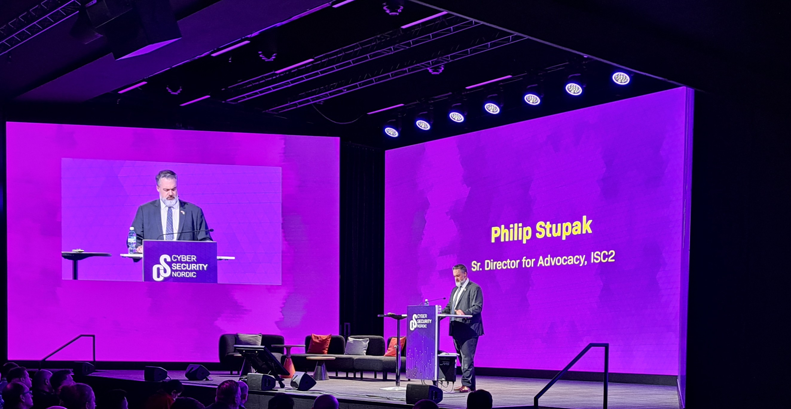
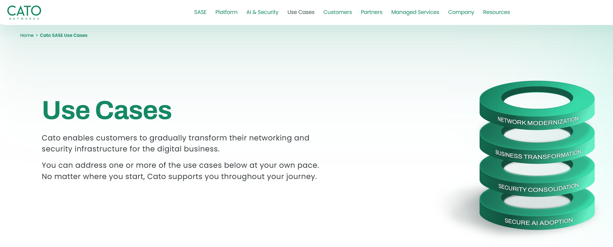

# h3 Messuilla
### Osallistu Cyber Security Nordic -tapahtumaan.

### x) Läksyksi tästä tapahtumasta teidän tulee tehdä lyhyt raportti siitä, mitä yrityksiä tapasitte, mitä mielenkiintoisia palveluita / tuotteita (max 3kpl) löysitte.

Osallistuin messuille keskiviikkona 5.11.2025. 

- Aluksi kävin katsomassa **Philip Stupak**:n esitystä yleisestä kyberturvallisuudesta. 

- Jäin vielä hetkeksi kuuntelemaan **Geri Revayn** esitystä AI hyökkäyksistä.

## Itse asiaan

### - **1 SPEAR innovations oy ltd**
  - Tästähän toki jotakin tiesin jo etukäteen, koska toinen opettajistamme tällä kurssilla: [Lari Iso-Anttila](https://github.com/lisoant) on yksi yrityksen perustajajäsenistä. Oli todella mukava vahingossa päätyä ensimmäisenä juuri tämän yrityksen pisteelle.
  - Turvallisia kulunvalvontatuotteita, joiden mielestäni tulisi olla Suomessa ja maailmalla laajemmassa käytössä.
  - [Yrityksen kotisivuilta](https://www.spear.fi/) löytyy lisää tietoa.

### - **2 CATO Networks**
  - Entuudestaan tuntematon yritys, ei ihmekään, koska Suomessa työskentelee yrityksessä noin 1 henkilö.
  - Yritys tarjoaa tietoturvaa yrityksille kokonaisvaltaisena pakettina, jossa kaikki on jo valmiiksi mietittynä asiakkaan näkökulmasta. Sen tarkemmin ei menty pintaa syvemmälle asiassa.
  - [Lisää yrityksen kotisivuilta](https://www.catonetworks.com/?_gl=1*wgmrz3*_up*MQ..*_gs*MQ..&gclid=Cj0KCQiAq7HIBhDoARIsAOATDxC-kPQ1XdY-48wdDahEfqkxxUYycbEV-hp7wVmDRYF991m-flH896UaAt6cEALw_wcB&gbraid=0AAAAADfWU5w8cdBN5tRL64cYgY08mMFeL).
  - Mukaan tarttui myös yrityksen logolla varustettu juomapullo.

kuva: catonetworks.com

### - **3 SSH**
  - Tämä tuli minulle yllätyksenä. En tiennyt että **SSH** on suomalainen yritys ja keksintö.
  - Secure Shell ja moni muu tuote on SSH:n käsialaa. Tulevaisuuteen on myös varauduttu esimerkiksi Quantum-Safe kryptografian muodossa.
  - SSH tarjoaa yrityksille esimerkiksi PrivX palvelua, josta lisää [yrityksen kotisivuilla](https://www.ssh.com/ssh-zero-trust-access-key-and-secrets-management).

### Lähteet

https://www.spear.fi/

catonetworks.com

https://www.ssh.com/ssh-zero-trust-access-key-and-secrets-management

---

Tätä dokumenttia saa kopioida ja muokata GNU General Public License (versio 2 tai uudempi) mukaisesti. [http://www.gnu.org/licenses/gpl.html](http://www.gnu.org/licenses/gpl.html)

Pohjana Tero Karvinen & Lari-Iso Anttila 2025: [Verkkoon tunkeutuminen ja tiedustelu](https://terokarvinen.com/verkkoon-tunkeutuminen-ja-tiedustelu/)

Kirjoittanut: <em>Santeri Vauramo</em> 2025
