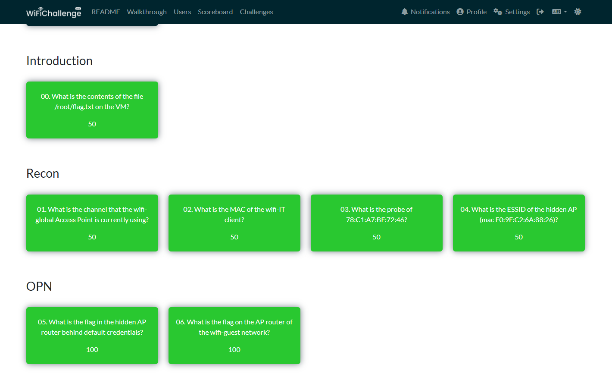
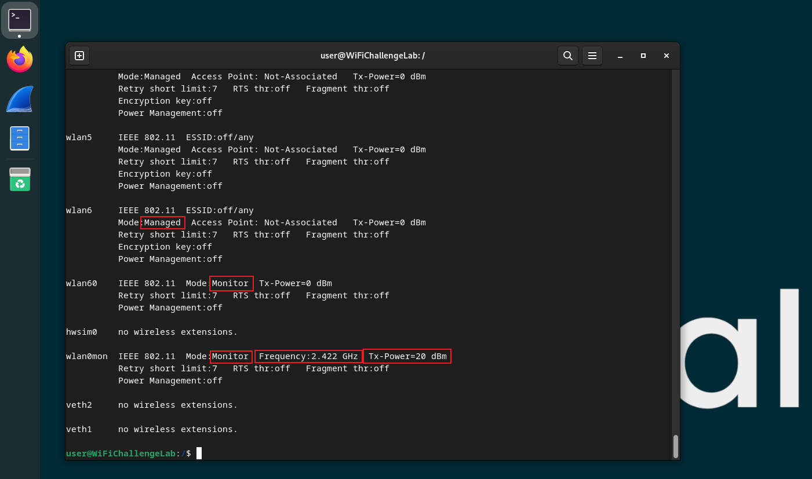
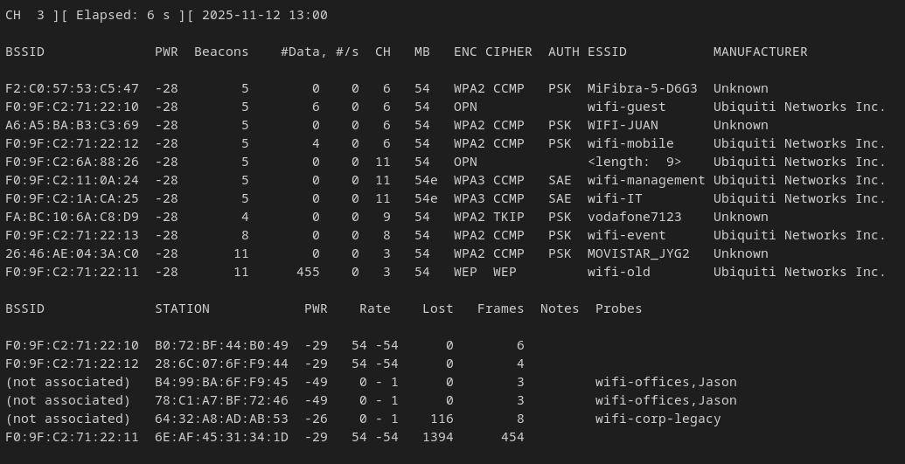

# h6 Wifi

#### Oma host kokoonpanoni:

| Komponentti | Kuvaus | Lisätiedot |
| :---        |    :----:   |          ---: |
| Emolevy | MSI B550-A PRO | ATX, AM4 |
| Prosessori   | AMD Ryzen 9 5900X | 12-Core 3.70 GHz |
| RAM   | G.Skill  Ripjaws V |  32GB (4x8GB) DDR4 3200MHz  |
| Näytönohjain   | Sapphire PULSE AMD Radeon RX 7900 GRE        | 16GB     |
| Kovalevy   | Kingston 1TB        | A2000 NVMe PCIe SSD M.2      |
| Kovalevy   | Crucial 512GB        | MX100 SSD     |
| Kovalevy   | Crucial 256GB        | MX100 SSD     |
| Virtalähde   | Asus 750W TUF       | ATX 80 Plus      |
| Kotelo   | Phanteks Enthoo Pro       |  Full Tower      |

- Käyttöjärjestelmä: Windows 11 Pro 25H2
- VMware® Workstation Pro 25H2 25.0.0.24995812
- WiFiChallenge Lab v2.3 Debian GNU/Linux 12 (bookworm)

### a) Tutustu [wifi challenge lab 2.1](https://lab.wifichallenge.com/) harjoitus ympäristöön ja käytä tarvittaessa hyväksesi jo olemassa olevia ohjeita.

Latasin **VMWaren** [https://www.vmware.com/products/desktop-hypervisor/workstation-and-fusion](https://www.vmware.com/products/desktop-hypervisor/workstation-and-fusion):stä ja **VMware v2.3 Direct ZIP**:n [https://lab.wifichallenge.com/README](https://lab.wifichallenge.com/README):stä harjoituksia varten. Luin ohjeet samaisesta README:sta.

Itse haasteet löytyvät sivulta: [https://lab.wifichallenge.com/challenges](https://lab.wifichallenge.com/challenges).

Jouduin katsomaan ohjeita: [https://www.aircrack-ng.org/doku.php?id=airmon-ng](https://www.aircrack-ng.org/doku.php?id=airmon-ng). Tosi hyviä vinkkejä aloittelijalle löytyy myös: [https://github.com/koutto/pi-pwnbox-rogueap/wiki](https://github.com/koutto/pi-pwnbox-rogueap/wiki):sta. Katsoin myös videon: [https://www.youtube.com/watch?v=G9cmm5RF6k8](https://www.youtube.com/watch?v=G9cmm5RF6k8).

Joitakin hyödyllisiä komentoja tehtävissä:

```bash
sudo cat "/esimerkki/kansio.txt"

sudo airmon-ng #listaa langattomat interfacet
sudo airmon-ng check #näyttää prosessit, jotka voivat häiritä tutkimista
sudo airmon-ng check kill #lopettaa häiritsevät prosessit
sudo airmon-ng start wlan1 #monitor mode päälle
sudo airmon-ng stop wlan1 #pois päältä

sudo airodump-ng --help #näyttää kaikki komennot
sudo airodump-ng wlan1 -w scan --manufacturer #kuunnellaan kanavia, "-w" kirjoittaa uuteen tiedostoon, "--manufacturer" kertoo myös verkkokortin valmistajan
sudo airodump-ng wlan1 --band ag #"b" ja "g" käyttää 2,4GHz taajuutta, "a" käyttää 5GHz taajuutta
sudo besside-ng -c 6 -b F0:9F:C2:1A:CA:25 wlan1 -v #käytetään WEP ja WPA avainten purkamiseen, "-c" lukitsee kanavan, "-b" tarkentaa tiettyyn MAC-osoitteeseen (b=BSSID)


sudo iwconfig #näyttää langattomien interfacejen statuksen, tällä löytyi esimerkiksi tieto, että wlan60 käyttää 5GHz taajuutta
```

Tein joitakin tehtäviä, aika nopeasti piti etsiä lähteistä tietoa ja viimeisissä oli pakko katsoa walkthrough:sta miten homma etenee.



### b) Kirjoita raportti siitä mitä opit ja mitkä asiat yllättivät sinut kun tutustuit harjoitukseen.

**Opin**:

- Käyttämään **Aircrack-ng**:tä [https://www.aircrack-ng.org/doku.php?id=Main](https://www.aircrack-ng.org/doku.php?id=Main]. Aircrack-ng on kokoelma erilaisia työkaluja WiFi-turvallisuuden tutkimiseen.
- Tekniikoita salasanojen sieppaamiseen WiFi-verkossa.
- Wiresharkilla voi tutkia liikenteestä kaapattuja .cap tiedostoja.



**Kuvassa**:

-  **Mode**:Monitor/Managed = Oletuksena **Managed-tilassa**. Täytyy laittaa **Monitor**-tilaan, jotta voidaan tutkia liikennettä.
-  **Frequency** = Taajuus.
-  **Tx-Power** = Kertoo kuinka kauas kortti pystyy lähettämään, kerrotaan muodossa **mW** tai **dBm**.



**Ylhäällä**: [https://github.com/aircrack-ng/aircrack-ng/blob/master/manpages/airodump-ng.8.in](https://github.com/aircrack-ng/aircrack-ng/blob/master/manpages/airodump-ng.8.in)

- BSSID = AP:n eli Access Pointin MAC osoite. (AP = käytännössä reititin tai muu laite, joka tarjoaa yhteyspisteen)
- PWR = Signaalin voimakkuus.
- Beacons = Kuinka monta Beaconia AP on lähettänyt, useimmiten noin 10 sekunnissa.
- #Data = Kaapattujen pakettien määrä.
- #/s = Kuinka monta pakettia sekunnissa viimeisen kymmenen sekunnin aikana.
- CH = Kanava.
- MB = AP:n maksiminopeus.
- ENC = Salausalgoritmi.
- CIPHER = Havaittu salaus, ei pakollinen.
- AUTH = Autentikointiprotokolla.
- ESSID = Verkon SSID eli nimi.

**Alhaalla** käyttäjien tiedot:

- STATION = Käyttäjän MAC osoite, joka on yhdistynyt AP:hen (BSSID). Tai etsii AP:ta johon yhdistää: "not associated".
- Rate = AP:n ja STATION:n välisen yhteyden viimeisin nopeus. Ensimmäinen numero = BSSID --> STATION, toinen numero = STATION --> BSSID.
- 

**Yllätykset**:

- Ei sinänsä yllätyksiä, toki hienoa nähdä käytännössä miten vanhempia WLan verkkoja voidaan murtaa.

### c) Miten suhtautumisesi WLanin turvallisuuteen muuttui sen jälkeen kun teit harjoitukset?

- Tiedossa oli jo entuudestaan, että langattomat verkot lähettävät tietoa kaikkiin suuntiin. Tällöin ne tulevat aina olemaan askeleen jäljessä turvallisuudessa verrattuna langallisiin verkkoihin, ei tarvita fyysistä kontaktia verkkoon.
- Ei tietenkään yhtään luottavaisempi olo tullut langattomien verkkojen suhteen, kun pääsi kokeilemaan erilaisia tapoja päästä käsiksi WLan verkkoihin.
asd

### Lähteet

[WiFi Challenge Lab](https://lab.wifichallenge.com/)

[https://www.vmware.com/products/desktop-hypervisor/workstation-and-fusion](https://www.vmware.com/products/desktop-hypervisor/workstation-and-fusion)

[https://lab.wifichallenge.com/README](https://lab.wifichallenge.com/README)

[https://lab.wifichallenge.com/challenges](https://lab.wifichallenge.com/challenges)

[https://www.aircrack-ng.org/doku.php?id=Main](https://www.aircrack-ng.org/doku.php?id=Main)

[https://github.com/koutto/pi-pwnbox-rogueap/wiki](https://github.com/koutto/pi-pwnbox-rogueap/wiki)

[https://www.youtube.com/watch?v=G9cmm5RF6k8](https://www.youtube.com/watch?v=G9cmm5RF6k8)

[https://github.com/aircrack-ng/aircrack-ng/blob/master/manpages/airodump-ng.8.in](https://github.com/aircrack-ng/aircrack-ng/blob/master/manpages/airodump-ng.8.in)

---

Tätä dokumenttia saa kopioida ja muokata GNU General Public License (versio 2 tai uudempi) mukaisesti. http://www.gnu.org/licenses/gpl.html

Pohjana Tero Karvinen & Lari-Iso Anttila 2025: Verkkoon tunkeutuminen ja tiedustelu

Kirjoittanut: <em>Santeri Vauramo</em> 2025
