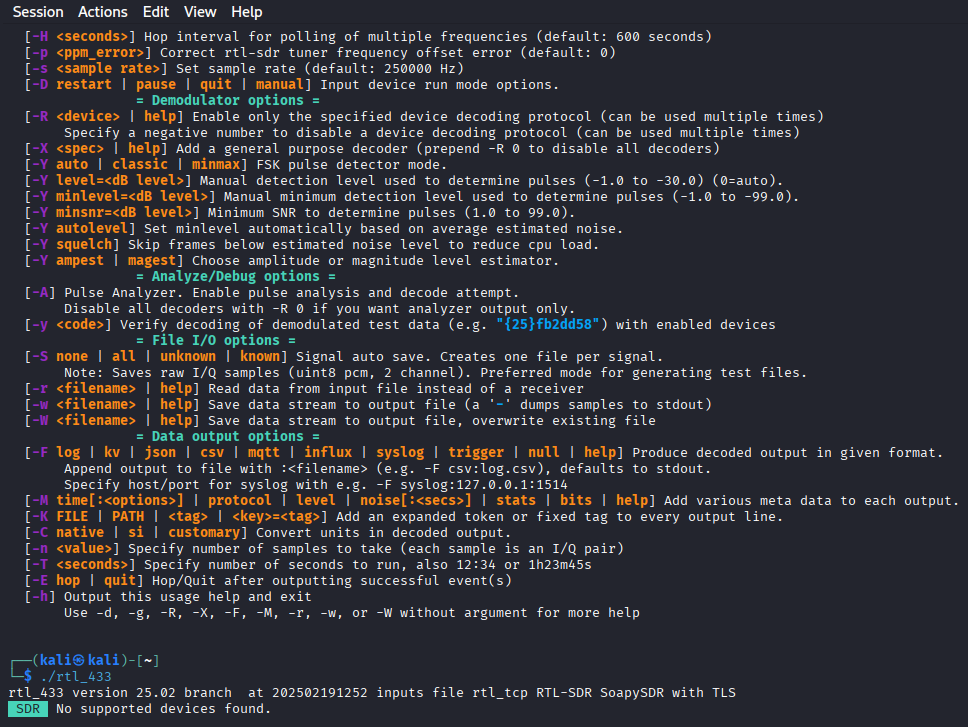
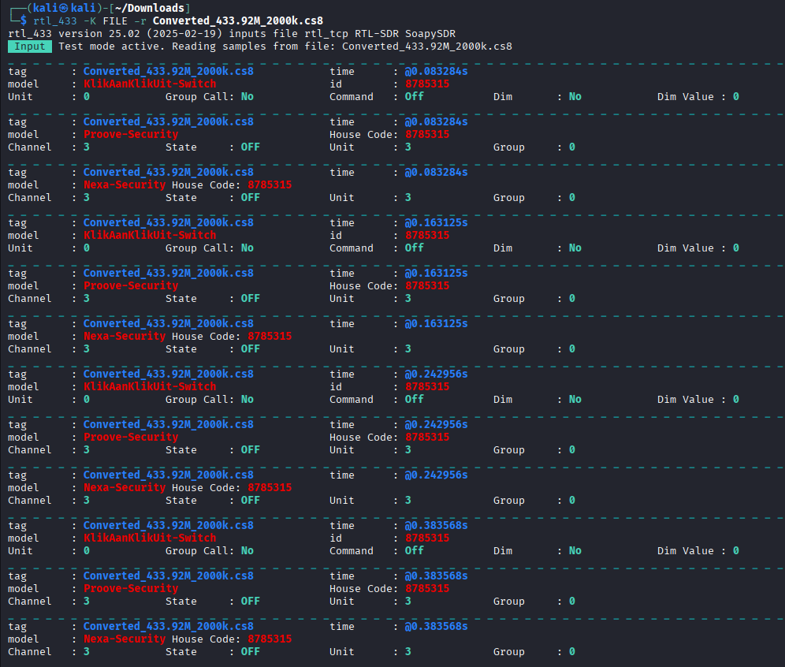
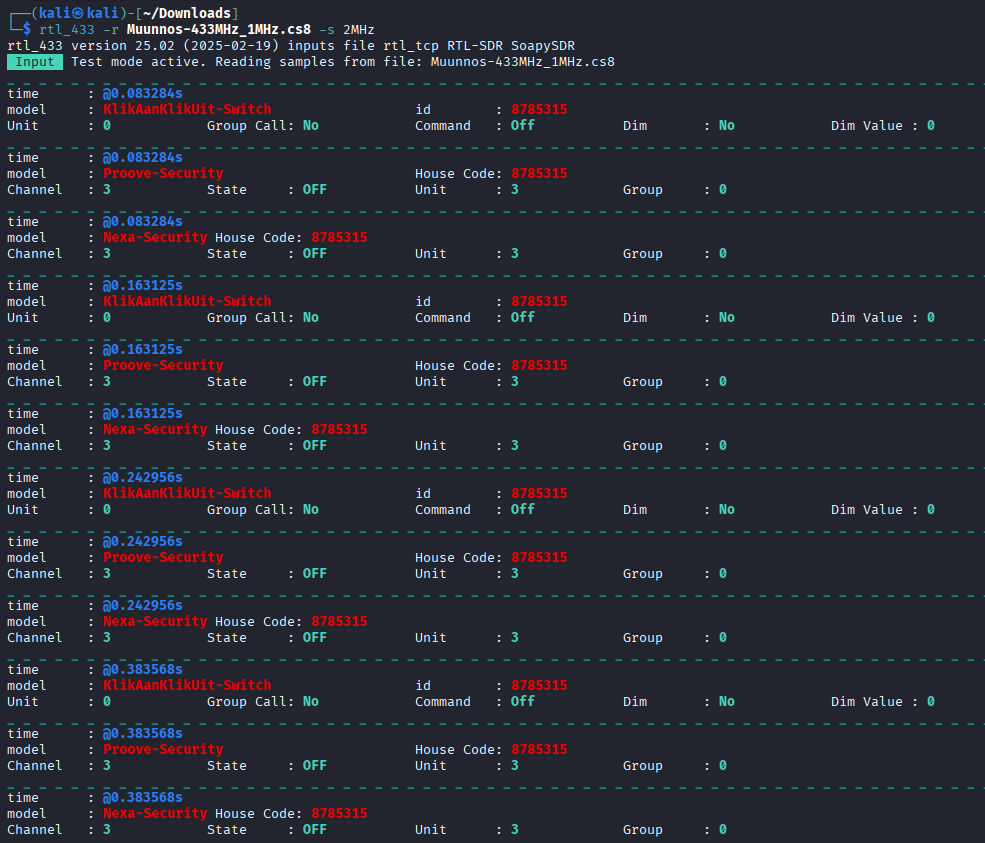

# h7 Aaltoja harjaamassa

#### Oma host kokoonpanoni:

| Komponentti | Kuvaus | Lisätiedot |
| :---        |    :----:   |          ---: |
| Emolevy | MSI B550-A PRO | ATX, AM4 |
| Prosessori   | AMD Ryzen 9 5900X | 12-Core 3.70 GHz |
| RAM   | G.Skill  Ripjaws V |  32GB (4x8GB) DDR4 3200MHz  |
| Näytönohjain   | Sapphire PULSE AMD Radeon RX 7900 GRE        | 16GB     |
| SSD   | Kingston 1TB        | A2000 NVMe PCIe SSD M.2      |
| SSD   | Crucial 512GB        | MX100 SSD     |
| SSD   | Crucial 256GB        | MX100 SSD     |
| Virtalähde   | Asus 750W TUF       | ATX 80 Plus      |
| Kotelo   | Phanteks Enthoo Pro       |  Full Tower      |

- Käyttöjärjestelmä: Windows 11 Pro 25H2
- Oracle VirtualBox 7.1.12
- Kali GNU/Linux Rolling 2025.3
- Debian GNU/Linux Trixie 13.1

### x) Lue ja tiivistä. (Tässä x-alakohdassa ei tarvitse tehdä testejä tietokoneella, vain lukeminen tai kuunteleminen ja tiivistelmä riittää. Tiivistämiseen riittää muutama ranskalainen viiva.)

- ### Hubacek 2019: [Universal Radio Hacker SDR Tutorial on 433 MHz radio plugs](https://www.youtube.com/watch?v=sbqMqb6FVMY&t=199s) (Video, alkaen 3:19 ja päättyen 7:40. Yhteensä noin 4 min.)

- Ohjelmalla voidaan tallentaa tietyn taajuuden radioliikennettä.
- Ohjelman avulla pystytään tarkastelemaan bittitasolla radiolähetyksen tallennetta.
- Kaapatun signaalin voi myös muuttaa hexadesimaali tai ASCII-muotoon.

### Cornelius 2022: [Decode 433.92 MHz weather station data](https://www.onetransistor.eu/2022/01/decode-433mhz-ask-signal.html)

- [rtl_433](https://github.com/merbanan/rtl_433):lla voidaan dekoodata noin 433MHz:n signaalista laitteen lähettämää tietoa selkokielelle.
- Universal Radio Hacker:lla pystyy **nauhoittamaan, analysoimaan, muuntamaan,** ja jos laitteisto sallii, myös **uudelleenlähettämään** minkä tahansa signaalin.
- Signaalia tulee nauhoittaa noin **20-100KHz** ohi tavoitteesta, koska ohjelma laskee tavoitteen ja asetetun taajuuden välistä eroa.

### Vapaaehtoinen, vaikeahko: Lohner 2019: [Decoding ASK/OOK_PPM Signals with URH and rtl_433](https://github.karllohner.com/SDR/Decoding/Example_2019-01-24/)

- Luin artikkelin, mutta tiivistäminen on hieman hankalaa.
- Artikkelissa kerrotaan kuinka Universal Radio Hacker:lla ja rtl_433:lla dekoodataan OOK_PPM signaalia.

## a) WebSDR. Etäkäytä WebSDR-ohjelmaradiota, joka on kaukana sinusta ja kuuntele radioliikennettä. Radioliikenne tulee siepata niin, että radiovastaanotin on joko eri maassa tai vähintään 400 km paikasta, jossa teet tätä tehtävää. Käytä esimerkkinä julkista, suurelle yleisölle tarkoitettua viestiä, esimerkiksi yleisradiolähetystä. Kerro löytämäsi taajuus, aallonpituus ja modulaatio. Kuvaile askeleet ja ota ruutukaappaus. (Tehtävässä ei saa ilmaista sellaisen viestin sisältöä tai olemassaoloa, joka ei ole tarkoitettu julkiseksi. Voit sen sijaan kuvailla, miten sait julkisen radiolähetyksen kuulumaan kaiuttimistasi. Julkisten, esimerkiksi yleisradiolähetysten sisältöä saa tietysti kuvailla.)

Menin Googlen kautta osoitteeseen [http://websdr.ewi.utwente.nl:8901/](http://websdr.ewi.utwente.nl:8901/). Radion on laittanut pystyyn **University of Twente** Alankomaissa. Säätelin nappuloita ja löysin taajuuden **9670.00kHz**, josta kuului **AM** modulaatiolla hyvän kuuloista vanhaa rockia.

**11.18kHz** aallonpituudella signaali oli oikein miellyttävä.


## b) rtl_433. Asenna rtl_433 automaattista analyysia varten. Kokeile, että voit ajaa sitä. './rtl_433' vastaa "rtl_433 version 25.02 branch..."

Yritin asentaa Kali:in ohjelmaa käyttämällä [https://github.com/merbanan/rtl_433](https://github.com/merbanan/rtl_433) ohjetta Debianille: **sudo apt-get install rtl-433**. Monta erroria tulee:

```bash
E: Failed to fetch http://http.kali.org/kali/pool/main/s/soapysdr/soapysdr0.8-module-all_0.8.1-6_amd64.deb  Temporary failure resolving 'http.kali.org'
E: Unable to fetch some archives, maybe run apt update or try with --fix-missing?
```

Asennusohjesivulta löytyi linkki muille distroille [https://repology.org/project/rtl-433/versions](https://repology.org/project/rtl-433/versions). Tuolta näkyi, että paketin nimi on nimenomaan tuo mitä yritin asentaa. Tässä vaiheessa kuitenkin tajusin, että tästä Kali:sta olin jossakin tämän kurssin tehtävistä laittanut internet yhteyden pois, nyt otin sen takaisin käyttöön. Tämän jälkeen asennus onnistui "**sudo apt-get install rtl-433**".

Nyt **rtl_433 -h** pitäisi antaa tietoja ohjelmasta. Tässä vaiheessa en saanut komennolla **rtl_433 -h** silti mitään vastausta. Katsoin [Karvisen ohjeesta](https://terokarvinen.com/verkkoon-tunkeutuminen-ja-tiedustelu/#h7-aaltoja-harjaamassa) vielä lisää ja ajoin seuraavat komennot:

```bash
sudo apt-get -y install atool wget libssl-dev libtool libusb-1.0-0-dev librtlsdr-dev rtl-sdr libsoapysdr-dev
wget https://github.com/merbanan/rtl_433/releases/download/25.02/rtl_433-soapysdr-openssl3-Linux-amd64-25.02.zip
aunpack rtl*.zip

rtl_433 -h #testit vielä, että asennus onnistui
./rtl_433
```



## c) Automaattinen analyysi. Mitä tässä näytteessä tapahtuu? Mitä tunnisteita (id yms) löydät? [Converted_433.92M_2000k.cs8](https://terokarvinen.com/verkkoon-tunkeutuminen-ja-tiedustelu/samples/Converted_433.92M_2000k.cs8). Analysoi näyte 'rtl_433' ohjelmalla.

rtl_433 ohjeesta löysin komennon, jolla saa lataamani tiedoston auki: **rtl_433 -K FILE -r Converted_433.92M_2000k.cs8**. Löysin tunnisteita:

- tag: Converted_433.92M <- Tämä sama kaikissa.
- model: Proove-Security, Nexa-Security, KlikAanKlikUit-Switch.
- Channel: 0 (KlikAanKlikUit-Switch), 3 (Proove-Security ja Nexa-Security).
- id: **8785315**, sama kaikissa, joissa on id.
- House Code: **8785315** <- sama kuin id. Eli tässä tapauksessa House Code = id, riippuen laitteesta/lähettimestä.
- State: OFF. Ilmeisesti järjestelmä on kytketty pois päältä.



Jos pitäisi arvailla mitä tämä kaikki tarkoittaa, sanoisin, että kyseessä on jonkin talon hälytysjärjestelmä.

Nopea haku "KlikAanKlikUit-Switch" löytää [https://www.mediamarkt.nl/nl/product/_klikaanklikuit-compact-wireless-socket-switch-set-apc3-2300r-draadloze-schakelaars-afstandsbediening-1536684.html](https://www.mediamarkt.nl/nl/product/_klikaanklikuit-compact-wireless-socket-switch-set-apc3-2300r-draadloze-schakelaars-afstandsbediening-1536684.html) sivun. Kyseessä on kaukosäätöinen pistorasia.

## d) Too compex 16? Olet nauhoittanut näytteen 'urh' -ohjelmalla .complex16s-muodossa. Muunna näyte rtl_433-yhteensopivaan muotoon ja analysoi se. Näyte [Recorded-HackRF-20250411_183354-433_92MHz-2MSps-2MHz.complex16s](https://terokarvinen.com/verkkoon-tunkeutuminen-ja-tiedustelu/samples/Recorded-HackRF-20250411_183354-433_92MHz-2MSps-2MHz.complex16s)

Karvisen ohjeen mukaan yritin asentaa Universal Radio Hacker ohjelman:

```bash
sudo apt-get update
sudo apt-get -y install pipx
pipx install urh

Fatal error from pip prevented installation. Full pip output in file:
    /home/kali/.local/state/pipx/log/cmd_2025-11-27_07.09.21_pip_errors.log

pip seemed to fail to build package:
    'urh'

Some possibly relevant errors from pip install:
    error: subprocess-exited-with-error
    ERROR: Failed to build 'urh' when getting requirements to build wheel

Error installing urh.
```

Löysin itseni sivulle: [https://pypi.org/project/urh/#Installation](https://pypi.org/project/urh/#Installation). Kokeilen vaihtoehtoista asennustapaa:

```bash
git clone https://github.com/jopohl/urh/
cd urh
python setup.py install

Cloning into 'urh'...
remote: Enumerating objects: 25311, done.
remote: Counting objects: 100% (739/739), done.
remote: Compressing objects: 100% (395/395), done.
remote: Total 25311 (delta 469), reused 344 (delta 343), pack-reused 24572 (from 3)
Receiving objects: 100% (25311/25311), 54.45 MiB | 16.28 MiB/s, done.
Resolving deltas: 100% (17984/17984), done.
You need Cython to build URH's extensions!
You can get it e.g. with python3 -m pip install cython.
```

Pari muutakin ohjetta katsoin ja asentelin riippuvuuksia, mikään näistä ei Kali:lle kelvannut. Löysin lopulta sivun: [https://kalilinuxtutorials.com/urh-universal-radio-hacker/](https://kalilinuxtutorials.com/urh-universal-radio-hacker/), jossa kerrottiin seuraavaa:

```bash
Without installation
To execute the Universal Radio Hacker without installation, just run:

git clone https://github.com/jopohl/urh/
cd urh/src/urh
./main.py
```

Ilmeisesti tämä oli nyt **ilman asennusta**, joka tapauksessa ohjelma käynnistyi ja nyt pääsen toivottavasti hommiin.

Lähdin aiemman X-kohdan Karlin ohjeen mukaan purkamaan tuota signaalia. 

- Avasin lataamani tiedoston Universal Radio Hackeriin.
- Vaihdoin Signal view:n **Spectogram**:ksi.
- Valitsin signaalin, hiiren oikeasta valitsin **Apply Bandpass Filter**.
- Jakoavain symbolista muutin pause **threshold** arvon 8 --> 0
- Zoomasin lähemmäs ja valitsin 2046 samplen pituuden kohdasta, jossa näkyy tapahtumia. 2046 jaettuna kuudella = 341, joten kirjoitan **Samples/Symbols** kenttään 341. (Ohjeessa puhutaan Bit Lenghtistä, mutta tässä tuo taitaa olla sama, niin lukee kun vie hiiren kursorin kentän päälle)
- Vaihdoin Pause Threshold:n 4:n.
- Tein ohjeen mukaan dekoodauksen ja tallensin nimellä.
- En löydä minne tuo dekoodaus tallentui. Tässä vaiheessa huomasin, että seuraavassa tehtävässä vasta pitää asentaa urh, jonka tässä jo tein. Tulipahan räplättyä ohjelmaa.

Yritin virallisen ohjeen mukaan avata tiedostoa -X ja -G flageilla tuloksetta. Kuitenkin tältä sivulta: [https://github.com/merbanan/rtl_433/blob/master/docs/IQ_FORMATS.md](https://github.com/merbanan/rtl_433/blob/master/docs/IQ_FORMATS.md) löytyy tieto, että **.complex16s** = **.cs8**. Samalla sivulla lukee, että yleiset sample ratet ovat 250 KHz, 1024 KHz ja 1 MHz. Yritän tuon sivun ohjeen mukaan muuttaa tiedoston luettavaan muotoon, lähinnä 2MHz --> 1MHz:

```bash
rtl_433 -w Muunnos-433_92MHz-2MSps-1MHz.cs8 Recorded-HackRF-20250411_183354-433_92MHz-2MSps-2MHz.complex16s
```

Tämä ei toiminut oikein missään muodossa, joten yritin muuttaa vain brute-forcella nimen:

```bash
mv Recorded-HackRF-20250411_183354-433_92MHz-2MSps-2MHz.complex16s Muunnos-433MHz_1MHz.cs8
```

Ei toiminut sekään. Luin lisää manuaalisivuja. README.md:stä ja **rtl_433 -h**:sta löytyy tieto, että **-s** flagilla saa sample raten ilmoitettua, ohjelma yrittää automaattisesti avata sitä 1MHz ratella. Käytän siis flagia -s 2MHz, jolla ohjelma osaa lukea tiedoston oikein:

```bash
rtl_433 -r Muunnos-433MHz_1MHz.cs8 -s 2MHz
```

Nyt toimii, näyttäisi olevan samaa dataa, kuin aiemmassa tehtävässä.



## e) Ultimate. Asenna URH, the Ultimate Radio Hacker.

Tämä tuli tavallaan tehtyä jo. Voisin silti siirtyä käyttämään Debiania, josko siihen onnistuisi tuo asennus ihan oikeasti. Näemmä ei ole Debian 13:a tällä koneella, joten asennan sen huumorilla VirtualBoxiin.


### Lähteet

[https://youtube.com/watch?t=199&v=sbqMqb6FVMY&feature=youtu.be](https://www.youtube.com/watch?v=sbqMqb6FVMY&t=199s)

[https://www.onetransistor.eu/2022/01/decode-433mhz-ask-signal.html](https://www.onetransistor.eu/2022/01/decode-433mhz-ask-signal.html)

[https://github.karllohner.com/SDR/Decoding/Example_2019-01-24/](https://github.karllohner.com/SDR/Decoding/Example_2019-01-24/)

[https://github.com/merbanan/rtl_433](https://github.com/merbanan/rtl_433)


---

Tätä dokumenttia saa kopioida ja muokata GNU General Public License (versio 2 tai uudempi) mukaisesti. [http://www.gnu.org/licenses/gpl.html](http://www.gnu.org/licenses/gpl.html)

Pohjana Tero Karvinen & Lari-Iso Anttila 2025: [Verkkoon tunkeutuminen ja tiedustelu](https://terokarvinen.com/verkkoon-tunkeutuminen-ja-tiedustelu/)

Kirjoittanut: <em>Santeri Vauramo</em> 2025
