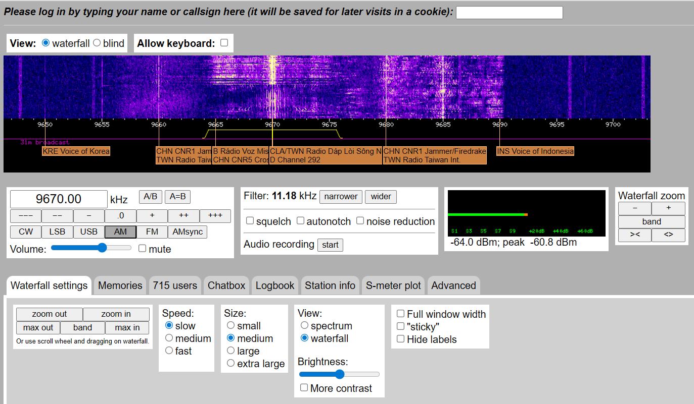

# h7 Aaltoja harjaamassa

#### Oma host kokoonpanoni:

| Komponentti | Kuvaus | Lisätiedot |
| :---        |    :----:   |          ---: |
| Emolevy | MSI B550-A PRO | ATX, AM4 |
| Prosessori   | AMD Ryzen 9 5900X | 12-Core 3.70 GHz |
| RAM   | G.Skill  Ripjaws V |  32GB (4x8GB) DDR4 3200MHz  |
| Näytönohjain   | Sapphire PULSE AMD Radeon RX 7900 GRE        | 16GB     |
| SSD   | Kingston 1TB        | A2000 NVMe PCIe SSD M.2      |
| SSD   | Crucial 512GB        | MX100 SSD     |
| SSD   | Crucial 256GB        | MX100 SSD     |
| Virtalähde   | Asus 750W TUF       | ATX 80 Plus      |
| Kotelo   | Phanteks Enthoo Pro       |  Full Tower      |

Käyttöjärjestelmä: Windows 11 Pro 25H2

Oracle VirtualBox 7.1.12

### x) Lue ja tiivistä. (Tässä x-alakohdassa ei tarvitse tehdä testejä tietokoneella, vain lukeminen tai kuunteleminen ja tiivistelmä riittää. Tiivistämiseen riittää muutama ranskalainen viiva.)

- ### Hubacek 2019: [Universal Radio Hacker SDR Tutorial on 433 MHz radio plugs](youtube.com/watch?t=199&v=sbqMqb6FVMY&feature=youtu.be) (Video, alkaen 3:19 ja päättyen 7:40. Yhteensä noin 4 min.)

- Ohjelmalla voidaan tallentaa tietyn taajuuden radioliikennettä.
- Ohjelman avulla pystytään tarkastelemaan bittitasolla radiolähetyksen tallennetta.
- Kaapatun signaalin voi myös muuttaa hexadesimaali tai ASCII-muotoon.

### Cornelius 2022: [Decode 433.92 MHz weather station data](https://www.onetransistor.eu/2022/01/decode-433mhz-ask-signal.html)

- [rtl_433](https://github.com/merbanan/rtl_433):lla voidaan dekoodata noin 433MHz:n signaalista laitteen lähettämää tietoa selkokielelle.
- Universal Radio Hacker:lla pystyy **nauhoittamaan, analysoimaan, muuntamaan,** ja jos laitteisto sallii, myös **uudelleenlähettämään** minkä tahansa signaalin.
- Signaalia tulee nauhoittaa noin **20-100KHz** ohi tavoitteesta, koska ohjelma laskee tavoitteen ja asetetun taajuuden välistä eroa.

### Vapaaehtoinen, vaikeahko: Lohner 2019: [Decoding ASK/OOK_PPM Signals with URH and rtl_433](https://github.karllohner.com/SDR/Decoding/Example_2019-01-24/)

- Luin artikkelin, mutta tiivistäminen on hieman hankalaa.
- Artikkelissa kerrotaan kuinka Universal Radio Hacker:lla ja rtl_433:lla dekoodataan OOK_PPM signaalia.

## a) WebSDR. Etäkäytä WebSDR-ohjelmaradiota, joka on kaukana sinusta ja kuuntele radioliikennettä. Radioliikenne tulee siepata niin, että radiovastaanotin on joko eri maassa tai vähintään 400 km paikasta, jossa teet tätä tehtävää. Käytä esimerkkinä julkista, suurelle yleisölle tarkoitettua viestiä, esimerkiksi yleisradiolähetystä. Kerro löytämäsi taajuus, aallonpituus ja modulaatio. Kuvaile askeleet ja ota ruutukaappaus. (Tehtävässä ei saa ilmaista sellaisen viestin sisältöä tai olemassaoloa, joka ei ole tarkoitettu julkiseksi. Voit sen sijaan kuvailla, miten sait julkisen radiolähetyksen kuulumaan kaiuttimistasi. Julkisten, esimerkiksi yleisradiolähetysten sisältöä saa tietysti kuvailla.)

Menin Googlen kautta osoitteeseen [http://websdr.ewi.utwente.nl:8901/](http://websdr.ewi.utwente.nl:8901/). Säätelin nappuloita ja löysin taajuuden **9670.00kHz**, josta kuului **AM** modulaatiolla hyvän kuuloista vanhaa rockia.

**11.18kHz** aallonpituudella signaali oli oikein miellyttävä.

## b) rtl_433. Asenna rtl_433 automaattista analyysia varten. Kokeile, että voit ajaa sitä. './rtl_433' vastaa "rtl_433 version 25.02 branch..."

##

##

### Lähteet

[youtube.com/watch?t=199&v=sbqMqb6FVMY&feature=youtu.be](youtube.com/watch?t=199&v=sbqMqb6FVMY&feature=youtu.be)

[https://www.onetransistor.eu/2022/01/decode-433mhz-ask-signal.html](https://www.onetransistor.eu/2022/01/decode-433mhz-ask-signal.html)

[https://github.karllohner.com/SDR/Decoding/Example_2019-01-24/](https://github.karllohner.com/SDR/Decoding/Example_2019-01-24/)

[https://github.com/merbanan/rtl_433](https://github.com/merbanan/rtl_433)

---

Tätä dokumenttia saa kopioida ja muokata GNU General Public License (versio 2 tai uudempi) mukaisesti. [http://www.gnu.org/licenses/gpl.html](http://www.gnu.org/licenses/gpl.html)

Pohjana Tero Karvinen & Lari-Iso Anttila 2025: [Verkkoon tunkeutuminen ja tiedustelu](https://terokarvinen.com/verkkoon-tunkeutuminen-ja-tiedustelu/)

Kirjoittanut: <em>Santeri Vauramo</em> 2025
